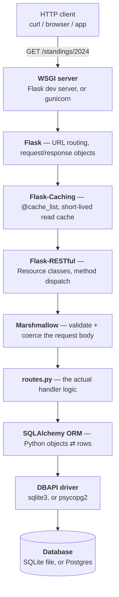
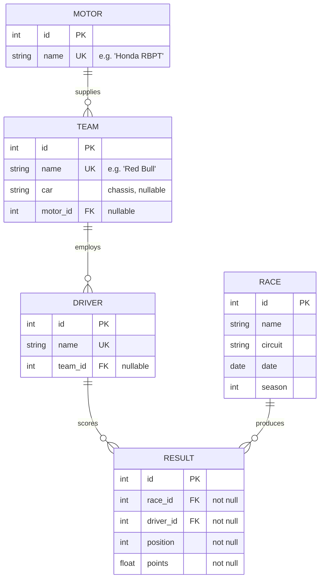
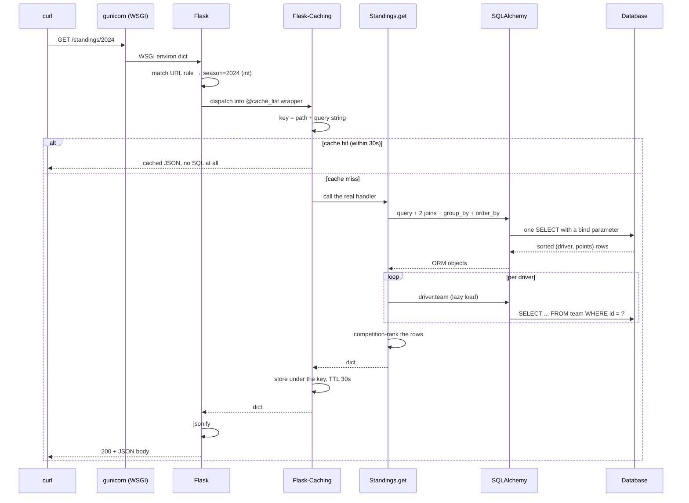

# F1 API — Explained

A from-first-principles walkthrough of every significant decision in this repository.

This document assumes **no prior knowledge** of Flask, SQLAlchemy, REST APIs, relational databases, Docker, Terraform, or AWS. It explains what each piece is, what problem it solves, why *this* path was chosen over the alternatives, and where it breaks. Every code snippet is quoted verbatim from the repo, with a file and line reference.

It also documents what is *wrong* with the code. Several sharp edges in [Part 15](#part-15--real-bugs-and-sharp-edges-verified-not-guessed) were found by running the app and probing it while writing this document, not by reading it. Those are the most valuable paragraphs here.

**If you only read one section, read [Part 8 — One Request, End to End](#part-8--one-request-end-to-end).** Everything else is elaboration on that trace.

---

## Table of Contents

- [Part 0 — The Mental Model](#part-0--the-mental-model)
- [Part 1 — Vocabulary, From Zero](#part-1--vocabulary-from-zero)
- [Part 2 — The Data Model, and the Keys Argument](#part-2--the-data-model-and-the-keys-argument)
- [Part 3 — The Application Factory](#part-3--the-application-factory)
- [Part 4 — The ORM Layer: Models and Relationships](#part-4--the-orm-layer-models-and-relationships)
- [Part 5 — The HTTP Layer: Resources and the Helper Vocabulary](#part-5--the-http-layer-resources-and-the-helper-vocabulary)
- [Part 6 — Validation, and Why `request.json` Is Not Your Friend](#part-6--validation-and-why-requestjson-is-not-your-friend)
- [Part 7 — Standings: Computing Instead of Storing](#part-7--standings-computing-instead-of-storing)
- [Part 8 — One Request, End to End](#part-8--one-request-end-to-end)
- [Part 9 — Migrations: Alembic and the Versioned Schema](#part-9--migrations-alembic-and-the-versioned-schema)
- [Part 10 — Caching](#part-10--caching)
- [Part 11 — The OpenAPI Spec and Swagger UI](#part-11--the-openapi-spec-and-swagger-ui)
- [Part 12 — Seeding Real Data](#part-12--seeding-real-data)
- [Part 13 — Tests and CI](#part-13--tests-and-ci)
- [Part 14 — Docker, Postgres, and Deployment](#part-14--docker-postgres-and-deployment)
- [Part 15 — Real Bugs and Sharp Edges (Verified, Not Guessed)](#part-15--real-bugs-and-sharp-edges-verified-not-guessed)
- [Part 16 — Key Decisions and Tradeoffs](#part-16--key-decisions-and-tradeoffs)
- [Part 17 — Known Weaknesses](#part-17--known-weaknesses)
- [Part 18 — Exercises](#part-18--exercises)
- [Appendix — Glossary, Cheatsheet, Further Reading](#appendix--glossary-cheatsheet-further-reading)
- [Course Log](#course-log)

---

## Part 0 — The Mental Model

### What this project is

One program. It listens on a network port, receives text messages describing requests for Formula 1 data, reads or writes rows in a database, and sends back text messages containing JSON.

That's it. There is no user interface, no JavaScript, no HTML page (except a documentation viewer). The "product" is the set of URLs it answers and the shapes it answers them with.

```
   any HTTP client                 this program                   a database
  (curl, browser,     ─────────►   Flask + SQLAlchemy  ────────►  SQLite (dev)
   Postman, an app)   ◄─────────   Python 3.11         ◄────────  Postgres (prod)
                        JSON                              SQL
```

### Why that's worth building

An API is a *contract*, decoupled from any one consumer. A website, a phone app, and someone's data-science notebook can all ask `GET /standings/2024` and get the same answer. Nothing in this codebase knows or cares who is calling.

This particular repository has a second purpose, and understanding it explains most of the decisions below: **it is a deliberate rebuild of a rough 2022 prototype.** The original worked, in the sense that it returned data, but it had a root-level `setup.py` holding global singletons, foreign keys pointing at name columns, no tests, no migrations, no validation, and a mass-assignment hole in every update handler. [`NOTES.md`](../NOTES.md) is the written record of those findings, made *before* any code changed. [`docs/roadmap.md`](roadmap.md) is the plan that responded to them, and [`CLAUDE.md`](../CLAUDE.md) is the decision log.

> **Transferable lesson:** the most valuable artifact in this repo is `NOTES.md` — a written inventory of everything wrong with the code, produced by tracing it before touching it. You cannot safely extend code you have not read, and you cannot prove you improved something you never described. Write the inventory first, even when nobody asks for it.

### The layer cake

Every request passes down through these layers and the response comes back up. Each layer knows only about the one below it.



Nine layers to return a list of drivers is a lot. Each one is buying something specific, and [Part 16](#part-16--key-decisions-and-tradeoffs) argues about which ones actually earn their place.

### The shape of the repository

```
f1-api/
├── app.py                  # 8 lines. The WSGI entrypoint. Calls the factory.
├── application/            # The actual package.
│   ├── __init__.py         #   create_app() — the application factory
│   ├── config.py           #   config classes, one per environment
│   ├── extensions.py       #   unbound db / migrate / cache singletons
│   ├── models/             #   one file per table
│   ├── routes/routes.py    #   every HTTP handler (390 lines — the core)
│   ├── schemas.py          #   Marshmallow validation + response shapes
│   └── docs.py             #   hand-built OpenAPI spec
├── migrations/             # Alembic. The versioned history of the schema.
├── tests/                  # pytest. 37 tests, in-memory SQLite.
├── seed.py                 # Standalone: pull a real season from a public API.
├── scripts/                # Operator tooling (CloudFront URL signer).
├── terraform/aws/          # Infrastructure as code: ECS + RDS + CloudFront.
├── Dockerfile / docker-compose.yml
└── docs/                   # roadmap.md, and this file.
```

The single most important structural fact: **`app.py` is 8 lines long.** Everything lives in an importable package, and the app is *built by a function* rather than existing as a module-level global. [Part 3](#part-3--the-application-factory) is entirely about why that matters.

---

## Part 1 — Vocabulary, From Zero

Skip this part if HTTP, JSON, SQL and ORMs are already familiar. Everything after it depends on these words.

### Client, server, port

A **server** is a program that starts, opens a network **port**, and then waits, doing nothing until someone connects. A **client** initiates contact. A port is just a number (0–65535) so one machine can run many servers at once; this app uses `5000`.

`localhost` always means "this machine" and resolves to `127.0.0.1`.

### HTTP

HTTP is a text request/response protocol. The client sends one request, the server sends exactly one response, and then it's finished. HTTP is **stateless** — the server remembers nothing between requests unless you deliberately build memory in (a database, a cache, a session store).

A request has four parts:

```
POST /drivers HTTP/1.1                  ← method + path
Host: localhost:5000                    ← headers (metadata)
Content-Type: application/json
                                        ← blank line ends the headers
{"name": "Charles Leclerc"}             ← body (optional)
```

- **Method** — the verb. This API uses `GET` (read), `POST` (create), `PATCH` (partially update), `DELETE` (remove).
- **Path** — which resource. `/drivers`, `/drivers/7`, `/standings/2024`.
- **Headers** — metadata. `Content-Type` describes the body's format. Getting this wrong produces a real error in this app — see [Part 15](#9-a-missing-content-type-header-is-a-415-not-a-400).
- **Body** — the payload. `GET` and `DELETE` requests here have none.

### Status codes

The first digit is the category, and the 4xx/5xx split is about **blame**:

| Range | Meaning | Who broke it |
|-------|---------|--------------|
| `2xx` | Success | nobody |
| `3xx` | Redirection | nobody |
| `4xx` | Client error | **you** — re-sending the same request will fail again |
| `5xx` | Server error | **me** — retrying might work |

What this API uses:

| Code | Name | Used when |
|------|------|-----------|
| `200` | OK | A successful read, update, or delete |
| `201` | Created | A successful `POST` |
| `400` | Bad Request | Marshmallow rejected the body |
| `404` | Not Found | No row with that id |
| `415` | Unsupported Media Type | Body sent without `Content-Type: application/json` |
| `500` | Internal Server Error | An unhandled Python exception — see [Part 15](#part-15--real-bugs-and-sharp-edges-verified-not-guessed), where far too many things land here |

That last row is the honest one. A 500 is always a bug: it means the server had no plan for what you did.

### REST and "resources"

**REST** is a style, not a specification. The relevant idea: model your domain as **resources** (nouns) identified by URLs, and use HTTP methods as the verbs on them.

```
GET    /drivers        → list drivers
POST   /drivers        → create a driver
GET    /drivers/7      → read driver 7
PATCH  /drivers/7      → partially update driver 7
DELETE /drivers/7      → delete driver 7
```

The alternative style is **RPC**, where you'd have `POST /createDriver` and `POST /deleteDriver`. REST's payoff is uniformity: a client that understands one resource understands them all, and generic tooling (caches, docs generators, HTTP libraries) can reason about your API without knowing your domain. This app leans on exactly that — the whole of [`application/docs.py`](../application/docs.py) is a loop over five resources that all have the same shape.

### Relational databases, tables, keys

A **table** is a grid. Each **row** is one thing; each **column** is one attribute with a fixed type.

- A **primary key** uniquely identifies a row. Here, always an auto-incrementing integer called `id`.
- A **foreign key** (FK) is a column holding another table's primary key — that's how rows point at each other. `driver.team_id` holds a `team.id`.
- A **constraint** is a rule the database enforces itself: `NOT NULL`, `UNIQUE`, or a FK's "this must reference a real row."

Constraints matter because the database is the *last* line of defense. Application code can forget a check; a constraint cannot be bypassed by a bug in a route handler. Unless it isn't switched on — which, in this project's development database, it isn't. See [Part 15](#4-foreign-keys-are-not-enforced-in-development-but-are-in-production).

### SQL, ORM, and the mapping

**SQL** is the query language databases speak:

```sql
SELECT driver.id, driver.name, driver.team_id FROM driver LIMIT 20 OFFSET 0;
```

An **ORM** (Object-Relational Mapper) lets you write Python objects and have it generate that SQL. This project uses **SQLAlchemy**, via the **Flask-SQLAlchemy** integration:

```python
Driver.query.get_or_404(7)      # → SELECT ... FROM driver WHERE id = 7
db.select(Driver)               # → a SELECT statement object, not yet run
```

The trade is real and worth stating plainly. You get: portability across database engines (this project genuinely runs on both SQLite and Postgres from identical code), protection from SQL injection, and Python objects with relationships you can navigate. You pay: a large dependency, a learning curve of its own, and **SQL you didn't write and can't see**. That last cost is not theoretical here — [Part 15](#5-n1-queries-measured-42-sql-statements-for-20-rows) shows one endpoint quietly issuing 42 queries where it should issue two.

### WSGI

**WSGI** is the Python standard interface between a web server and a Python web application. An application is any callable taking `(environ, start_response)`.

Flask objects are WSGI applications. That single fact is why `gunicorn app:app` works in [the Dockerfile](../Dockerfile) with no adapter code: gunicorn imports the module `app`, finds the object named `app`, and calls it. The development server (`app.run()`) and gunicorn are interchangeable because both speak WSGI.

### JSON

**J**ava**S**cript **O**bject **N**otation, a text format with six types: string, number, boolean, null, array, object. Notably **absent**: dates. Every JSON number is a float.

The missing date type has a direct consequence in this codebase. `Race.date` is a Python `datetime.date`, which Flask's JSON encoder refuses to serialize, so [`routes.py:38`](../application/routes/routes.py) converts it by hand:

```python
def serialize(item):
    def to_json_value(value):
        if isinstance(value, (datetime.date, datetime.datetime)):
            return value.isoformat()
        return value

    return {
        column: to_json_value(getattr(item, column))
        for column in item.__table__.columns.keys()
    }
```

`isoformat()` produces `"2024-05-26"` — the ISO 8601 form, which is unambiguous, sorts correctly as a string, and is what every JSON API should emit. The alternative, a Unix timestamp, is a number (so JSON-native) but loses the distinction between "a date" and "a moment in time," and forces every client into timezone arithmetic.

---

## Part 2 — The Data Model, and the Keys Argument

Five tables. This is the whole domain.



`RESULT` is the interesting table: it's a **join table with payload**. It connects a race to a driver (the many-to-many relationship "who drove in what") and carries the facts of that pairing — `position` and `points`. Everything the API can compute about championships comes from aggregating this one table.

### The keys argument: natural vs surrogate

This is the single most important design change in the rebuild, and it's the one concept worth taking away even if you forget the rest of the project.

The original 2022 code had this:

```python
# the ORIGINAL — do not copy
class Driver(db.Model):
    team_name = db.Column(db.String(80), db.ForeignKey('team.name'))
```

The foreign key pointed at `team.name`. That's a **natural key** — a key made of real-world data. The rebuild changed it to a **surrogate key** — a meaningless auto-increment integer ([`application/models/Driver.py:6`](../application/models/Driver.py)):

```python
team_id = db.Column(db.Integer, db.ForeignKey('team.id'))
```

Four concrete reasons, in increasing order of how much they hurt:

1. **Renames become schema surgery.** When a team is renamed — and in F1 they constantly are; Alfa Romeo became Stake became Audi — a natural key means updating the name in every child row of every referencing table, atomically. With a surrogate key you `UPDATE team SET name = 'Audi' WHERE id = 9` and every driver, result, and standings query is instantly correct because nothing ever stored the name.

2. **You're forced into a `UNIQUE` constraint on a display string.** A FK target must be unique, so `team.name` has to be unique forever. That's a *presentation* field carrying *structural* responsibility. Two teams can never share a name, even legitimately, and you can never allow a display name to be edited freely.

3. **Wider rows, wider indexes.** An 80-character string in every child row and every index entry, versus a 4-byte integer. This is the least important reason at this scale and the one people quote first.

4. **Typos resolve to `None` instead of failing.** The original's create handlers did `Team.query.filter_by(name=request.json['team'])`. A client sending `"Mercedez"` got `None` back and a driver silently created with no team. With ids, a bad id is a number that either exists or doesn't — and the database can be asked to enforce that.

> **Transferable lesson:** identity and description are different jobs. A surrogate key's *only* property is that it identifies a row; because it means nothing, it can never become wrong. The moment a key carries meaning, every change to that meaning becomes a migration.

The counter-argument, stated fairly: natural keys make raw SQL readable (`WHERE team_name = 'Ferrari'` needs no join) and can eliminate a join for lookups you do constantly. For a data warehouse or a read-mostly reporting schema, that's a real argument. For a transactional API whose entities get renamed, it isn't.

Note that the natural-key idea isn't banished from the codebase — it's just moved to where it belongs. [`seed.py`](../seed.py) looks rows up *by name* deliberately, because a name is the only identifier the upstream API and this database share. See [Part 12](#part-12--seeding-real-data). The lesson isn't "never match on names," it's "don't make a name the thing your schema is wired together with."

### The column that was deleted

The original `Driver` had a `wins` integer. Once `Result` rows exist, `wins` is derivable:

```sql
SELECT count(*) FROM result WHERE driver_id = 7 AND position = 1;
```

So it was dropped ([`migrations/versions/90c5b2fc29cd_...py`](../migrations/versions/90c5b2fc29cd_add_race_and_result_models_drop_driver_.py)):

```python
with op.batch_alter_table('driver', schema=None) as batch_op:
    batch_op.drop_column('wins')
```

Storing a value you can compute means storing a value that can **disagree** with the truth. Every write path that creates a `Result` would have to remember to bump `wins`, forever, including the seeder, including manual fixes, including whatever gets added next year. One forgotten increment and the number is wrong with no way to tell.

The same reasoning is why `/standings/<season>` computes the championship table on every request instead of maintaining a standings table ([Part 7](#part-7--standings-computing-instead-of-storing)). Denormalization is a performance optimization, and like all optimizations it should be applied when you have measured a problem, not when you're designing the schema.

> **Transferable lesson:** derived data is a cache, whether or not you call it one. Caches go stale. Only accept that cost knowingly, in exchange for a measured speedup.

---

## Part 3 — The Application Factory

This part explains an eight-line file and a three-line file, and it is the most structurally important part of the document.

### What the original did, and why it was a trap

The 2022 code had a root-level `setup.py` containing the live Flask app, the database handle, and the API object as module-level globals. Route modules did `from setup import db`, reaching back up out of the package to grab them.

Three separate problems, from cosmetic to fatal:

1. **`setup.py` is a reserved-by-convention filename.** It's what setuptools uses to describe an installable package. Putting a running application there guarantees confusion and eventually a tooling collision.
2. **It's an upward import.** `application/routes/routes.py` importing from a root-level module means the package cannot be installed, moved, or imported on its own. The import graph points the wrong way: inner code depended on outer code.
3. **The app was built at import time, so its configuration was frozen at import time.** This is the fatal one. If `app` exists the moment the module is imported, then by the time a test wants an app pointed at an in-memory test database, it's too late — the object already exists, wired to the development SQLite file. Your only options are monkeypatching globals or mutating config after the fact and hoping nothing read it yet.

That third point is why the restructure had to happen *before* the tests could be written, and why [`CLAUDE.md`](../CLAUDE.md) made it its own phase (0.5) with its own PR.

### The fix: build the app inside a function

[`app.py`](../app.py) — the entire file:

```python
import os

from application import create_app

app = create_app(os.environ.get("FLASK_CONFIG", "default"))

if __name__ == "__main__":
    app.run(debug=True)
```

Two responsibilities, and nothing else: read one environment variable to decide *which* configuration, and hold the resulting object under the name `app` so `gunicorn app:app` can find it. The `if __name__` guard means `app.run(debug=True)` fires only when you run `python app.py` directly — when gunicorn imports this module, the guard is false and gunicorn does the serving. Notice what that prevents: shipping the debug server (and its remote code execution console) to production by accident.

[`application/__init__.py`](../application/__init__.py) — the factory itself:

```python
def create_app(config_name="default"):
    app = Flask(__name__)
    app.config.from_object(config[config_name])

    db.init_app(app)
    migrate.init_app(app, db)
    cache.init_app(app)

    from .routes.routes import Driver, Motor, Team, Race, RaceResults, Result, Standings

    api = Api(app)
    api.add_resource(Motor, "/motors", "/motors/<int:id>")
    api.add_resource(Team, "/teams", "/teams/<int:id>")
    api.add_resource(Driver, "/drivers", "/drivers/<int:id>")
    api.add_resource(Race, "/races", "/races/<int:id>")
    api.add_resource(RaceResults, "/races/<int:id>/results")
    api.add_resource(Result, "/results", "/results/<int:id>")
    api.add_resource(Standings, "/standings/<int:season>")
```

Read it as four steps: create an empty app, apply a named configuration to it, attach the extensions to *that* app, then register the URLs.

The payoff appears in [`tests/conftest.py:14`](../tests/conftest.py):

```python
@pytest.fixture
def app():
    app = create_app("testing")
```

One string, and you have a completely separate application instance pointed at a throwaway in-memory database. No monkeypatching, no global mutation, no import-order puzzles. That line is the entire return on the restructure.

> **Transferable lesson:** anything constructed at import time has its configuration decided at import time. Wrapping construction in a function turns a fixed global into a parameterized factory — and testability is usually just the first benefit you notice.

### The unbound-extension pattern

[`application/extensions.py`](../application/extensions.py):

```python
db = SQLAlchemy()
migrate = Migrate()
cache = Cache()
```

Three objects created with no app. This looks strange the first time: how can a database handle exist without knowing its database?

Because it's in two phases. Constructing `SQLAlchemy()` creates the *machinery* — the model base class, the metadata registry, the session factory — none of which needs a connection string. Then `db.init_app(app)` inside the factory reads `app.config["SQLALCHEMY_DATABASE_URI"]` and builds the actual engine.

This split is what lets models be defined at module scope. [`application/models/Driver.py`](../application/models/Driver.py) starts:

```python
from ..extensions import db

class Driver(db.Model):
```

`db.Model` must exist when this module is imported, long before any app is configured. If `db` needed an app to exist, you'd have a circular dependency: models need `db`, `db` needs the app, the app's factory imports the models.

Note the relative import, `from ..extensions import db` — two dots, meaning "up one package." That's an *internal* reference within `application/`, the opposite of the original's `from setup import db`, which pointed outside the package entirely. The package is now self-contained: everything it needs is inside it.

### The one extension that isn't a singleton

The docstring at the top of `extensions.py` explains an exception, and it's a good example of a comment that earns its place by recording a constraint that isn't visible from the code:

```python
"""
Flask-RESTful's ``Api`` doesn't support being re-bound to a second app once
its resources are registered (each ``add_resource()`` call attaches routes
directly to whichever app it's bound to), so it isn't a shared singleton
here — ``create_app()`` builds a fresh ``Api(app)`` each time, which is what
lets it be called more than once (e.g. once per test).
"""
```

`db`, `migrate` and `cache` all implement the two-phase `init_app` protocol. Flask-RESTful's `Api` does not — `add_resource()` registers URL rules on one specific app immediately. So `Api` is constructed *inside* the factory, once per app.

This matters directly for the test suite. The `app` fixture is function-scoped, so `create_app("testing")` runs once per test — 37 times in this suite. If `Api` were a module-level singleton, the second call would try to re-register `/motors` on a new app and fail, or worse, register routes on the wrong app.

> **Transferable lesson:** "use the app factory pattern" is not a rule you can apply uniformly, because it depends on every extension cooperating. When one doesn't, find out *why* before working around it, and write the reason down — the next person will otherwise "fix" your inconsistency and break the tests.

### The deferred import

Inside the factory:

```python
    from .routes.routes import Driver, Motor, Team, Race, RaceResults, Result, Standings
```

An import statement in the middle of a function is normally a smell. Here it's load-bearing. `routes.py` imports `db` and `cache` from `extensions`, and imports the models, which themselves need `db.Model`. Doing this import at the top of `application/__init__.py` would create a cycle: `application` → `routes` → `models` → `extensions`, while `application` is still mid-initialization.

Deferring it until `create_app()` *runs* means `application/__init__.py` has finished importing, `extensions` is fully loaded, and the cycle is broken by timing rather than by restructuring.

The honest assessment: this works, it's idiomatic in the Flask world, and it's also a workaround for a design that has a mutual dependency between the factory and the routes. A larger application would invert it — routes declared in blueprints that the factory registers without importing their internals. At seven resources in one file, the deferred import is the smaller cost.

### Configuration by class

[`application/config.py`](../application/config.py):

```python
class Config:
    SQLALCHEMY_TRACK_MODIFICATIONS = False
    CACHE_TYPE = "SimpleCache"
    CACHE_DEFAULT_TIMEOUT = 30


class DevelopmentConfig(Config):
    SQLALCHEMY_DATABASE_URI = "sqlite:///" + os.path.join(basedir, "data.db")


class TestingConfig(Config):
    TESTING = True
    SQLALCHEMY_DATABASE_URI = "sqlite://"
    CACHE_TYPE = "NullCache"
```

Shared defaults in a base class, per-environment differences in subclasses, and `app.config.from_object()` copies every uppercase attribute into the app's config dictionary. Inheritance means a new setting added to `Config` applies everywhere at once — you can't forget to add it to one environment.

Three details worth naming:

- **`sqlite://` with no path** (note: three slashes for a file, two for nothing) means an **in-memory** database. It exists only inside the process, vanishes when it exits, and is the fastest possible database to create and destroy. That's what makes 37 tests run in 0.87 seconds, each with a freshly created schema.
- **`SQLALCHEMY_TRACK_MODIFICATIONS = False`** disables a Flask-SQLAlchemy signal system that fires an event on every object change. It costs memory and CPU, almost nobody uses it, and leaving it unset emits a deprecation warning on startup. Turning it off is close to universal practice.
- **`CACHE_TYPE = "NullCache"`** in testing makes the cache a no-op. Without it, a `POST` in one test could be served from a cache populated by a different test — cross-test contamination that would be maddening to debug. Note the consequence: **the caching behavior is then untested by default.** [`tests/test_caching.py`](../tests/test_caching.py) deals with that by flipping one app back to a real cache, which is a genuinely clever move — see [Part 13](#part-13--tests-and-ci).

`ProductionConfig` is the only one that reads the environment, and it does one non-obvious thing:

```python
def _normalize_database_url(url):
    # Render/Heroku-style connection strings use the "postgres://" scheme,
    # which SQLAlchemy 2.0 no longer accepts.
    if url.startswith("postgres://"):
        return url.replace("postgres://", "postgresql+psycopg2://", 1)
    return url
```

A SQLAlchemy connection URL's scheme names the **dialect and driver**: `postgresql+psycopg2://` means "PostgreSQL, via the psycopg2 library." SQLAlchemy dropped the bare `postgres://` alias in 2.0. Several hosting platforms still hand out `DATABASE_URL` values in the old form, and you cannot edit a managed provider's injected variable. So the app normalizes at the boundary.

The `1` in `.replace(..., 1)` limits it to the first occurrence — so a password containing the literal text `postgres://` can't be corrupted. That's a small, cheap piece of paranoia in exactly the right place.

> **Transferable lesson:** normalize hostile-but-unavoidable input at the boundary, once, in a named function. The alternative — every consumer remembering to handle both spellings — is a bug waiting for the one place you forget.

---

## Part 4 — The ORM Layer: Models and Relationships

Each model is a Python class whose attributes describe columns. [`application/models/Result.py`](../application/models/Result.py), the most connected one:

```python
class Result(db.Model):
    id = db.Column(db.Integer, primary_key=True)
    race_id = db.Column(db.Integer, db.ForeignKey('race.id'), nullable=False)
    driver_id = db.Column(db.Integer, db.ForeignKey('driver.id'), nullable=False)
    position = db.Column(db.Integer, nullable=False)
    points = db.Column(db.Float, nullable=False)

    race = db.relationship("Race", back_populates="results")
    driver = db.relationship("Driver", back_populates="results")
```

Two distinct kinds of attribute here, and confusing them is the classic beginner error:

- **`db.Column`** is a real column in the real table. `race_id` holds an integer.
- **`db.relationship`** is **not a column**. Nothing about it appears in the database. It's a Python-level convenience that says: when someone reads `result.race`, go and fetch the `Race` row whose `id` matches `race_id`, and hand back the object.

So `result.race_id` is a number that exists in the table, and `result.race` is a `Race` object that exists only in memory, assembled on demand. The FK is the truth; the relationship is navigation.

Table names, incidentally, are never declared. Flask-SQLAlchemy derives `race` from `Race` and `result` from `Result` by converting CamelCase to snake_case. That's why the FK strings read `'race.id'` in lowercase.

### `back_populates` vs `backref`

This codebase uses both, which is worth examining because it's the single most common source of confusion in SQLAlchemy.

**`back_populates` — explicit, used by `Race`/`Driver`/`Result`:**

```python
# Result.py
race = db.relationship("Race", back_populates="results")

# Race.py
results = db.relationship("Result", back_populates="race")
```

Both sides are written out. Each names the attribute on the other side. Verbose, and symmetrical: reading `Race.py` tells you `race.results` exists without opening `Result.py`.

**`backref` — implicit, used by `Motor`/`Team`:**

```python
# Team.py
driver = db.relationship("Driver", backref='team')
```

One declaration creates *two* attributes: `team.driver` here, and `driver.team` **injected onto the `Driver` class at import time**. Read [`Driver.py`](../application/models/Driver.py) end to end and you will not find `team` anywhere — yet `driver.team` works, and [`routes.py:86`](../application/routes/routes.py) depends on it:

```python
def serialize_result_with_driver(result):
    driver = result.driver
    team = driver.team          # ← this attribute is declared in Team.py
```

That invisible attribute is exactly why the modern SQLAlchemy documentation recommends `back_populates` and treats `backref` as legacy. Half the model's interface is declared in a different file, and nothing at the definition site tells you.

The mixed usage here is honest history rather than design: `Motor` and `Team` are inherited from the 2022 code and kept `backref`, while `Race`, `Result` and `Driver.results` were written fresh in Phase 2 with `back_populates`. Unifying them would be a small, safe, satisfying change — it's [Exercise 2](#exercise-2--unify-backref-and-back_populates).

### The relationship named in the singular

```python
# Motor.py
team = db.relationship("Team", backref='motor')
```

`Motor.team` returns a **list** of teams, because one motor supplier equips many teams — Mercedes power units in Mercedes, McLaren, Williams and Aston Martin. So `motor.team` is a list called `team`, and `Team.driver` is a list called `driver`.

`NOTES.md` flagged this in Phase 0 and it's still here, because renaming it is an API-visible change that no phase had a reason to make. It's a naming bug, not a behavior bug — but this is precisely the kind of thing that makes the next person write `if motor.team:` expecting an object and get a surprising truthiness check on a list.

Note that the *other* side of both of these is correctly plural (`driver.results`, `race.results`), which makes the inconsistency more jarring, not less.

### Lazy loading, and the cost hiding inside it

By default, SQLAlchemy relationships are **lazy**: the related rows are not fetched when the parent is loaded, but on first attribute access. So this loop:

```python
for result in race.results:
    driver = result.driver      # one SELECT, per iteration
    team = driver.team          # another SELECT, per iteration
```

...issues a query every time around. With 20 results that's 40 extra queries. This is the **N+1 query problem**, and it is not hypothetical in this repository: [Part 15](#5-n1-queries-measured-42-sql-statements-for-20-rows) contains the measured counts.

Lazy loading is a reasonable default — it means loading a `Race` doesn't drag in the entire results table — but it makes an expensive operation (a database round-trip) look exactly like a cheap one (an attribute access). The cost is invisible at the call site. That's the ORM's central tradeoff in one line.

The fix is an eager loading strategy, telling SQLAlchemy to fetch the related rows in the same query via a JOIN:

```python
from sqlalchemy.orm import joinedload
db.session.execute(
    db.select(Result)
      .where(Result.race_id == id)
      .options(joinedload(Result.driver).joinedload(Driver.team))
)
```

That's [Exercise 4](#exercise-4--kill-the-n1-in-racesidresults-), the highest-value exercise here.

> **Transferable lesson:** an abstraction that hides a cost will eventually be used as if the cost weren't there. When you adopt an ORM, adopt a way to *see* its queries at the same time — query logging, an assertion on query counts in a test, something. Otherwise you find out in production.

---

## Part 5 — The HTTP Layer: Resources and the Helper Vocabulary

[`application/routes/routes.py`](../application/routes/routes.py) is 390 lines and holds every handler. It's the core of the project.

### Flask-RESTful's `Resource`

Plain Flask associates a *function* with a URL and a method list. Flask-RESTful associates a *class* with a URL, and dispatches by method name:

```python
class Motor(fr.Resource):
    def get(self, id=None): ...
    def post(self): ...
    def patch(self, id): ...
    def delete(self, id): ...
```

`GET` calls `get()`, `POST` calls `post()`, and a method you didn't define returns `405 Method Not Allowed` automatically. It also serializes returned dicts to JSON for you, so `return data, 201` is a complete response.

Both URLs map to the same class ([`application/__init__.py:20`](../application/__init__.py)):

```python
api.add_resource(Motor, "/motors", "/motors/<int:id>")
```

`<int:id>` is a **converter**: it matches only digits and passes `id` as an `int`. `/motors/abc` therefore 404s at the routing layer, before any handler runs — a small, free piece of input validation.

This is also the source of the `id=None` default. One class serves both the collection and the single item, so every handler branches:

```python
if not id:
    return paginated_data(db.select(motorModel.Motor))
else:
    motor = motorModel.Motor.query.get_or_404(id)
```

Two things to notice, one stylistic and one an actual bug.

The stylistic one: `if not id` is doing a truthiness test where an identity test belongs. It's correct only because Postgres and SQLite auto-increment ids start at 1, so no real row ever has id `0`. Write the same code against a table seeded from zero and the collection branch fires for a valid row. `if id is None` says what's meant and costs nothing.

The actual bug: this two-URLs-one-class arrangement means `PATCH /motors` — the collection, no id — dispatches into `patch(self, id)` with no `id` argument, raising `TypeError` and returning **500 instead of 405**. Verified in [Part 15](#1-patch-or-delete-on-a-collection-url-returns-500-instead-of-405). It affects every resource with writes.

### The helper vocabulary

Six small functions do the repetitive work. Learning these six is most of learning the file.

**`serialize(item)`** — one ORM object to a plain dict, quoted in [Part 1](#json). It iterates `item.__table__.columns.keys()`, so it reflects over whatever columns the table actually has.

That reflection is a genuine double-edged decision. Upside: add a column to a model and it appears in the API automatically, with zero route changes. Downside: **add a column to a model and it appears in the API automatically.** There is no allow-list. The day someone adds `Driver.internal_notes` or a `password_hash` to any model, it is publicly served, and no test fails. For a read-only public dataset of F1 facts this is fine and saves real work; the moment one private field exists it's a leak. An explicit output schema per model is the fix — Marshmallow is already a dependency and [`schemas.py`](../application/schemas.py) already has the classes, they're just only used for the docs.

**`makeData(item, message=None, single=True)`** — wraps the payload in an envelope:

```python
def makeData(item, message = None, single = True):
    data = {"message": message} if message else {}
    if single:
        data["data"] = serialize(item)
    else:
        data["data"] = [serialize(element) for element in item]
    return data
```

So responses are `{"data": {...}}` rather than a bare object. The envelope is worth the extra nesting because it leaves room to add fields — `message`, and the pagination keys below — without changing the type of the response. Returning a bare top-level JSON *array* is the specific thing to avoid: you can never add a sibling field to an array without breaking every client.

This function is a small relic. The original `makeData` built the id-keyed shape that Phase 1 removed, and the `single=False` branch is now dead code — `paginated_data` handles every list. Flagged in [Part 17](#part-17--known-weaknesses).

**`paginated_data(query)`** — the list response:

```python
def paginated_data(query):
    page = request.args.get("page", 1, type=int)
    per_page = request.args.get("per_page", 20, type=int)

    result = db.paginate(query, page=page, per_page=per_page, error_out=False)

    return {
        "data": [serialize(item) for item in result.items],
        "page": result.page,
        "per_page": result.per_page,
        "total": result.total,
        "pages": result.pages,
    }
```

Pagination exists because `GET /results` on a full season is ~450 rows, and on ten seasons ~4,500 — and the server has to build all of them in memory before sending. Unbounded list endpoints are how APIs fall over.

`request.args.get(..., type=int)` returns the default rather than raising when the value won't parse, so `?per_page=abc` quietly becomes 20 (verified). That's a reasonable choice for a query parameter — it's arguable that a malformed parameter should be a 400, but silently using the default is defensible and never returns a 500.

`error_out=False` is the important flag. By default Flask-SQLAlchemy's `paginate` **aborts with a 404** for an out-of-range page. With it off, `?page=99999` returns `200` with an empty `data` array (verified). That's the right call: an empty page of results is not a missing resource, and a client paging through a shrinking dataset shouldn't get a 404 for a page that existed a second ago.

The returned metadata — `total` and `pages` alongside `page` and `per_page` — is what makes the response usable. Without `total` a client cannot render "page 3 of 12" or know when to stop, and has to keep requesting until it gets an empty array.

The gap: **`per_page` has no upper bound.** `?per_page=100000` is honored (verified). See [Part 15](#6-per_page-is-unbounded).

**`load_or_400(schema, json_body)`** — validation, covered in [Part 6](#part-6--validation-and-why-requestjson-is-not-your-friend).

**`cache_list(f)`** — the caching decorator, covered in [Part 10](#part-10--caching).

**`serialize_result_with_driver(result)`** — the one hand-written nested shape:

```python
def serialize_result_with_driver(result):
    driver = result.driver
    team = driver.team

    return {
        "id": result.id,
        "position": result.position,
        "points": result.points,
        "driver": {
            "id": driver.id,
            "name": driver.name,
            "team": {"id": team.id, "name": team.name} if team else None,
        },
    }
```

This is what `GET /races/<id>/results` returns, and it's the project's first real **multi-table join** surfaced to a client. It answers the question a caller actually has ("who finished where, and for whom?") in one request instead of three.

The `if team else None` matters: `Driver.team_id` is nullable, so a driver with no team is legal, and without that guard the endpoint would 500 on `None.id`. The test suite covers this case — [`tests/test_standings.py`](../tests/test_standings.py) asserts `standings[0]["driver"]["team"] is None` for a team-less driver. Guarding a nullable FK *and* testing the null case is the pattern; the guard alone is only half.

Two flaws worth stating: this is where the N+1 lives ([Part 15](#5-n1-queries-measured-42-sql-statements-for-20-rows)), and this endpoint is neither paginated nor cached, so a race with many results is unbounded work on every call.

### 404 handling

The original crashed on a missing id: `Model.query.get(id)` returned `None`, and `makeData(None)` raised `AttributeError` — a 500 for an ordinary, expected request.

The fix throughout is `get_or_404`:

```python
motor = motorModel.Motor.query.get_or_404(id)
```

Flask-SQLAlchemy's `get_or_404` fetches by primary key and raises Werkzeug's `NotFound` if there's no row. Flask turns that into a clean `404`, and — crucially — the handler code after it doesn't need an `if`. A guard clause that raises is how you keep the happy path unindented.

One wrinkle the test run surfaced: `get_or_404` is built on `Query.get()`, which SQLAlchemy 2.0 considers legacy. Running the suite prints 18 of these:

```
LegacyAPIWarning: The Query.get() method is considered legacy as of the 1.x
series of SQLAlchemy and becomes a legacy construct in 2.0.
```

Which sits slightly awkwardly beside [`CLAUDE.md`](../CLAUDE.md)'s decision to use "SQLAlchemy 2.0-style usage" — the list queries were modernized to `db.select(...)`, the by-id lookups weren't. `db.get_or_404(Model, id)` is the 2.0-style equivalent and a one-line-per-call change. [Exercise 1](#exercise-1--silence-the-legacy-queryget-warnings).

---

## Part 6 — Validation, and Why `request.json` Is Not Your Friend

### The original's hole

Every update handler in the 2022 code did this:

```python
for column in request.json:
    setattr(item, column, request.json[column])
```

Read it as an instruction: *for every key the client sent, set that attribute on the database object.* The client chooses which fields to write. That's **mass assignment**, and it's a genuine vulnerability class — the same bug that let someone add themselves to the Rails core team on GitHub in 2012.

Concretely, against this schema: `PATCH /motors/1` with `{"id": 999}` rewrites the primary key. Every `team.motor_id` pointing at motor 1 is now dangling, and no error is raised. **This is not hypothetical — it still works in this codebase**, and [Part 15](#2-mass-assignment-survives-on-motor-and-team--you-can-rewrite-a-primary-key) has the verified transcript.

The general principle is that `request.json` is attacker-controlled input. The client decides the keys, the values, the types, the nesting depth, and the size. Iterating over it and calling `setattr` hands the client your object model.

### The fix: schemas as an allow-list

[`application/schemas.py`](../application/schemas.py) declares what is acceptable:

```python
class DriverSchema(Schema):
    name = fields.String(required=True, validate=validate.Length(min=1))
    team_id = fields.Integer(required=False, allow_none=True)


class ResultSchema(Schema):
    race_id = fields.Integer(required=True)
    driver_id = fields.Integer(required=True)
    position = fields.Integer(required=True, validate=validate.Range(min=1))
    points = fields.Float(required=True, validate=validate.Range(min=0))
```

**Marshmallow** does three jobs at once, and it's worth separating them:

1. **Validation** — is `position` present, an integer, and ≥ 1?
2. **Coercion** — the string `"3"` becomes the integer `3`, so handlers never guess at types.
3. **Filtering** — and this is the security-relevant one. A field not declared is not accepted. Marshmallow's default on an unknown key is to *raise*, so `POST /drivers` with `{"name": "New Guy", "wins": 99}` returns:

```json
{"message": "Validation error", "errors": {"wins": ["Unknown field."]}}
```

(Verified.) The schema is an allow-list, and the allow-list is the whole point. There is no way to reach `Driver.id` through it, because `id` isn't in it.

`validate.Range(min=1)` on `position` and `min=0` on `points` encode domain rules the *database* can't: SQLite and Postgres will happily store `position = -5` in an integer column. Nobody finishes a race in position −5.

### The `PATCH` variants

```python
class DriverPatchSchema(DriverSchema):
    name = fields.String(required=False, validate=validate.Length(min=1))
```

`PATCH` means *partial* update, so nothing is required — but the constraints still apply to whatever *is* sent. `{"name": ""}` is still rejected, because `Length(min=1)` survives inheritance; only `required` changed. Subclassing and overriding one attribute expresses "same rules, different requiredness" without duplicating the field list.

Note the asymmetry with `POST`: if `DriverPatchSchema` simply set `required=False` on everything by copy-paste, a later change to `name`'s validation would have to be made twice. Inheritance makes the relationship explicit.

### The bridge to HTTP

[`routes.py:77`](../application/routes/routes.py):

```python
def load_or_400(schema, json_body):
    try:
        return schema.load(json_body or {})
    except ValidationError as err:
        fr.abort(400, message="Validation error", errors=err.messages)
```

Nine lines that convert a library-specific exception into an HTTP fact. `schema.load()` either returns a clean dict of known keys with correct types, or raises. `fr.abort` raises a Werkzeug exception carrying a status and a body, which Flask-RESTful renders as JSON.

The `json_body or {}` handles `null`/absent bodies by validating an empty dict, which fails with proper per-field "Missing data for required field" messages instead of a `TypeError`.

Returning the field-level `errors` dict rather than a single string is deliberate: a client can highlight the specific bad input. An error message a machine can act on beats prose.

The handler then becomes:

```python
def post(self):
    payload = load_or_400(driver_schema, request.json)
    driver = driverModel.Driver(name=payload["name"], team_id=payload.get("team_id"))
```

Note what's *absent*: no `try`, no `if`, no type checks. Past line one, `payload` is trusted — and it's trusted because it was validated, not because the author hoped. And critically, the fields are named explicitly. Even `Result.post`'s `Result(**payload)` is safe *because* `payload` came out of a schema that can only contain four known keys.

And the `PATCH` handler ([`routes.py:239`](../application/routes/routes.py)):

```python
payload = load_or_400(driver_patch_schema, request.json)

for column, value in payload.items():
    setattr(driver, column, value)
```

That's the same `setattr` loop as the original — but iterating over `payload` instead of `request.json`. The loop was never the bug. **Iterating over unvalidated input was the bug.** One word changed, and the vulnerability is gone.

> **Transferable lesson:** validate at the boundary, then trust. A validated object that flows inward unchecked is not laziness — it's the payoff for having a boundary at all. What makes it work is that the boundary is *narrow*: one function, one schema per shape, no second way in.

### The part that wasn't finished

`Motor`, `Team` and `Race` were never wired to schemas. `Motor.post` is still:

```python
motor = motorModel.Motor(name=request.json['name'])
```

A `POST /motors` with no `name` raises `KeyError` → **500** (verified). And `Motor.patch`/`Team.patch` still iterate `request.json` — the original mass-assignment hole, live.

`schemas.py` is candid about it:

```python
# The schemas below aren't wired into request validation (Motor/Team/Race
# POST/PATCH still accept whatever's in request.json, same as before this
# phase) — they exist to describe response shapes for the OpenAPI docs in
# application/docs.py.
```

So `MotorSchema` and `TeamSchema` exist, and are used to generate documentation *claiming* these endpoints validate input. The classes are written; they are simply not passed to `load_or_400`. This is the largest single gap in the project, it's three lines per handler to close, and it's [Exercise 3](#exercise-3--close-the-mass-assignment-hole-). The roadmap's Phase 3 said "at least `Driver` and `Result`" — "at least" is how this happens.

> **Transferable lesson:** a security control applied to *some* of the entry points is not a security control, it's a false sense of one. Worse here than having none, because the docs assert the validation exists.

---

## Part 7 — Standings: Computing Instead of Storing

`GET /standings/<season>` is the most interesting endpoint in the project, because it's the one that does actual work rather than shuffling rows.

The roadmap's instruction was pointed: *"compute the championship table by aggregating `Result` rows, don't store it redundantly."* The class docstring records why ([`routes.py:348`](../application/routes/routes.py)):

```python
class Standings(fr.Resource):
    """Championship standings for a season, computed from Result rows on
    every request rather than stored — there's no separate standings
    table to keep in sync as results come in.
    """
```

### The query

```python
rows = (
    db.session.query(
        driverModel.Driver,
        func.sum(resultModel.Result.points).label("points"),
    )
    .join(resultModel.Result, resultModel.Result.driver_id == driverModel.Driver.id)
    .join(raceModel.Race, raceModel.Race.id == resultModel.Result.race_id)
    .filter(raceModel.Race.season == season)
    .group_by(driverModel.Driver.id)
    .order_by(func.sum(resultModel.Result.points).desc())
    .all()
)
```

That compiles to exactly this SQL (dumped from the running app, not transcribed by hand):

```sql
SELECT driver.id, driver.name, driver.team_id, sum(result.points) AS points
FROM driver JOIN result ON result.driver_id = driver.id
            JOIN race   ON race.id = result.race_id
WHERE race.season = ?
GROUP BY driver.id
ORDER BY sum(result.points) DESC
```

Four SQL concepts, each earning its place:

- **`JOIN`** stitches rows from two tables together on a matching condition. Two joins here: `driver`→`result` to find each driver's results, then `result`→`race` because the season lives on the *race*, not the result. You cannot filter by season without that second hop — the shape of the schema dictates the shape of the query.
- **`GROUP BY driver.id`** collapses all of one driver's result rows into a single output row.
- **`sum(result.points)`** is an **aggregate**: it only makes sense in the presence of `GROUP BY`, and it produces one number per group. This is the championship total.
- **`ORDER BY ... DESC`** sorts, highest first.

The whole championship table is one query the database executes internally. Doing this in Python — fetch every result for the season, loop, accumulate into a dict — would transfer thousands of rows over a socket to compute a number the database can produce without leaving its own memory. **Push aggregation down to the database.** It has indexes, a query planner, and no serialization cost.

Note the `?` in the compiled SQL where the season should be. That's a **bind parameter**: the value is sent separately from the statement text, so it can never be interpreted as SQL. This is what makes the ORM injection-proof by construction — string-formatting `season` into the query is the classic vulnerability, and there's no natural way to write it here.

### The ranking loop, and why ties are hard

SQL gave us sorted rows. It did not give us rank numbers, and rank is subtler than "row number":

```python
standings = []
previous_points = None
rank = 0
for index, (driver, points) in enumerate(rows, start=1):
    if points != previous_points:
        rank = index
    previous_points = points
```

This implements **competition ranking**: equal scores share a rank, and the next distinct score skips the consumed positions. Two drivers tied on 25 points are both rank 1, and the next is rank **3**, not 2 — the same convention as sport itself.

Trace it on `[30, 25, 25, 18]`:

| index | points | `points != previous` | rank |
|-------|--------|----------------------|------|
| 1 | 30 | yes (None) | **1** |
| 2 | 25 | yes | **2** |
| 3 | 25 | **no** | **2** (unchanged) |
| 4 | 18 | yes | **4** |

The mechanism is that `rank` is only reassigned when the score changes, and when it is reassigned it takes the value of the *current row index* — which has kept counting through the tie. That's what produces the skip. Using a separate counter incremented per distinct score would give `1, 2, 2, 3` (dense ranking), which is a different and, for a championship table, wrong convention.

[`tests/test_standings.py`](../tests/test_standings.py) pins this down:

```python
def test_standings_ties_share_a_rank(client, seed_data):
    ...
    assert [entry["rank"] for entry in standings] == [1, 1]
```

A tie is exactly the sort of edge case that works by accident and then regresses silently during a refactor. Testing it is what makes the convention a decision rather than an implementation detail.

### Empty seasons return 200, not 404

```python
return {"season": season, "data": standings}
```

`GET /standings/1950` returns `200` with an empty array (verified, and tested). That's the right semantics and a genuinely arguable call, so it's worth the argument.

A season with no results in the database isn't a *missing resource* — it's a valid question with an empty answer. The URL `/standings/1950` is meaningful and always will be; there was a 1950 championship. Compare `/drivers/9999`, which 404s, because a driver with that id genuinely does not exist as an entity.

The counter-case: `/standings/1066` also returns `200` with `[]`, and there was no 1066 Formula 1 season. A stricter API would validate the season against known races and 404 for a season it has never heard of. That would be more precise and more code, and it would make "no data yet for the current season" indistinguishable from "typo." Empty-for-unknown is the simpler contract, and the README documents it explicitly — which is what makes it a decision rather than an oversight.

> **Transferable lesson:** `404` means "this identifier names nothing." An empty collection means "this query matched nothing." Conflating them forces clients to treat a normal empty result as an error.

The cost of computing on demand is the [N+1 in this same handler](#5-n1-queries-measured-42-sql-statements-for-20-rows): one clean aggregate query, then one extra query per driver to fetch `driver.team`. The aggregation was pushed down; the team lookup wasn't.

---

## Part 8 — One Request, End to End

**This is the section to read if you read only one.** We'll follow `GET /standings/2024` from the keystroke to the rendered JSON. Every step is a real line of code in this repository.



### The nineteen steps

**1. The client sends bytes.** `curl http://localhost:5000/standings/2024` opens a TCP connection to port 5000 and writes:

```
GET /standings/2024 HTTP/1.1
Host: localhost:5000
```

**2. The WSGI server accepts.** In development that's Flask's built-in server from `app.run(debug=True)`; in the container it's `gunicorn --bind 0.0.0.0:5000 app:app`. Either way it parses the HTTP text into a Python dict (the WSGI `environ`) and calls the Flask app object.

**3. Flask builds a request context.** The `request` object that `paginated_data` and every handler reference as a global is bound *here*, to this thread and this request. It looks like a global and isn't — that's why two simultaneous requests don't see each other's data.

Flask also pushes an **application context**, and this is the step that makes [Part 15's session note](#7-no-rollback-after-a-failed-commit--masked-by-per-request-teardown) work: Flask-SQLAlchemy scopes the database session to the app context, so *this request gets its own session*, torn down when the context pops.

**4. URL matching.** Werkzeug compares `/standings/2024` against the registered rules and matches `"/standings/<int:season>"` from `application/__init__.py:26`. The `int` converter parses `"2024"` → `2024`. Had the client sent `/standings/twenty-twenty-four`, no rule would match and Flask would return `404` here — no handler code runs.

**5. Flask-RESTful dispatches.** The matched endpoint is the `Standings` resource. Flask-RESTful instantiates it, reads the request method (`GET`), and calls `get(season=2024)`.

**6. The cache decorator intercepts.** `Standings.get` is wrapped by `@cache_list`. Its `unless` predicate runs first:

```python
unless=lambda: request.view_args and request.view_args.get("id") is not None
```

`request.view_args` is `{"season": 2024}` — truthy, but `.get("id")` is `None`, so the expression is `False`: **do not skip the cache**. The cache key is the path plus the query string (`query_string=True`).

**7. Cache lookup.** If an identical request arrived in the last 30 seconds (`CACHE_DEFAULT_TIMEOUT`), the stored response is returned right here and **steps 8–16 never happen — zero SQL**. Assume a miss, and continue.

**8. The handler runs.** `Standings.get(self, season=2024)` begins building the query. Nothing has touched the database yet: `db.session.query(...).join(...).filter(...)` constructs a statement *object*. SQLAlchemy is lazy about execution — the query is data until you ask for results.

**9. `.all()` executes.** Now SQLAlchemy compiles the statement to SQL for the connected dialect, gets a connection from the pool, and sends:

```sql
SELECT driver.id, driver.name, driver.team_id, sum(result.points) AS points
FROM driver JOIN result ON result.driver_id = driver.id
            JOIN race   ON race.id = result.race_id
WHERE race.season = ?
GROUP BY driver.id
ORDER BY sum(result.points) DESC
```

with `2024` bound separately as a parameter.

**10. The database does the real work.** It joins three tables, filters to 2024, groups by driver, sums the points, and sorts. This is the only step where the championship is actually *computed*, and it happens entirely inside the database engine.

**11. Rows come back and become objects.** SQLAlchemy's **identity map** ensures each distinct `driver.id` maps to exactly one `Driver` instance in this session. The result is a list of `(Driver, points)` tuples, sorted.

**12. The ranking loop runs** — pure Python over an already-sorted list, assigning competition ranks as traced in [Part 7](#the-ranking-loop-and-why-ties-are-hard).

**13. `driver.team` fires a query — once per driver.** Inside the loop:

```python
team = driver.team
```

`team` isn't a column; it's the `backref` from `Team.driver`, lazily loaded. So each iteration emits:

```sql
SELECT team.id, team.name, team.car, team.motor_id FROM team WHERE team.id = ?
```

With 20 drivers that's **20 extra queries on top of the 1 aggregate — 21 in total**, measured. This is the N+1 problem, in the flagship endpoint, and it's [Exercise 4](#exercise-4--kill-the-n1-in-racesidresults-).

**14. The dict is assembled** — `{"season": 2024, "data": [...]}`, plain Python types only, with `points` as floats and `team` either a small dict or `None`.

**15. The cache stores it**, keyed on `/standings/2024`, expiring in 30 seconds.

**16. Flask-RESTful serializes.** The returned dict becomes a JSON body with `Content-Type: application/json` and status `200`.

**17. The app context pops.** Flask-SQLAlchemy's teardown hook removes the session, returning the connection to the pool. Any uncommitted state is discarded — which is why a failed write in one request cannot poison the next.

**18. The response goes out** over the same TCP connection.

**19. The client prints:**

```json
{
  "season": 2024,
  "data": [
    {"rank": 1, "points": 30.0,
     "driver": {"id": 2, "name": "Max Verstappen", "team": null}},
    {"rank": 2, "points": 25.0,
     "driver": {"id": 1, "name": "Lewis Hamilton",
                "team": {"id": 1, "name": "Mercedes"}}}
  ]
}
```

Nineteen steps, one HTTP round-trip, and — on a cache miss with 20 drivers — twenty-one SQL statements where two would do. Each layer had one job; one of them is doing its job twenty times too often.

---

## Part 9 — Migrations: Alembic and the Versioned Schema

### The problem

You've shipped. The database holds real rows. Now you need a new column.

You cannot just edit the model — the model is Python, the table is in the database, and changing one does not change the other. The naive approach is `db.create_all()`, which creates tables that don't exist and **silently ignores tables that do**. It cannot add a column to an existing table. So the naive workflow becomes "delete the database and recreate it," which is fine on day one and catastrophic the moment the data matters.

### Migrations

A **migration** is a script describing one schema change as a pair of functions: `upgrade()` applies it, `downgrade()` reverses it. **Alembic** (via **Flask-Migrate**) keeps them in an ordered chain and records which one a given database is at, in a table called `alembic_version`.

That version marker is the whole trick. Alembic can compare where a database *is* to where the chain *ends* and apply exactly the missing steps. That's what makes `flask db upgrade` safe to run against a fresh database, a development database three versions behind, and production — the same command, doing different amounts of work.

This project has two migrations, chained by explicit ids:

```python
# d870f14e926b — initial schema with id-based foreign keys
revision = 'd870f14e926b'
down_revision = None            # ← the head of the chain

# 90c5b2fc29cd — add race and result models, drop driver.wins
revision = '90c5b2fc29cd'
down_revision = 'd870f14e926b'  # ← points at its parent
```

A linked list. `down_revision = None` marks the first. Alembic walks it to order the migrations, which is why they work regardless of filename or timestamp — and why two developers branching migrations simultaneously creates a genuine merge conflict that Alembic will refuse to resolve for you.

### Why this started in Phase 1

[`CLAUDE.md`](../CLAUDE.md) recorded this as an explicit decision:

> **Alembic (via Flask-Migrate) is set up starting in Phase 1**, not deferred to the Postgres switch in Phase 6. Every schema change from Phase 1 onward should be a migration, not a `db.create_all()` / drop-and-recreate cycle.

The reasoning is about *practice*, not need. In Phase 1 nothing is deployed and the database is disposable, so drop-and-recreate genuinely works — which is exactly why it's the right moment to learn migrations, while getting one wrong costs nothing. Deferring to Phase 6 would mean learning Alembic *and* Postgres *and* Docker simultaneously, with the first real migration being one that matters.

There's a second, less obvious payoff. Because migrations existed from Phase 1, the Docker entrypoint could be written as a one-liner ([`docker-entrypoint.sh`](../docker-entrypoint.sh)):

```sh
#!/bin/sh
set -e

flask db upgrade

exec "$@"
```

Every container start brings the schema to current before the app serves traffic. Had the project used `create_all()`, there would be no equivalent command to put here, and schema management in production would be a manual step in a runbook. Migrations are what make schema changes deployable.

`set -e` aborts on any error, so a failed migration prevents the app from starting rather than letting it serve against a half-migrated schema. `exec "$@"` replaces the shell process with the `CMD` (gunicorn), so gunicorn becomes PID 1 and receives signals directly — without `exec`, the shell would sit in the middle swallowing `SIGTERM`, and container stops would take the full 10-second grace period before being killed.

### The `batch_alter_table` detail

```python
with op.batch_alter_table('driver', schema=None) as batch_op:
    batch_op.drop_column('wins')
```

Why the ceremony for a dropped column? **SQLite cannot drop columns** (older versions can't at all; newer ones only in limited cases). Alembic's batch mode works around it by creating a new table with the desired shape, copying the rows, dropping the original, and renaming — all in a transaction.

Flask-Migrate enables this automatically in its generated templates, and it's the main reason these migrations run unchanged on both SQLite and Postgres. Postgres supports `ALTER TABLE ... DROP COLUMN` natively, so batch mode is unnecessary there but harmless.

Both files also carry autogeneration's honest warning:

```python
# ### commands auto generated by Alembic - please adjust! ###
```

`flask db migrate` compares your models to the database and guesses. It's good at additions, weaker at renames — it typically sees a rename as a drop plus an add, which **destroys the data in that column**. The comment is an instruction, not decoration: read every generated migration before running it, especially against anything you care about.

> **Transferable lesson:** a migration is executable documentation of how your schema got here. That's why "just recreate the database" is a habit worth breaking before it costs you something — the history is as valuable as the current state.

---

## Part 10 — Caching

A **cache** stores the result of expensive work under a key so the next identical request can skip the work. The cost is **staleness**: the stored answer may no longer be true.

Every caching decision is a position on that trade. This project's position is *"be stale for at most 30 seconds, and never be stale about something the API itself changed."*

### The decorator

[`routes.py:28`](../application/routes/routes.py), with its comment, which is doing real explanatory work:

```python
# Cache list endpoints only, not single-resource lookups by id — `unless`
# skips caching whenever the view was matched with an `id` in the URL.
# SimpleCache is per-process: on a multi-worker deployment this means each
# worker has its own cache, which is fine for cutting duplicate-query load
# but isn't a shared/consistent cache across workers.
def cache_list(f):
    return cache.cached(
        query_string=True,
        unless=lambda: request.view_args and request.view_args.get("id") is not None,
    )(f)
```

Three decisions packed into six lines.

**`query_string=True`** includes the query string in the cache key. Without it, `/races?season=2023` and `/races?season=2024` would collide on the key `/races` and serve each other's data — a spectacular bug. Any cached endpoint whose response depends on query parameters *must* key on them.

**The `unless` predicate** is the clever bit. `Motor.get` serves both `/motors` and `/motors/7`, so the decorator can't be applied selectively by URL — one method, two roles. `unless` resolves it at request time by inspecting `request.view_args`: an `id` present means this is a single-resource lookup, so skip the cache.

Why exempt single-item reads? They're already cheap — one primary-key lookup, the fastest query a database performs. The expensive endpoints are the lists, which paginate, count, and (in the case of standings) join and aggregate. Caching the cheap thing buys little and adds staleness for nothing. Note also that `/motors/7` is the response most likely to be read immediately after a write to it, where staleness would be most visible.

**The per-process caveat** is the important disclosure, addressed below.

### Invalidation

```python
def invalidate_cache():
    cache.clear()
```

Every `POST`, `PATCH` and `DELETE` handler calls this after committing. It's a sledgehammer: one new motor flushes the cached driver lists, race lists, and every standings page.

The defense is that it's *correct*, and the alternative isn't obviously so. Consider what a `POST /results` actually invalidates: `/results` (a new row), `/standings/<that race's season>` (points changed), and `/races/<race_id>/results`. Computing that set requires the handler to know which cached keys depend on which tables — a dependency graph maintained by hand, in parallel with the routes, and wrong the moment someone adds an endpoint and forgets to register its dependencies. A wrong invalidation map serves confidently incorrect data.

`cache.clear()` cannot be wrong in that way. It's wasteful, and waste here means "the next few reads hit the database," which is the normal, functioning state of an uncached API. Given a 30-second TTL and a write-rare/read-often workload, the sledgehammer is the right instrument.

> **Transferable lesson:** cache invalidation bugs are *silently wrong answers*; over-invalidation is *slower correct answers*. When you can't cheaply guarantee precision, prefer the failure mode that is merely slow. Get precise later, with measurements.

### Where this actually breaks

Two limitations, and it's worth being precise about which is live and which is latent.

**`SimpleCache` is per-process.** It's a dict in the worker's memory. Run gunicorn with four workers and you have four independent caches — and, more sharply, **`cache.clear()` only clears the cache of the worker that handled the write.** A `POST /motors` served by worker 1 leaves workers 2, 3 and 4 serving the pre-write list for up to 30 seconds. The comment in the code notes the per-process part; the invalidation consequence is the part that actually bites.

Is it live? Not currently. The [Dockerfile](../Dockerfile) runs `gunicorn --bind 0.0.0.0:5000 app:app` with no `--workers`, so gunicorn's default of **one** worker applies, and [`terraform/aws/variables.tf`](../terraform/aws/variables.tf) sets `ecs_desired_count = 1`. One process, one cache, invalidation always total. The bug is latent — and it is armed to trigger on the most natural scaling change anyone would make: adding `--workers 4`, or bumping `desired_count` to 2. Neither of those looks like it should affect correctness.

The fix is a shared cache backend — `CACHE_TYPE = "RedisCache"` with a Redis URL — at which point `cache.clear()` genuinely clears the one cache everyone reads. The README already says this:

> The default `CACHE_TYPE` is Flask-Caching's `SimpleCache` (in-process, not shared across workers/instances) — fine for a single container, but swap in a shared backend like Redis before running more than one.

**Read-your-writes isn't guaranteed for out-of-band writes.** `invalidate_cache()` only runs when a write goes *through the API*. `seed.py` writes straight to the database, so a cached list can be stale for up to 30 seconds after seeding. For a seeder that's irrelevant. For any future background job or admin tool it's a trap worth knowing about.

> **Transferable lesson:** a cache whose invalidation lives in the application is only correct for writes that go through the application. The database is not the boundary of your system; the write paths are.

---

## Part 11 — The OpenAPI Spec and Swagger UI

**OpenAPI** (formerly Swagger) is a JSON/YAML format for describing an HTTP API: its paths, methods, parameters, request and response shapes. It's machine-readable, which is the entire point — from one spec you get interactive documentation, client libraries in a dozen languages, mock servers, and contract tests.

This app serves the spec at `/openapi.json` and a browsable UI at `/docs`, wired up in eight lines of the factory:

```python
from .docs import build_spec

@app.get("/openapi.json")
def openapi_spec():
    return jsonify(build_spec().to_dict())

app.register_blueprint(
    get_swaggerui_blueprint("/docs", "/openapi.json", config={"app_name": "F1 API"})
)
```

`get_swaggerui_blueprint` returns a Flask **blueprint** — a reusable bundle of routes that serves the Swagger UI static assets. The UI is a JavaScript app that fetches `/openapi.json` and renders it, so the spec is the only thing this project maintains.

Note that `build_spec()` is called **per request**, rebuilding the spec every time `/openapi.json` is hit. It's a pure function over static data, so it's correct, just needlessly repeated. A module-level constant or `functools.lru_cache` would fix it; at documentation-endpoint traffic levels it doesn't matter, and the function-per-request form avoids import-time work. Worth noticing, not worth fixing.

### The choice of tooling, and what it cost

[`docs/roadmap.md`](roadmap.md) records the decision:

> API docs via Swagger/OpenAPI (used apispec + flask-swagger-ui rather than flask-smorest, to avoid rewriting the existing Flask-RESTful resources as MethodViews — see README's "API docs" section)

The alternative, **flask-smorest**, generates the spec automatically from decorated route handlers — far less hand-written declaration, and no risk of the docs drifting from the code, because the docs *are* the code. But it requires handlers to be Flask `MethodView` classes with its own decorators. Adopting it meant rewriting all seven Flask-RESTful resources.

So the trade was: rewrite every route handler for auto-generated docs, or hand-declare the paths once and keep the routes untouched. For a stretch-goal phase on a stable seven-resource API, hand-declaring won.

The cost is stated plainly in [`application/docs.py`](../application/docs.py)'s own docstring:

```python
"""Builds the OpenAPI 3 spec served at /openapi.json (and rendered by
Swagger UI at /docs).

The routes are Flask-RESTful resources rather than plain view functions,
so there's no decorator on each handler generating this automatically —
the paths below are declared by hand, once per resource, using apispec's
MarshmallowPlugin to turn the existing marshmallow schemas into component
schemas and $refs.
"""
```

**Hand-declared paths can lie.** Nothing checks the spec against the routes. The documentation and the implementation are two independent descriptions of the same thing, and they drift.

They have already drifted. The spec declares `400: Validation error` on `POST /motors` and `PATCH /motors/{id}` — but [Part 6](#the-part-that-wasnt-finished) established that those handlers don't validate at all, and a missing `name` produces a **500**. The docs describe the API as it was intended, not as it behaves.

> **Transferable lesson:** documentation maintained separately from code is a second source of truth, and two sources of truth diverge. Sometimes that's the right trade — but then the drift is a known debt, not a surprise. The mitigation is a test that reads the spec and exercises what it claims.

### The DRY part

The file avoids being 400 lines of repetition by noticing that five resources have an identical shape:

```python
# name -> (schema class, base path, extra query params for the list op)
RESOURCES = {
    "Motor": (MotorSchema, "/motors", []),
    "Team": (TeamSchema, "/teams", []),
    "Driver": (DriverSchema, "/drivers", []),
    "Race": (RaceSchema, "/races", [{"name": "season", "in": "query", "schema": {"type": "integer"}}]),
    "Result": (ResultSchema, "/results", []),
}
```

Then one loop emits the collection path and the item path for each. The per-resource variation — the schema, the base path, and `/races`' extra `season` filter — is data in a table; the structure is code. Adding a sixth resource is one line.

`apispec`'s `MarshmallowPlugin` turns the Marshmallow schema classes into OpenAPI component schemas, so the field types in the docs come from the same declarations used for validation:

```python
spec.components.schema(name, schema=schema_cls)
```

This is the part that *doesn't* drift, because it's derived rather than written. `DriverSchema` says `name` is a required string, and the spec says so too, automatically. The hand-written parts are the paths, parameters and response envelopes — and those are exactly the parts that have drifted.

`_envelope()` and `_list_envelope()` capture the two response shapes:

```python
def _list_envelope(schema_name):
    return {
        "type": "object",
        "properties": {
            "data": {"type": "array", "items": {"$ref": f"#/components/schemas/{schema_name}"}},
            "page": {"type": "integer"},
            "per_page": {"type": "integer"},
            "total": {"type": "integer"},
            "pages": {"type": "integer"},
        },
    }
```

`$ref` is OpenAPI's cross-reference: rather than inlining the driver shape into every response, point at the one component definition. Same motivation as a variable.

### What the tests check

[`tests/test_docs.py`](../tests/test_docs.py) is 14 lines and asserts only that the spec is served and lists every resource path:

```python
for path in ("/motors", "/teams", "/drivers", "/races", "/results", "/standings/{season}"):
    assert path in spec["paths"]
```

That catches the most likely regression — a new resource added to the routes but forgotten in `RESOURCES` — which is the highest-value thing to test given this design. It does not, and cannot easily, catch the drift described above: that a documented `400` is really a `500`. Catching *that* needs a test that drives the API from the spec, which is [Exercise 7](#exercise-7--make-the-openapi-spec-testable).

---

## Part 12 — Seeding Real Data

Five tables of F1 data need filling, and typing a season by hand is out of the question. [`seed.py`](../seed.py) pulls one from the **Jolpica-F1 API**, the maintained successor to Ergast (the long-running public F1 dataset that shut down its own API).

### Standalone, but inside the app

```python
def main(argv=None):
    parser = argparse.ArgumentParser(description=__doc__)
    parser.add_argument("--season", type=int, default=DEFAULT_SEASON, ...)
    parser.add_argument("--base-url", default=DEFAULT_BASE_URL, ...)
    args = parser.parse_args(argv)

    app = create_app()
    with app.app_context():
        seed_season(requests.Session(), args.base_url, args.season)
```

It's a command-line program, not an endpoint — bulk imports don't belong behind HTTP, where they'd block a worker for minutes and time out. But it calls the same `create_app()` and uses the same models, so it writes through the same validation-free-but-consistent ORM layer as everything else. One schema, one set of models, two entry points.

`with app.app_context():` is required because `db.session` and `Model.query` need to know *which* app's engine to use. In a request, Flask pushes that context for you; in a script you push it yourself.

Two details that make this testable:

- **`argv=None` passed through to `parse_args`** — when `None`, argparse reads `sys.argv`; when a list, it parses that. So tests can call `main(["--season", "2023"])` directly.
- **`requests.Session()` is constructed by the caller and injected** — `seed_season(session, base_url, season)` takes it as a parameter rather than creating it. That single choice is what lets [`tests/test_seed.py`](../tests/test_seed.py) pass in a fake object with a `get()` method and test the entire seeder with no network access at all. The `--base-url` flag serves the same purpose from the command line.

> **Transferable lesson:** the difference between testable and untestable code here is one parameter. A function that *creates* its HTTP client can only be tested by monkeypatching the library; a function that *receives* one can be tested by passing a dict-returning stub. Inject what talks to the outside world.

### Idempotency

```
Safe to re-run: every row is looked up by its natural key (name; season +
name for races; race + driver for results) before insert, so seeding the
same season twice updates existing rows instead of duplicating them.
```

**Idempotent** means running it twice has the same effect as running it once. It matters because seeding fails halfway — the network drops, the API rate-limits, you hit Ctrl-C — and the only acceptable recovery is running it again.

The pattern is get-or-create, once per entity:

```python
def get_or_create_motor(name):
    motor = Motor.query.filter_by(name=name).first()
    if motor is None:
        motor = Motor(name=name)
        db.session.add(motor)
        db.session.flush()
    return motor
```

And the results version updates rather than skipping:

```python
def upsert_result(race, driver, position, points):
    result = Result.query.filter_by(race_id=race.id, driver_id=driver.id).first()
    if result is None:
        result = Result(race_id=race.id, driver_id=driver.id, position=position, points=points)
        db.session.add(result)
    else:
        result.position = position
        result.points = points
```

Not skipping is the right choice: results get amended after the race (post-race penalties reshuffle classifications routinely in F1), so re-running should pick up corrections. A skip-if-exists seeder would permanently freeze the first version it ever saw.

Notice the natural keys — `filter_by(name=...)` — which is exactly what [Part 2](#the-keys-argument-natural-vs-surrogate) argued against. It's right here and wrong there, and the distinction is the lesson: a name is the only identifier this database and the upstream API *share*, so matching on it is unavoidable at the integration boundary. What Part 2 objected to was making the name the thing rows are *wired together* with. Match on natural keys at the boundary; store surrogate keys in the schema.

### `flush()` vs `commit()`

`get_or_create_motor` calls `db.session.flush()`, not `commit()`. The distinction matters:

- **`flush()`** sends the pending `INSERT` to the database inside the current transaction. The row isn't durable yet, and can still be rolled back — but the database has assigned its auto-increment `id`, so `motor.id` is now readable.
- **`commit()`** ends the transaction and makes everything durable.

The seeder needs the `id` immediately — `get_or_create_team` passes the motor into `Team(motor=motor)`, which requires a real id. But it doesn't want to commit per row, because then a crash halfway would leave a partial season with no clean boundary. So: flush per row to get ids, commit once per phase:

```python
    db.session.commit()
    return teams_by_constructor_id
```

Two commits total — one after constructors and drivers, one after races and results. Each is an atomic unit: either the whole phase landed or none of it did.

### Mapping a foreign API

The upstream shapes don't match this schema, and the docstring is honest about the gap:

```
The upstream API describes constructors, not engine suppliers or chassis
names, so those aren't available to pull in. Engine manufacturer is filled
in from a small static, season-specific lookup (CONSTRUCTOR_ENGINES) with
the constructor's own name as a fallback (correct for works teams); "car"
is left unset.
```

This project's model splits `Motor` (engine supplier) from `Team` (constructor). The upstream API has only "constructor." Those are genuinely different things: in 2023, Red Bull ran Honda RBPT engines, McLaren and Williams and Aston Martin all ran Mercedes engines, Haas and Alfa ran Ferrari engines.

The data doesn't exist upstream, so it's hardcoded:

```python
CONSTRUCTOR_ENGINES = {
    2023: {
        "red_bull": "Honda RBPT",
        "alphatauri": "Honda RBPT",
        "mclaren": "Mercedes",
        ...
    },
}
```

with a fallback that's correct by construction for the remaining cases:

```python
engine_name = engines.get(constructor_payload["constructorId"], constructor_payload["name"])
```

Any constructor not listed is assumed to build its own engine — true for Ferrari, Mercedes and Renault/Alpine as works teams. So the table only needs the *customer* deals, which is why it's eight entries rather than twenty.

The limitation is real and keyed by season: seeding 2024 uses `CONSTRUCTOR_ENGINES.get(2024, {})`, gets an empty dict, and every team is recorded as running its own engine — wrong for McLaren, Williams, Aston Martin, Haas and Alpine, with no warning. A `print` when the season isn't in the table would cost one line and save real confusion.

> **Transferable lesson:** when your model is richer than your data source, you are choosing between three options: drop the field, infer it, or hardcode it. All three are defensible. What isn't defensible is doing one of them silently — write down which one, and why, where the next person will find it.

### Politeness

```python
REQUEST_DELAY_SECONDS = 0.3

def fetch_json(session, url, **params):
    response = session.get(url, params=params, timeout=30)
    response.raise_for_status()
    time.sleep(REQUEST_DELAY_SECONDS)
    return response.json()["MRData"]
```

Three good habits in five lines:

- **`raise_for_status()`** turns a `4xx`/`5xx` into an exception. Without it, an error page's HTML would flow into `.json()` and fail with a confusing parse error far from the actual cause.
- **`timeout=30`** — `requests` has **no default timeout**. Omit it and a hung connection hangs your script forever. This is the single most commonly forgotten argument in the library.
- **`time.sleep(0.3)`** rate-limits voluntarily. A full season is ~25 sequential requests, so the delay costs about 7 seconds and keeps a free public API from rate-limiting or blocking you. Being a good citizen of someone else's infrastructure is cheap here.

---

## Part 13 — Tests and CI

37 tests, 0.87 seconds. That speed is a design achievement, not an accident, and it's what makes running them a reflex rather than a chore.

### The fixture chain

**Fixtures** are pytest's dependency injection: a function decorated with `@pytest.fixture`, requested by name as a test's parameter. `conftest.py` is the file pytest loads automatically, so fixtures defined there are available to every test without imports.

[`tests/conftest.py`](../tests/conftest.py):

```python
@pytest.fixture
def app():
    app = create_app("testing")

    with app.app_context():
        db.create_all()
        yield app
        db.session.remove()
        db.drop_all()
```

The `yield` splits setup from teardown. Everything above it runs before the test, the test runs with `app` bound to the yielded value, and everything below runs after — **even if the test fails**, which is what a plain setup/teardown pair in the test body cannot guarantee.

So each of the 37 tests gets: a brand-new app, a brand-new in-memory SQLite database, a freshly created schema, and a clean drop afterward. Total isolation. Tests cannot leak state into each other, cannot depend on execution order, and cannot be made to pass by a previous test's side effects.

This is affordable only because of two earlier decisions compounding:

1. The **app factory** ([Part 3](#part-3--the-application-factory)) makes `create_app("testing")` a one-liner. Without it there'd be one global app wired to `data.db`.
2. **In-memory SQLite** makes `create_all()` + `drop_all()` nearly free. Against a real Postgres, 37 schema creations would take minutes and the fixture would have to be session-scoped with transaction rollback per test — a strictly more complicated design.

Note `db.create_all()` here rather than `flask db upgrade`. Tests build the schema from the *models*; production builds it from the *migrations*. That's fast and convenient, and it means **the migrations are never exercised by the test suite** — a broken migration passes CI. See [Part 17](#part-17--known-weaknesses).

Then a chain:

```python
@pytest.fixture
def client(app):
    return app.test_client()
```

`app.test_client()` is a fake HTTP client that invokes the WSGI app directly — no socket, no server, no port. `client.get("/drivers")` goes through the full stack (routing, the cache decorator, the resource dispatch, the handler, SQLAlchemy) and returns a real response object. Full-stack coverage at in-process speed.

And `seed_data` builds a small, realistic world:

```python
@pytest.fixture
def seed_data(app):
    motor = Motor(name="Mercedes PU")
    team = Team(name="Mercedes", car="W15", motor=motor)
    other_team = Team(name="Ferrari", car="SF-24")
    driver = Driver(name="Lewis Hamilton", team=team)
    other_driver = Driver(name="Max Verstappen")
    ...
```

Look at what's deliberately *asymmetric*: `team` has a motor, `other_team` doesn't. `driver` has a team, `other_driver` doesn't. Those nulls are not laziness — they're the nullable-FK edge cases, available to every test by default. It's why `test_standings_ranks_drivers_by_total_points` can assert both branches of the `if team else None` guard in one test:

```python
assert standings[1]["driver"]["team"]["name"] == "Mercedes"
assert standings[0]["driver"]["team"] is None
```

> **Transferable lesson:** design your fixtures so the awkward cases are always present. If every seeded record is fully populated, your tests silently only cover the happy shape, and the null-handling bug ships.

Note also `Team(name="Mercedes", car="W15", motor=motor)` — passing the *object* `motor`, not `motor.id`. SQLAlchemy resolves the relationship and fills in the FK at flush time, so the fixture doesn't need to commit in dependency order. The one place it does commit twice is where a real id is needed:

```python
db.session.add_all([motor, team, other_team, driver, other_driver, race])
db.session.commit()

result = Result(race_id=race.id, driver_id=driver.id, position=1, points=25.0)
```

`Result` is constructed with explicit `race_id`/`driver_id` integers rather than objects, so the parents must be committed first for their ids to exist.

### What's covered

| File | Covers |
|------|--------|
| `test_drivers.py` | Full CRUD: list, get, 404, POST valid/invalid, PATCH valid/invalid, DELETE |
| `test_results.py` | Same, plus `position=0` and `points=-5` rejection |
| `test_races.py` | List, `?season=` filter, get, 404, and the nested `/races/<id>/results` join |
| `test_motors_teams.py` | List, get, 404, POST — the un-validated resources, read paths only |
| `test_standings.py` | Ranking order, tie-sharing, empty season |
| `test_caching.py` | That caching actually caches, and that writes invalidate |
| `test_docs.py` | The spec is served and lists every resource |
| `test_seed.py` | The whole seeder against a fake API session |

The roadmap asked for "GET list, GET by id, GET missing id (404), POST valid, POST invalid (400), PATCH, DELETE — for at least Driver and Result," and that's delivered exactly. The pattern throughout is **behavior, not implementation**: tests call URLs and assert on status codes and JSON bodies. Not one test imports a route handler or asserts on an internal call. That's what lets [Exercise 4](#exercise-4--kill-the-n1-in-racesidresults-) rewrite a handler's query strategy entirely with the tests as a safety net rather than an obstacle.

The gap is that `Motor` and `Team` have no `PATCH` or `DELETE` tests. That is not a coincidence — those are precisely the handlers that still have the mass-assignment hole. **Untested code and broken code are strongly correlated**, and the correlation runs in both directions.

### The cleverest test in the suite

The testing config sets `CACHE_TYPE = "NullCache"` so tests don't contaminate each other. Which makes the caching behavior unreachable — you cannot test a cache that's disabled. [`tests/test_caching.py`](../tests/test_caching.py) solves it by re-initializing one app with a real cache:

```python
def test_list_endpoint_is_actually_cached(app):
    # ...This flips one running app over to SimpleCache to prove @cache_list
    # works: a write that bypasses the API (straight to the DB) should stay
    # invisible to /motors until something calls invalidate_cache(), i.e.
    # until a write goes through the API.
    app.config["CACHE_TYPE"] = "SimpleCache"
    cache.init_app(app)
    client = app.test_client()

    with app.app_context():
        db.session.add(Motor(name="Mercedes PU"))
        db.session.commit()

    first = client.get("/motors")
    assert first.get_json()["total"] == 1

    with app.app_context():
        db.session.add(Motor(name="Ferrari"))
        db.session.commit()

    cached = client.get("/motors")
    assert cached.get_json()["total"] == 1  # stale: still cached from the first call

    client.post("/motors", json={"name": "Red Bull"})  # goes through the API, invalidates

    fresh = client.get("/motors")
    assert fresh.get_json()["total"] == 3
```

The technique is worth studying. It **proves staleness** — it writes to the database behind the API's back, then asserts the API returns the *old* answer. `assert total == 1` when there are two rows is an assertion that the cache is working, expressed as an assertion that the answer is wrong.

Testing a cache by asserting a fresh value would be a false positive: it passes whether or not the cache exists. Only asserting the *stale* value distinguishes "cached" from "not cached." Then the final `POST` demonstrates invalidation, and `total == 3` proves both that the cache cleared and that all three rows are really there.

`cache.init_app(app)` working a second time on a live app is the two-phase extension pattern from [Part 3](#the-unbound-extension-pattern) being used for something its designers probably didn't intend — and it works precisely because `init_app` reads config at call time.

> **Transferable lesson:** to test that an optimization is active, assert the observable consequence that *only* the optimization produces. For a cache, that consequence is staleness.

### The seeder test

[`tests/test_seed.py`](../tests/test_seed.py) defines canned API payloads and a fake session:

```python
CONSTRUCTORS = {
    "MRData": {
        "ConstructorTable": {
            "Constructors": [
                {"constructorId": "red_bull", "name": "Red Bull"},
                {"constructorId": "ferrari", "name": "Ferrari"},
            ]
        }
    }
}
```

Nested exactly as Jolpica-F1 returns it, `"MRData"` wrapper and all — because `fetch_json` does `response.json()["MRData"]`, and a fake that doesn't match the real shape tests nothing.

This exercises URL construction, the `MRData` unwrapping, the constructor→engine mapping, name assembly from `givenName`/`familyName`, ISO date parsing, and the get-or-create idempotency — with no network. Fast, deterministic, and it still passes when Jolpica-F1 is down.

Its blind spot is the flip side of the same coin: if the upstream API changes its response shape, the fake keeps the old shape and the test keeps passing while the real seeder breaks. That's inherent to mocking an external dependency. The mitigation is a separate, optional, network-touching **contract test** run occasionally — not in the fast suite.

### CI

[`.github/workflows/test.yml`](../.github/workflows/test.yml):

```yaml
on:
  push:
    branches: [main]
  pull_request:

jobs:
  test:
    runs-on: ubuntu-latest
    steps:
      - uses: actions/checkout@v4
      - uses: actions/setup-python@v5
        with:
          python-version: "3.11"
      - name: Install dependencies
        run: pip install -r requirements-dev.txt
      - name: Run tests
        run: pytest
```

Checkout, install Python 3.11, install dependencies, run pytest. Four steps, and the value isn't complexity — it's that it runs on a machine that is *not* the author's, from a clean checkout, on every push and every PR.

`python-version: "3.11"` is quoted deliberately. Unquoted YAML would parse `3.11` as the *number* 3.11, which equals 3.1 — and you'd get Python 3.1. This is a genuine, widely-hit footgun.

Two decisions recorded in [`CLAUDE.md`](../CLAUDE.md) are visible here:

**CI was folded into Phase 4 rather than left as its own later phase:**

> no gap where tests exist but nothing runs them on push.

Tests that only run when someone remembers are already halfway to being dead. Wiring CI in the same PR as the suite means every phase from 5 onward was checked automatically from the moment tests existed.

**It runs on SQLite, not Postgres.** The roadmap is explicit that a Postgres service container should be added once Phase 6 landed, and that item is still unchecked. This is not cosmetic: [Part 15](#4-foreign-keys-are-not-enforced-in-development-but-are-in-production) shows a test-passing behavior that would be a 500 on Postgres. **CI currently certifies the app against a database it doesn't deploy on.**

`requirements-dev.txt` is worth a note:

```
-r requirements.txt
pytest==9.1.1
```

The `-r` includes the other file, so development dependencies are runtime dependencies *plus* pytest. One source of truth, and no possibility of the two lists drifting on a shared package version. Every version is pinned exactly (`==`), so CI installs the same bytes every run — a transitive dependency's patch release can't turn a green build red overnight.

---

## Part 14 — Docker, Postgres, and Deployment

### Why Postgres, when SQLite works

SQLite is a *library*, not a server: the database is a single file on disk, accessed directly by the process. That's why it's perfect for tests (no setup) and fine for local development.

It's wrong for a deployed service, for reasons that are all structural rather than about speed:

1. **Writes serialize.** SQLite locks the whole database for a write. Multiple concurrent writers queue.
2. **It's on one machine's filesystem.** Two application containers cannot share a SQLite file. That makes horizontal scaling impossible, not just difficult.
3. **The filesystem is ephemeral in a container.** Restart the container and the file is gone unless it's on a mounted volume, and now your data's durability depends on container orchestration details.
4. **Loose typing and fewer constraints.** Which is not abstract here — see the FK enforcement difference in [Part 15](#4-foreign-keys-are-not-enforced-in-development-but-are-in-production).

Postgres is a separate server process, reachable over the network by many clients at once, with real concurrency (MVCC), enforced constraints, and a storage lifecycle independent of any application container.

The migration cost was nearly zero, and that's the ORM earning its keep: the models, the routes, the queries are all unchanged. What changed is a connection string.

### Env-driven configuration

```python
class ProductionConfig(Config):
    SQLALCHEMY_DATABASE_URI = _normalize_database_url(
        os.environ.get("DATABASE_URL", "sqlite:///" + os.path.join(basedir, "data.db"))
    )
```

The connection string — which contains a password — comes from the environment, never from a committed file. This is the **twelve-factor** principle: configuration that varies between deployments lives in the environment, not in code. It's also the only way to avoid committing credentials, which is a mistake you cannot fully undo once pushed (git keeps every version, forever).

The SQLite fallback is a debatable convenience. `os.environ.get("DATABASE_URL", <sqlite>)` means a production deployment with a missing or misspelled `DATABASE_URL` **starts successfully against a local SQLite file** instead of failing loudly. The app comes up, serves requests, appears healthy, and writes data into a file that vanishes with the container. A `raise RuntimeError` when `DATABASE_URL` is unset in production would fail fast and be strictly safer; the current form is friendlier for someone trying the production config locally. Reasonable either way, but it should be a conscious choice — [Exercise 8](#exercise-8--fail-fast-on-missing-production-config).

> **Transferable lesson:** a default that silently substitutes something *almost* right is more dangerous than no default. Crashing on missing configuration is a feature.

### The Dockerfile

A **container** is a process with an isolated filesystem, network and process tree, sharing the host kernel — not a virtual machine, which is why it starts in milliseconds. An **image** is the read-only filesystem template; a container is a running instance of one. It solves "works on my machine" by shipping the application *and its entire userland*.

```dockerfile
FROM python:3.11-slim

WORKDIR /app

ENV PYTHONDONTWRITEBYTECODE=1 \
    PYTHONUNBUFFERED=1 \
    FLASK_APP=app.py

COPY requirements.txt .
RUN pip install --no-cache-dir -r requirements.txt

COPY . .

EXPOSE 5000

COPY docker-entrypoint.sh /usr/local/bin/docker-entrypoint.sh
RUN chmod +x /usr/local/bin/docker-entrypoint.sh
ENTRYPOINT ["docker-entrypoint.sh"]

CMD ["gunicorn", "--bind", "0.0.0.0:5000", "app:app"]
```

Line by line:

**`python:3.11-slim`** — `slim` drops build toolchains and docs from the full image, cutting it from ~1GB to ~150MB. A smaller image pulls faster and has a smaller attack surface. (`alpine` is smaller still, but uses musl instead of glibc, so Python packages with C extensions — `psycopg2-binary` here — often need compiling from source. `slim` is the pragmatic middle.)

**`PYTHONDONTWRITEBYTECODE=1`** — don't write `.pyc` files. In a container they're never reused across runs, so they're pure image bloat.

**`PYTHONUNBUFFERED=1`** — this one is important and non-obvious. Python buffers stdout when it isn't a terminal, so log lines sit in a buffer instead of reaching Docker's log driver. Your application looks silent, then dumps everything at once when it crashes — or loses the buffer entirely. Unbuffered output is essential for container logging.

**`COPY requirements.txt` before `COPY . .`** — this is **layer caching**, and it's the most valuable pattern in the file. Each instruction creates a cached layer, reused if the instruction and its inputs are unchanged. Copying requirements first means editing `routes.py` invalidates only the final `COPY`, and the expensive `pip install` stays cached. Copy everything first and every code change reinstalls all twelve dependencies. Unlike in some projects where this pattern is ornamental, here it's doing real work — `psycopg2-binary` and `SQLAlchemy` are not fast installs.

**`EXPOSE 5000`** is **documentation only.** It publishes nothing. `docker run -p 5000:5000` or compose's `ports:` does the actual mapping. Very commonly misunderstood.

**`ENTRYPOINT` + `CMD`** — the entrypoint always runs; `CMD` is its default argument. Since `docker-entrypoint.sh` ends with `exec "$@"`, the pattern is "always migrate, then run whatever was asked." So `docker compose run web python seed.py` still migrates first and then runs the seeder instead of gunicorn. That composability is the reason to split them.

**`.dockerignore`** keeps the build context lean:

```
.venv
__pycache__
*.pyc
data.db
.git
.github
tests
```

Excluding `data.db` is the one that matters most — without it, a developer's local SQLite file (possibly with real data) would be baked into a published image.

### Compose

```yaml
services:
  db:
    image: postgres:16-alpine
    environment:
      POSTGRES_USER: f1api
      POSTGRES_PASSWORD: f1api
      POSTGRES_DB: f1api
    volumes:
      - pgdata:/var/lib/postgresql/data
    healthcheck:
      test: ["CMD-SHELL", "pg_isready -U f1api"]
      interval: 5s
      timeout: 5s
      retries: 5

  web:
    build: .
    environment:
      DATABASE_URL: postgresql+psycopg2://f1api:f1api@db:5432/f1api
      FLASK_CONFIG: production
    depends_on:
      db:
        condition: service_healthy
```

Two points worth dwelling on.

**`@db:5432` — `db` is a hostname.** Compose puts both containers on a network where each service is resolvable by its service name. There's no IP address anywhere in the configuration, so nothing breaks when Docker assigns different addresses on the next `up`.

**`condition: service_healthy` is the difference between working and flaky.** Plain `depends_on` only waits for the container to *start*, and a Postgres container takes several seconds after starting before it accepts connections. Without the health check, `docker compose up` on a cold volume is a race: the entrypoint runs `flask db upgrade`, Postgres isn't listening, the migration fails, `set -e` aborts, and the web container exits. It would work on the second try — the classic "works sometimes" bug.

`pg_isready` is Postgres's own readiness probe, so the condition is "the database says it can accept connections," not "the process is running." Distinguishing *started* from *ready* is the whole idea.

The trivially weak `f1api:f1api` credentials are fine here and only here: this database is reachable only from within the compose network on a developer's machine. Note that `ports: - "5432:5432"` does publish it to the host — convenient for connecting a database GUI, and something to be aware of on a shared network.

### AWS: CloudFront as a lock, not a CDN

Phase 7's target changed mid-build from Render/Fly.io to AWS. All of it lives in [`terraform/aws/`](../terraform/aws/) as **infrastructure as code** — the infrastructure declared in version-controlled files rather than clicked together in a console, so it's reviewable, reproducible, and destroyable.

```
viewer --(signed URL/cookie required)--> CloudFront --(shared-secret header,
    IP-range-restricted)--> ALB --> ECS Fargate (this app) --> RDS Postgres
```

The unusual decision is what CloudFront is for. Normally a CDN caches static assets near users. Here it's **the authentication layer**, and the app has no authentication of its own at all:

```hcl
  default_cache_behavior {
    ...
    # This is the actual access control: without a valid signed URL or
    # signed cookie from the key pair in aws_cloudfront_key_group.signer,
    # CloudFront returns 403 before the request ever reaches the ALB.
    trusted_key_groups = [aws_cloudfront_key_group.signer.id]
  }
```

Unsigned requests are rejected at the edge — they never reach the load balancer, let alone Python. And note:

```hcl
# Managed policy: don't cache anything. This is a dynamic API, not a CDN
# for static assets — caching is left to the app/client, not CloudFront.
data "aws_cloudfront_cache_policy" "caching_disabled" {
  name = "Managed-CachingDisabled"
}
```

Caching explicitly *disabled*. A CDN used purely as a cryptographic gate.

Is this a good idea? It's an unusual but coherent one. **For:** the API needs no user model, no login endpoints, no token handling, no password storage — access control is entirely infrastructure, and requests are rejected before consuming any application resource. That's a real DDoS property. Signed URLs also expire, so access is time-bounded by construction. **Against:** it's all-or-nothing. There are no per-user permissions, no roles, no audit trail of who called what, and no revocation short of rotating the key pair and re-issuing every URL. It's a lock on a door, not an identity system. For a portfolio API with no multi-user story, that's the right size; for anything with tenants it isn't.

[`scripts/sign_cloudfront_url.py`](../scripts/sign_cloudfront_url.py) is the operator-side tool that mints the signatures, and it's a nice small lesson in reading a protocol spec precisely:

```python
def cloudfront_b64encode(data: bytes) -> str:
    # CloudFront's flavor of base64: standard base64, then swap the three
    # characters that aren't URL/cookie-safe.
    encoded = base64.b64encode(data).decode("ascii")
    return encoded.replace("+", "-").replace("=", "_").replace("/", "~")
```

Standard base64 uses `+`, `/` and `=`, all of which are meaningful in URLs and cookies. CloudFront defines its own substitution — and it isn't the RFC 4648 URL-safe alphabet, so you can't use `base64.urlsafe_b64encode`. You have to do CloudFront's exact three swaps.

```python
    # No whitespace: CloudFront verifies the signature over these exact bytes.
    return json.dumps(policy, separators=(",", ":")).encode("utf-8")
```

The signature covers the literal bytes of the policy document. `json.dumps` inserts `", "` and `": "` by default; those extra spaces change the bytes and the signature fails validation. `separators=(",", ":")` forces the compact form. A single space is the difference between working and a 403 with no useful error message.

`padding.PKCS1v15()` and `hashes.SHA1()` are not modern choices — SHA-1 is deprecated for new designs — but they're what CloudFront's signing scheme specifies. This is one of those cases where you implement the protocol you're talking to, not the protocol you'd design.

### Defense in depth at the ALB

The most instructive piece of the Terraform is a two-layer control whose comment explains exactly why one layer isn't enough:

```hcl
# The prefix list narrows *who* can reach the ALB to CloudFront's edge
# network, but doesn't prove a request came from *this* distribution
# specifically (anyone else's CloudFront distribution could point at the
# same ALB). random_password + the listener rule in alb.tf close that gap:
# CloudFront attaches this value as a custom header, and the ALB only
# forwards requests that carry it.
resource "random_password" "origin_verify" {
  length  = 32
  special = false
}
```

Follow the reasoning. Restricting the ALB's security group to CloudFront's published IP ranges (via AWS's managed prefix list) stops the general internet. But CloudFront is shared infrastructure — **anyone** can create a distribution pointing at your ALB's public DNS name, and their traffic arrives from those same IPs, passing the security group. The IP restriction proves the request came from *some* CloudFront distribution, not *yours*.

So CloudFront injects a 32-character secret header, and the ALB's default action is to **reject**:

```hcl
  default_action {
    type = "fixed-response"
    fixed_response {
      status_code  = "403"
      message_body = "Forbidden"
    }
  }
```

with a single rule that forwards only requests carrying the secret. Default-deny plus an explicit allow — the right way round. A misconfiguration fails closed.

> **Transferable lesson:** "the request came from a trusted network" and "the request came from my trusted service" are different claims. Shared infrastructure makes network-level identity almost meaningless on its own. Ask what an attacker who *also* has access to that network can do.

The rest follows the same posture: ECS tasks in private subnets with `assign_public_ip = false`, their security group accepting traffic only from the ALB's security group (by identity, not IP), RDS reachable only from the tasks, and `DATABASE_URL` injected from Secrets Manager rather than as a plaintext environment variable:

```hcl
      secrets = [
        { name = "DATABASE_URL", valueFrom = aws_secretsmanager_secret.database_url.arn }
      ]
```

ECS fetches the value at task start, so the password never appears in the task definition, in `terraform plan` output, or in the console.

The deploy workflow uses OIDC rather than stored keys:

```yaml
permissions:
  id-token: write # for OIDC -> AssumeRoleWithWebIdentity, no long-lived AWS keys
```

GitHub Actions requests a short-lived identity token, AWS exchanges it for temporary credentials. No permanent access key in the repository's secrets — so nothing to leak, rotate, or find in a log. And it's `workflow_dispatch` only:

```yaml
# Manual only — this needs real infrastructure (terraform/aws) already
# applied and the repo variables below configured, so it must never fire
# on an ordinary push/PR.
```

### What is honestly not done

The roadmap and READMEs are unusually candid, and this matters for calibrating how much of the above is *verified* versus *written*:

- **Phase 6:** `docker compose up` was never run — the session's network policy blocked the Docker Hub CDN. `docker compose config` validates the file, `psycopg2-binary` imports, the SQLite suite passes against identical code paths. The live confirmation is unticked.
- **Phase 7:** `terraform apply` has never run. No AWS credentials, and `terraform init` couldn't reach the provider registry, so even `terraform validate` is unconfirmed.
- **Migrations against Postgres** have never been applied.

So: **none of the Postgres or AWS path has been executed end to end.** That's a meaningful caveat, and writing it down — in the roadmap, in the READMEs, and here — is the difference between an honest project and a misleading one.

> **Transferable lesson:** "I wrote the configuration" and "I ran the configuration" are different claims, and only one of them is evidence. State which one you have.

---

## Part 15 — Real Bugs and Sharp Edges (Verified, Not Guessed)

Everything in this part was found by **running** the application and probing it while writing this document, in a Python 3.11 virtualenv with the pinned requirements installed. The test suite passes — **37 passed in 0.87s** — and none of the following is caught by it. That relationship is the lesson: a green suite tells you the cases you thought of still work.

Responses below are transcribed from actual output, with `PROPAGATE_EXCEPTIONS = False` so unhandled exceptions render as the `500` a real client would receive rather than re-raising into the test harness.

### 1. `PATCH` or `DELETE` on a collection URL returns 500 instead of 405

```
PATCH /motors  {"name": "z"}   →  500 {"message": "Internal Server Error"}
```

with this in the log:

```
TypeError: Motor.patch() missing 1 required positional argument: 'id'
```

**Root cause.** One resource class is registered on two URLs:

```python
api.add_resource(Motor, "/motors", "/motors/<int:id>")
```

`Motor.get` handles both because it's declared `def get(self, id=None)`. But `patch` and `delete` are declared `def patch(self, id)` — no default. Flask-RESTful matches `/motors` (so the method is "allowed" as far as routing is concerned), dispatches to `patch`, and Python raises `TypeError` before a line of handler code runs.

**Why it matters.** It's a `5xx` for a client error. A `500` tells the caller "the server is broken, retry later"; the truth is "that method isn't valid on this URL, don't retry." It also means an unhandled exception and a stack trace in the logs for what should be an unremarkable rejection — noise that masks real failures. Affects `Motor`, `Team`, `Driver` and `Result`.

**Fix.** Give the signatures defaults and return a proper status:

```python
def patch(self, id=None):
    if id is None:
        fr.abort(405, message="PATCH requires a resource id")
```

RFC 9110 also requires a `405` response to carry an `Allow` header listing valid methods, which Flask-RESTful handles for genuinely unrouted methods but not for this case.

### 2. Mass assignment survives on `Motor` and `Team` — you can rewrite a primary key

```
PATCH /motors/1  {"id": 999}
  →  200 {"message": "Resource succesfully updated", "data": {"id": 999, "name": "Merc PU"}}

GET /motors/999
  →  200 {"data": {"id": 999, "name": "Merc PU"}}
```

The primary key was changed by a client, and the server reported success.

**Root cause.** [`routes.py:129`](../application/routes/routes.py), unchanged from 2022:

```python
for column in request.json:
    setattr(motor, column, request.json[column])
```

Phase 3 fixed this for `Driver` and `Result` by validating through a Marshmallow schema first ([Part 6](#part-6--validation-and-why-requestjson-is-not-your-friend)). `Motor`, `Team` and `Race` were left, because the roadmap said "at least `Driver` and `Result`."

**Why it matters.** Every `team.motor_id` that pointed at motor 1 is now dangling — it references an id that no longer exists. Under SQLite with foreign keys off (finding 3) nothing complains; the rows are simply wrong, and `GET /teams/1` still returns `motor_id: 1` pointing at nothing. On Postgres, the `UPDATE` would be rejected by the FK constraint and surface as a `500`. Either way it's data corruption reachable by any client with a single request.

Also note the confirmation message is a lie in a subtler way: `"Resource succesfully updated"` (with the typo that's in every handler) reports success for an operation that broke referential integrity.

**Fix.** Wire the existing `MotorSchema`/`TeamSchema` into `load_or_400`, exactly as `Driver` does. The schemas are already written in [`schemas.py`](../application/schemas.py) — they're just only used to generate documentation. This is [Exercise 3](#exercise-3--close-the-mass-assignment-hole-) and it's the highest-priority fix in the project.

### 3. `POST` to an unvalidated resource returns 500 for a missing field

```
POST /motors  {}                              →  500  (KeyError: 'name')
POST /teams   {"name":"X","motor_id":1}       →  500  (KeyError: 'car')
```

**Root cause.** `motor = motorModel.Motor(name=request.json['name'])` — direct subscript access on client-controlled input. A missing key raises `KeyError`.

The `Team` case is worse than it looks: `car` is a **nullable** column, so a team without a chassis name is perfectly legal in the schema, but the handler requires it in the request body. The README even documents `car` as expected. So creating a team without one is impossible through the API despite being valid in the database.

**Why it matters.** A missing required field is the most ordinary client error there is, and it should be a `400` with a message naming the field. `Driver` and `Result` already do exactly that:

```json
{"message": "Validation error", "errors": {"name": ["Missing data for required field."]}}
```

**Fix.** Same as finding 2 — one shared fix closes both.

### 4. Foreign keys are not enforced in development, but are in production

```
POST /results  {"race_id": 99999, "driver_id": 88888, "position": 3, "points": 15.0}
  →  201 {"message": "Resource succesfully created",
          "data": {"id": 2, "race_id": 99999, "driver_id": 88888, ...}}
```

A result was created for a race that doesn't exist and a driver that doesn't exist. The Marshmallow schema validated it — `race_id` is an integer, `position` ≥ 1, `points` ≥ 0 — because a schema checks *shape*, not *existence*.

So why didn't the database stop it? Because:

```
PRAGMA foreign_keys  →  0
```

**SQLite does not enforce foreign key constraints unless you switch them on per connection.** The constraint is declared in the schema and ignored at runtime. Postgres has no such setting — constraints are always enforced.

**Why it matters.** This is the most interesting finding here, because it's not really a bug in the code — it's a **divergence between the development/test environment and production**, which is the category of problem that gets discovered by users:

| | SQLite (dev, test, CI) | Postgres (production) |
|---|---|---|
| `POST /results` with bogus ids | **201 Created** | `IntegrityError` → **500** |

The test suite passes. CI passes. The same request against the deployed app returns a `500`. And [Part 13](#ci) noted CI still runs on SQLite with the Postgres service container unticked in the roadmap — so nothing in the pipeline can catch this class of difference.

**Two fixes, and you want both:**

1. **Make the environments agree.** Enable the pragma for SQLite connections so dev and CI behave like production:

   ```python
   from sqlalchemy import event
   @event.listens_for(db.engine, "connect")
   def _set_sqlite_pragma(dbapi_connection, connection_record):
       dbapi_connection.execute("PRAGMA foreign_keys=ON")
   ```

2. **Validate existence in the handler**, so the answer is a `400`/`404` with a useful message on *either* database rather than a `500`. A FK violation surfacing as `500` is still a server error for what is really a client mistake.

> **Transferable lesson:** "it works on SQLite" is not "it works." Every difference between your test database and your production database is a bug that cannot be caught by testing. Run the real engine in CI, or accept that you're testing a different program.

### 5. N+1 queries, measured: 42 SQL statements for 20 rows

I attached a SQLAlchemy `before_cursor_execute` listener and counted statements per request, with one race, 20 drivers, 20 teams and 20 results:

| Endpoint | SQL statements | Should be |
|----------|----------------|-----------|
| `GET /races/1/results` | **42** | 1–2 |
| `GET /standings/2024` | **21** | 1–2 |
| `GET /drivers?per_page=20` | **2** | 2 ✓ |

**Root cause.** Lazy loading in a loop ([Part 4](#lazy-loading-and-the-cost-hiding-inside-it)). For `/races/1/results`: one query for the race, one for its results, then per result one for `result.driver` and one for `driver.team` — `2 + 20 + 20 = 42`. For `/standings/2024`: one aggregate query, then one per driver for `driver.team` — `1 + 20 = 21`.

`GET /drivers` is the control case, and it proves the endpoint design is fine when no relationships are touched: one `SELECT` for the page, one `count(*)` for the pagination total.

**Why it matters.** Query count, not query complexity, is what kills API latency. Each statement is a round-trip; on SQLite that's microseconds, but against RDS Postgres across an AZ boundary it's a millisecond or more each — so a 42-query response is tens of milliseconds of pure waiting. And it scales with the data: a full 20-car field is 42 queries today, and the endpoint is unpaginated, so a race with more classified finishers is proportionally worse.

**Fix.** Eager load:

```python
from sqlalchemy.orm import joinedload

results = db.session.execute(
    db.select(resultModel.Result)
      .where(resultModel.Result.race_id == id)
      .options(joinedload(resultModel.Result.driver).joinedload(driverModel.Driver.team))
).scalars().all()
```

42 → 2. This is [Exercise 4](#exercise-4--kill-the-n1-in-racesidresults-).

The short TTL cache hides this from repeat callers, which is worth naming as its own hazard: **caching an inefficient query makes the inefficiency harder to notice** while leaving every cache-miss request slow.

### 6. `per_page` is unbounded

```
GET /motors?per_page=100000
  →  200 {"data": [...], "page": 1, "per_page": 100000, "total": 1, "pages": 1}
```

The value is accepted as given. Flask-SQLAlchemy's `paginate()` takes a `max_per_page` argument; [`paginated_data`](../application/routes/routes.py) doesn't pass it.

**Why it matters.** Pagination was added in Phase 3 precisely to stop unbounded list responses, and a query parameter opts straight back out. `GET /results?per_page=1000000` against a seeded multi-season database asks the server to load every row into memory and serialize it — one URL, no authentication needed, repeatable. That's a denial-of-service primitive.

To be fair about severity: the deployed design puts CloudFront signing in front of everything ([Part 14](#aws-cloudfront-as-a-lock-not-a-cdn)), so an anonymous attacker can't reach it. But a limit is one argument:

```python
result = db.paginate(query, page=page, per_page=per_page, max_per_page=100, error_out=False)
```

The well-behaved caller is unaffected; the pathological one is capped.

For completeness, the other pagination inputs behave sensibly (all verified): `?per_page=-5` → falls back to 20, `?per_page=abc` → falls back to 20, `?page=99999` → `200` with an empty `data` array.

### 7. No `rollback()` after a failed commit — masked by per-request teardown

No handler wraps `db.session.commit()` in a `try`, so a failed commit leaves the session in a state where every subsequent operation raises `PendingRollbackError` until someone calls `rollback()`. Nobody does.

I expected this to poison subsequent requests. **It doesn't**, and it's worth showing why, because the reasoning is the useful part:

```
POST /drivers {"name":"Lewis Hamilton"}   (duplicate)  →  500
GET  /drivers                        immediately after →  200  (correct data)
POST /drivers {"name":"George Russell"}                →  201  (works fine)
```

**Why it's contained.** Flask-SQLAlchemy scopes the session to the **application context**, and Flask pushes a fresh app context per request, tearing it down (and removing the session) afterwards — step 17 of [the end-to-end trace](#the-nineteen-steps). So the broken session is discarded before the next request begins.

This is a real property worth understanding rather than a lucky accident — but it's **containment, not correctness**, and it's fragile in one specific way: it holds only as long as no handler does more than one unit of work. Add a second `commit()` after the first in any handler, or a `try`/`except` that continues, and the missing rollback becomes a live bug immediately. I reproduced exactly that while probing: sharing one app context across several requests (which is what happens if you hold a context open) made a later `DELETE` fail with a `500` purely because of an earlier failed `POST`.

**Fix.** Handle the failure where it happens:

```python
try:
    db.session.commit()
except IntegrityError:
    db.session.rollback()
    fr.abort(409, message="A resource with that name already exists")
```

Which also fixes finding 8.

### 8. Constraint violations are 500s, not 4xx

```
POST /drivers  {"name": "Lewis Hamilton"}   (already exists)
  →  500 {"message": "Internal Server Error"}
```

with `sqlalchemy.exc.IntegrityError: UNIQUE constraint failed: driver.name`.

**Why it matters.** Creating a duplicate is a client error the client can fix, and the correct answer is `409 Conflict` (or `400`) with a message saying which field collided. A `500` tells the client to retry the identical request, which will fail identically forever. The database's `UNIQUE` constraint did its job perfectly; the application simply has no plan for being told no.

This generalizes: **the schema's constraints are currently a crash surface rather than an error-handling surface.** Every `NOT NULL`, `UNIQUE` and (on Postgres) FK constraint is a `500` waiting for the right request.

### 9. A missing `Content-Type` header is a 415, not a 400

```
POST  /drivers   (no body, no Content-Type)
  →  415 {"message": "Did not attempt to load JSON data because the request
           Content-Type was not 'application/json'."}
```

This one is **correct behavior**, included because it's the kind of thing that looks like a bug the first time you hit it with `curl`. Flask's `request.json` refuses to parse a body that isn't declared as JSON, and `415 Unsupported Media Type` is precisely the right status. The lesson is for the caller: `curl -X POST localhost:5000/drivers -d '{"name":"X"}'` fails, because `curl -d` sends `application/x-www-form-urlencoded`. You need `-H "Content-Type: application/json"`.

### 10. The container health check doesn't check health

```hcl
  health_check {
    path                = "/"
    matcher             = "200"
  }
```

The ALB polls `/`, which is:

```python
@app.get("/")
def index():
    return "Hello World!"
```

A string literal. It proves Python is running and gunicorn is accepting connections. It proves **nothing** about the database.

**Why it matters.** If RDS becomes unreachable — credentials rotated, security group changed, instance failing over — every real endpoint returns `500` while `/` cheerfully returns `200`. ECS considers the task healthy and keeps it in service, and the deployment system that exists specifically to replace broken tasks never notices. A health check that can't fail is decoration.

**Fix.** A `/health` endpoint that executes `SELECT 1`:

```python
@app.get("/health")
def health():
    db.session.execute(db.text("SELECT 1"))
    return {"status": "ok"}
```

and point the ALB at it. That's [Exercise 6](#exercise-6--a-health-check-that-can-actually-fail). The judgment call is how much a health check should test — too shallow and it never fails, too deep and a slow downstream dependency triggers a restart storm. "Can I reach my own primary database" is the standard middle ground.

### 11. Process drift: the git history doesn't match its own contract

Not a code bug, but it's a documented rule with verifiable compliance, so it's checkable. [`CLAUDE.md`](../CLAUDE.md) states:

> One PR per phase, merged with `--no-ff` so the merge commit marks the phase boundary — `git log --first-parent main` should read like the roadmap's phase list.

Counting parents on `origin/main`:

| Phase | How it landed | Matches the rule? |
|-------|---------------|-------------------|
| 3, 4, 5, 6 | merge commit, 2 parents | ✅ |
| 8 (`#12`) | **1 parent — squash merge** | ❌ contradicts "not squash" |
| 0.5, 1, 2, 7 | committed straight to main, no merge commit | ❌ no phase boundary at all |

So `git log --first-parent main` does *not* read like the roadmap's phase list. It reads as four phase boundaries, one squashed phase, and a flat run of commits for the rest.

Worth a second note: local `main` is at `3e0e8b9`, the bootstrap commit, while `origin/main` is at `6c42e07`. Anyone following `CLAUDE.md`'s instruction to "branch off current `main`" without fetching first would branch from the pre-rebuild state.

**Why it matters.** The whole point of the convention was that the first-parent log would be a readable table of contents for the rebuild. Half-followed, it's worse than either alternative: you can't read the log as a phase list, and you can't trust the stated convention to tell you how a given change landed. The squash is the more consequential half — [`CLAUDE.md`](../CLAUDE.md) explicitly says "the commit decomposition inside the PR is deliberate and worth keeping," and squashing Phase 8 discarded exactly that decomposition for the standings/caching/docs work.

> **Transferable lesson:** a process convention nobody verifies decays into a description of what someone once intended. If the rule is worth writing down, it's worth a check that enforces it — a branch protection setting, or a CI step that fails when a phase lands without a merge commit.

---

## Part 16 — Key Decisions and Tradeoffs

[`CLAUDE.md`](../CLAUDE.md) keeps a decision log, which is itself the best practice on display here: the reasoning behind a choice is written down *at the time*, so later sessions don't relitigate it from scratch or silently reverse it.

### The six recorded decisions

**1. Modernize dependencies rather than pin to 2022 versions.** Flask 3.x, Flask-SQLAlchemy 3.x, SQLAlchemy 2.0-style. *Why:* the original README claimed Python 3.9.1 while the environment was 3.11 — real drift, not a loose range. Pinning to 2022 would mean learning APIs that are already legacy. *Cost:* SQLAlchemy 2.0 has genuine breaking changes, and the `postgres://` scheme removal is one this project had to write code for. *Partly incomplete:* the by-id lookups are still legacy `Query.get()` ([finding in Part 5](#404-handling)).

**2. Alembic from Phase 1, not Phase 6.** Covered in [Part 9](#why-this-started-in-phase-1). Learn migrations while mistakes are free.

**3. The app-factory restructure is its own phase (0.5).** *Why:* so Phase 1's diff contains only foreign-key changes, and 0.5's contains only the restructure. *The general principle:* one PR, one kind of change. A diff that moves every file *and* changes behavior is unreviewable — the reviewer cannot tell which of a hundred moved lines also changed meaning. This was a prerequisite for Phase 4's tests anyway, so the ordering was forced.

**4. Fix the list response shape in Phase 1.** The original returned `{"1": {...}, "2": {...}}`; now it's `{"data": [...], "page": ..., "total": ...}`. *Why then:* "There are no real consumers yet, so this is free now and everything after it (pagination in Phase 3, tests in Phase 4) is built on the right shape from the start." *The principle:* breaking changes are free before you have consumers and expensive after. The window closes permanently, so spend it deliberately.

**5. Fold CI into Phase 4.** Covered in [Part 13](#ci). No gap where tests exist but nothing runs them.

**6. One fresh session per phase.** Each session reads `CLAUDE.md` and `NOTES.md`, branches off `main`, does one phase, opens one PR. *Why:* it forces the project's context to live in *files* rather than in a conversation. If the documentation is insufficient, the next session fails immediately and visibly — which is a feature. A single long session accumulates unwritten context and the docs silently rot.

### Decisions that are genuinely arguable

**Flask-RESTful.** It's the original 2022 choice, kept to avoid a rewrite. It has been in low maintenance for years, and it's the direct cause of finding 1 (the `500` on collection `PATCH`) and of the awkward `id=None` branching in every `get`. It also blocked flask-smorest, which is why [`docs.py`](../application/docs.py) is hand-written and has already drifted from reality ([Part 11](#the-choice-of-tooling-and-what-it-cost)). Plain Flask `MethodView`s, or flask-smorest, would cost one rewrite and remove a dependency, a bug class, and the docs drift. The case for keeping it: it works, the rewrite touches every route, and no phase had a reason to spend that. This is the decision most likely to look wrong in a year.

**`cache.clear()` as the invalidation strategy.** Argued in [Part 10](#invalidation). The choice of over-invalidation over precision is right; the un-argued part is `SimpleCache` in a deployment that could scale to multiple workers, where `clear()` stops being global ([Part 10](#where-this-actually-breaks)).

**Reflective serialization.** `serialize()` iterating `__table__.columns` means new columns are exposed automatically. Zero-effort for a public dataset, a leak the moment one private field exists ([Part 5](#the-helper-vocabulary)). The alternative — Marshmallow dump schemas — is already half-built in `schemas.py`.

**CloudFront signed URLs as the entire auth model.** Argued in [Part 14](#aws-cloudfront-as-a-lock-not-a-cdn). Coherent and unusual; right-sized for a single-consumer API, insufficient for anything with users.

**Nullable `Driver.team_id` and `Team.motor_id`.** Modelled as optional, which is *correct* for real F1 data — reserve drivers exist, and the seeder legitimately creates drivers before knowing their team. The cost is that every consumer must handle `None`, which [`serialize_result_with_driver`](../application/routes/routes.py) does and the tests check. Making them `NOT NULL` would be simpler code and wrong data.

**SQLite fallback in `ProductionConfig`.** A missing `DATABASE_URL` in production starts against a local file instead of crashing ([Part 14](#env-driven-configuration)). Convenient locally, dangerous in production.

---

## Part 17 — Known Weaknesses

Catalogued honestly. A project that presents itself as finished teaches worse than one that's clear about its edges.

### Verified defects

These are the [Part 15](#part-15--real-bugs-and-sharp-edges-verified-not-guessed) findings, ranked by what I'd fix first:

| # | Issue | Severity | Fix cost |
|---|-------|----------|----------|
| 2 | Mass assignment on `Motor`/`Team` `PATCH` — a client can rewrite a primary key | **High** — data corruption | ~3 lines per handler |
| 3 | `POST /motors`, `/teams` → 500 on a missing field | Medium | same fix as #2 |
| 4 | FKs unenforced on SQLite → dev/test and production disagree | **High** — untestable class of bug | ~5 lines + CI change |
| 5 | N+1: 42 queries for a 20-row response | Medium — latency, scales badly | ~5 lines |
| 8 | Constraint violations → 500 instead of 409 | Medium | a `try/except` per write |
| 1 | `PATCH`/`DELETE` on a collection URL → 500 instead of 405 | Low | signature defaults |
| 6 | `per_page` unbounded | Low (behind CloudFront) / High (if ever public) | one argument |
| 10 | Health check can't fail | Medium in production | ~6 lines |
| 7 | No `rollback()` after a failed commit | Low today, latent | same as #8 |

### Gaps in coverage and process

| Gap | Risk |
|-----|------|
| **CI runs on SQLite, not Postgres** | The roadmap's own unticked item. Cannot catch finding 4, or any other engine difference. |
| **Migrations are never run by the tests** | `conftest.py` uses `db.create_all()`, so the schema under test comes from the models, not the migration chain. A broken migration passes CI and fails at container start. |
| **`docker compose up` never executed** | Documented in the roadmap. The compose file validates; the stack has not run. |
| **`terraform apply` never executed** | No AWS credentials; `terraform init` couldn't reach the registry. All of [Part 14](#aws-cloudfront-as-a-lock-not-a-cdn)'s infrastructure is unverified. |
| **No `PATCH`/`DELETE` tests for `Motor`/`Team`** | Exactly the handlers that are broken. |
| **No test asserts query counts** | Nothing would catch a new N+1, or a regression of a fixed one. |

### Missing for a production service

| Missing | Why it matters |
|---------|----------------|
| **Authentication/authorization in the app** | Anything reaching the app has full read/write. CloudFront signing is all-or-nothing, with no users, roles, or audit trail. |
| **Structured logging** | No request ids, no log levels, no context. Debugging a production `500` means a bare stack trace in CloudWatch. |
| **Rate limiting** | No per-client limits. `flask-limiter` is the usual answer. |
| **`DELETE` returns 200 with a body** | Echoing the deleted resource is unusual; `204 No Content` is conventional. Arguable, not wrong. |
| **No cascade policy on delete** | Deleting a `Race` with results relies on SQLAlchemy's default FK-nulling — but `Result.race_id` is `NOT NULL`, so on Postgres this is an `IntegrityError` → 500. Untested, and a consequence of finding 4 hiding it locally. |
| **`gunicorn` runs one worker** | Fine for now, and the setting that arms the cache bug in [Part 10](#where-this-actually-breaks). |
| **No `SECRET_KEY`** | Not needed today (no sessions, no cookies, no flash messages), but required by anything that adds them. |
| **Container runs as root** | `python:3.11-slim`'s default user. A `USER` directive with a non-root uid is standard hardening. |
| **No request size limit** | `MAX_CONTENT_LENGTH` is unset, so a huge body is parsed into memory. |

### Cosmetic but worth knowing

- **`"Resource succesfully created"`** — misspelled ("succesfully") in all nine places it appears. Fixing it is a client-visible string change, which is why it has survived; it's the kind of typo that becomes permanent API surface.
- **`makeData(..., single=False)`** is dead code — `paginated_data` handles every list response now.
- **`Motor.team` and `Team.driver`** are singular names for list relationships ([Part 4](#the-relationship-named-in-the-singular)). Flagged in `NOTES.md` and still present.
- **`build_spec()` runs per request** ([Part 11](#part-11--the-openapi-spec-and-swagger-ui)) — pure and cheap, but needlessly repeated.
- **`if not id`** instead of `if id is None` throughout ([Part 5](#flask-restfuls-resource)) — correct only because ids start at 1.
- **18 `LegacyAPIWarning`s** on every test run, from `get_or_404` ([Part 5](#404-handling)).
- **README still says "Python 3.9.1"** in the installation section, while the Dockerfile, CI and `NOTES.md` all say 3.11. The exact drift `NOTES.md` flagged in Phase 0, still in the first screenful of the README.

---

## Part 18 — Exercises

Roughly ordered by difficulty. Each has a hint; try without it first. The test suite is your safety net — run `pytest` after each.

### Exercise 1 — Silence the legacy `Query.get()` warnings
Replace `Model.query.get_or_404(id)` with the SQLAlchemy 2.0-style equivalent everywhere, and confirm the 18 `LegacyAPIWarning`s disappear.

<details><summary>Hint</summary>

`db.get_or_404(motorModel.Motor, id)`. It's a Flask-SQLAlchemy 3.x method on the extension object rather than on `Model.query`. Mechanical, about ten call sites, and a good way to get oriented in `routes.py`. Then ask: why did the *list* queries get modernized to `db.select(...)` in Phase 1 while these didn't? (Because `get_or_404` was added in Phase 3's 404 work, and it worked.)
</details>

### Exercise 2 — Unify `backref` and `back_populates`
Convert `Motor.team` and `Team.driver` to explicit `back_populates`, and rename them to `Motor.teams` and `Team.drivers` while you're there.

<details><summary>Hint</summary>

Add `motor = db.relationship("Motor", back_populates="teams")` to `Team` and `team = db.relationship("Team", back_populates="drivers")` to `Driver`, then drop the `backref` arguments. The rename will break `seed.py` (`Team(motor=motor)` still works, but check `driver.team`) and `serialize_result_with_driver`. **This is a model-only change — no migration is needed**, because relationships aren't columns. Convincing yourself of *why* no migration is needed is the real exercise.
</details>

### Exercise 3 — Close the mass-assignment hole ⭐
Wire `MotorSchema`, `TeamSchema` and `RaceSchema` into request validation so `Motor`, `Team` and `Race` behave like `Driver` and `Result`. Then prove finding 2 is dead.

*The highest-priority fix in the project.*

<details><summary>Hint</summary>

The schemas already exist in `schemas.py` — but note they carry `id = fields.Integer(dump_only=True)`. Think about what `dump_only` means for a `load()` call, and check whether it's enough on its own (it is: `dump_only` fields are rejected on load). You'll need `*PatchSchema` subclasses with `required=False`, following `DriverPatchSchema`. Also fix `Team.post`'s insistence on `car`, which is a nullable column.

Write the failing tests **first**: `PATCH /motors/1 {"id": 999}` should be a 400, and `POST /motors {}` should be a 400. Both currently return 200 and 500.
</details>

### Exercise 4 — Kill the N+1 in `/races/<id>/results` ⭐
Get it from 42 SQL statements to 2, and add a test that *asserts the query count* so it can't regress.

*The most instructive exercise here — it makes an invisible cost visible and then locks it down.*

<details><summary>Hint</summary>

`from sqlalchemy.orm import joinedload`, then `db.select(Result).where(...).options(joinedload(Result.driver).joinedload(Driver.team))`. Chaining `joinedload` follows the relationship two levels deep.

For the test, use a SQLAlchemy event listener as a counter:

```python
from sqlalchemy import event
statements = []
event.listen(db.engine, "before_cursor_execute",
             lambda *a: statements.append(a[2]))
```

Then `assert len(statements) <= 2`. Do the same for `/standings/<season>` (21 → 2). Then ask why `GET /drivers` was already at 2 — the answer tells you exactly which operations are dangerous.
</details>

### Exercise 5 — Make SQLite enforce foreign keys
Turn on the pragma so dev and CI catch what production would, then watch a test fail.

<details><summary>Hint</summary>

A `connect` event listener issuing `PRAGMA foreign_keys=ON`, registered against the engine. It has to be per-connection, not once at startup — that's the part people get wrong.

Then `POST /results {"race_id": 99999, ...}` becomes an `IntegrityError` → 500. That's *better* (dev now matches production) but still wrong. Finish the job: make it a `400` or `404` with a message naming the bad id. Decide whether to check existence in the handler or catch the `IntegrityError`, and write down why — it's a real design argument about where validation belongs.
</details>

### Exercise 6 — A health check that can actually fail
Add `GET /health` that verifies database connectivity, point the ALB at it, and test both the healthy and unhealthy responses.

<details><summary>Hint</summary>

`db.session.execute(db.text("SELECT 1"))` in a `try`, returning `200 {"status": "ok"}` or `503 {"status": "unavailable"}`. Change `health_check { path = "/" }` in [`terraform/aws/alb.tf`](../terraform/aws/alb.tf).

Testing the failure path is the interesting half: how do you simulate an unreachable database in a test? (One way: `monkeypatch` the session's `execute` to raise.) Then the judgment question — should the check verify anything *beyond* the primary database? Consider what happens during a brief RDS failover if the check is too aggressive.
</details>

### Exercise 7 — Make the OpenAPI spec testable
Write a test that reads `/openapi.json` and verifies the API actually behaves as documented. Watch it fail.

<details><summary>Hint</summary>

Start narrow: for each documented `400` response on a `POST`, send an empty body and assert you get a 400. `POST /motors` is documented as returning 400 and returns **500** ([finding 3](#3-post-to-an-unvalidated-resource-returns-500-for-a-missing-field)) — so this test fails until Exercise 3 is done. That's the point: it converts documentation drift into a build failure.

Then consider going further with `schemathesis`, which generates test cases from an OpenAPI spec automatically. Ask what that would find here, and whether a hand-written spec is a trustworthy input for a fuzzer ([Part 11](#the-choice-of-tooling-and-what-it-cost) says no).
</details>

### Exercise 8 — Fail fast on missing production config
Make `ProductionConfig` refuse to start without `DATABASE_URL` instead of falling back to SQLite.

<details><summary>Hint</summary>

The subtlety is that config classes are evaluated at *import* time, so a bare `raise` in the class body fires whenever `config.py` is imported — including in tests, and including when `FLASK_CONFIG=development`. Move the check into the factory (after `from_object`), or make the URI a lazily-evaluated property. Getting this wrong breaks the entire test suite, which is itself the lesson about import-time work.
</details>

### Exercise 9 — Postgres in CI
Add a Postgres service container to [`.github/workflows/test.yml`](../.github/workflows/test.yml) and run the suite against it. This is the roadmap's own unticked Phase 4 item.

<details><summary>Hint</summary>

GitHub Actions `services:` with `postgres:16`, a health check (`pg_isready`) so the job waits for readiness — the same start-vs-ready distinction as [compose](#compose) — and `DATABASE_URL` in the job's env.

Then the real design problem: `TestingConfig` hardcodes `sqlite://`. You need a way to point the tests at Postgres without breaking the fast local SQLite run. And `db.create_all()`-per-test will be far too slow against a real server — this is where you learn why serious suites use a session-scoped schema with a per-test transaction rollback. Consider running the suite *both* ways: SQLite for speed locally, Postgres for truth in CI.
</details>

### Exercise 10 — Exercise the migration chain
Make the test suite build its schema from the migrations instead of from the models, and prove the two agree.

<details><summary>Hint</summary>

Two parts. First, a test that runs `flask db upgrade` against a temporary database (a file-based SQLite one — in-memory is awkward here because Alembic opens its own connection) and asserts it succeeds. Second, and more valuable: after upgrading, use Alembic's autogenerate comparison programmatically to assert it detects **no** differences between the models and the migrated schema. A non-empty diff means the models and migrations have drifted — which is exactly the bug `create_all()`-based testing cannot see.
</details>

### Exercise 11 — Add constructors' standings
`GET /standings/<season>/constructors`, aggregating points by team rather than driver.

<details><summary>Hint</summary>

One more join: `result → driver → team`. The design question is the interesting part, and it's a genuine data-modelling problem: `Result` links to a *driver*, and a driver's team is stored on the `Driver` row as it is **now**. So if a driver changes team mid-season, aggregating through `driver.team_id` credits all their earlier points to the new team.

Real championships don't work that way. Fixing it properly means `Result` needs its own `team_id` — recording who the driver was racing *for at that race*. That's a migration, a seeder change, and a lesson about the difference between an entity's current state and a historical fact. Write down the tradeoff before you code.
</details>

---

## Appendix — Glossary, Cheatsheet, Further Reading

### Glossary

| Term | Definition |
|------|-----------|
| **Aggregate function** | SQL function collapsing many rows to one value (`sum`, `count`, `avg`) |
| **Alembic** | SQLAlchemy's migration tool; `Flask-Migrate` is its Flask integration |
| **Allow-list** | Naming what's permitted rather than what's forbidden; the safe direction |
| **App factory** | A function that builds and configures the app, instead of a module-level global |
| **Application context** | Flask's per-request scope holding `current_app`; the DB session's lifetime |
| **`back_populates`** | Explicit two-sided relationship declaration; both sides are written out |
| **`backref`** | Implicit one-sided declaration that injects an attribute onto the other class |
| **Bind parameter** | A value sent separately from the SQL text; what makes injection impossible |
| **Blueprint** | A reusable bundle of Flask routes registered onto an app |
| **Coercion** | Converting input to the expected type (`"3"` → `3`) |
| **Competition ranking** | Ties share a rank and consume the next positions (1, 2, 2, 4) |
| **Constraint** | A rule the database enforces itself (`NOT NULL`, `UNIQUE`, foreign key) |
| **Denormalization** | Storing derived data for speed, accepting that it can go stale |
| **Eager loading** | Fetching related rows in the same query, via `joinedload` etc. |
| **Envelope** | Wrapping a payload in an object (`{"data": ...}`) so fields can be added later |
| **Fixture** | pytest's dependency injection; setup/teardown split by a `yield` |
| **`flush()` vs `commit()`** | Send SQL within the transaction (ids assigned) vs end the transaction (durable) |
| **Foreign key** | A column holding another table's primary key |
| **Idempotent** | Running it twice has the same effect as running it once |
| **Identity map** | SQLAlchemy's guarantee of one Python object per row per session |
| **Image / Container** | A filesystem template / a running process isolated from the host |
| **Infrastructure as code** | Infrastructure declared in version-controlled files, not clicked in a console |
| **Layer caching** | Docker reusing unchanged build steps; why `COPY requirements.txt` comes first |
| **Lazy loading** | Fetching related rows on first attribute access; the cause of N+1 |
| **Mass assignment** | Letting client-supplied keys set object attributes directly; a vulnerability |
| **Marshmallow** | The validation/serialization library used for schemas here |
| **Migration** | A versioned script with `upgrade()`/`downgrade()` describing one schema change |
| **N+1 query problem** | One query for a list, then one more per item; measured in [Part 15](#5-n1-queries-measured-42-sql-statements-for-20-rows) |
| **Natural key** | A key made of real-world data (a name); renames become schema surgery |
| **OIDC** | Short-lived identity tokens exchanged for credentials; no stored secrets |
| **OpenAPI** | A machine-readable format describing an HTTP API (formerly Swagger) |
| **ORM** | Object-Relational Mapper; Python objects in, SQL out |
| **Pagination** | Returning a bounded slice of a collection, with `page`/`per_page`/`total` |
| **Prefix list (AWS)** | A managed set of IP ranges usable as a security-group source |
| **REST** | Resources as URLs, HTTP methods as verbs |
| **Signed URL** | A URL carrying a cryptographic signature and expiry; CloudFront's access control |
| **Surrogate key** | A meaningless auto-increment id used as the key; can never become wrong |
| **Twelve-factor** | Config in the environment, not in code |
| **Upsert** | Update if present, insert if not |
| **WSGI** | The Python web server ↔ application interface; why `gunicorn app:app` works |

### Command cheatsheet

```bash
# Setup
python3 -m venv .venv && source .venv/bin/activate
pip install -r requirements-dev.txt        # runtime deps + pytest

# Database
export FLASK_APP=app.py
flask db upgrade                           # apply all pending migrations
flask db migrate -m "describe the change"  # autogenerate a new one — then READ IT
flask db downgrade                         # step back one
flask db current                           # which revision is this database at?
flask db history                           # the whole chain

# Run
python app.py                               # dev server on :5000, debug on
gunicorn --bind 0.0.0.0:5000 app:app        # production-style
FLASK_CONFIG=production python app.py       # use ProductionConfig (needs DATABASE_URL)

# Tests
pytest                                      # all 37
pytest -v                                   # one line per test
pytest tests/test_standings.py              # one file
pytest -k "cache"                           # by name substring
pytest -x                                   # stop at the first failure

# Seed real data
python seed.py --season 2023
python seed.py --season 2023 --base-url http://localhost:9999   # a fake API

# Docker
docker compose up --build                   # app + Postgres, migrations run first
docker compose exec web python seed.py --season 2023
docker compose down                         # stop; add -v to delete the pgdata volume
docker compose config                       # validate the compose file

# Poke the API
curl localhost:5000/drivers
curl "localhost:5000/races?season=2023&page=2&per_page=5"
curl localhost:5000/standings/2023
curl localhost:5000/races/1/results
curl -X POST localhost:5000/drivers \
     -H "Content-Type: application/json" \
     -d '{"name":"Oscar Piastri","team_id":2}'     # the header is required — see finding 9
curl localhost:5000/openapi.json
open  localhost:5000/docs                    # Swagger UI

# Infrastructure (needs real AWS credentials — never applied from this repo)
cd terraform/aws && terraform init && terraform apply
python ../../scripts/sign_cloudfront_url.py --url https://<dist>.cloudfront.net/motors \
    --key-pair-id <id> --private-key cloudfront-signer.pem
```

### Further reading

- [Flask docs: Application Factories](https://flask.palletsprojects.com/en/stable/patterns/appfactories/) — the pattern in [Part 3](#part-3--the-application-factory), from the source
- [SQLAlchemy 2.0 ORM Querying Guide](https://docs.sqlalchemy.org/en/20/orm/queryguide/) — especially the *Relationship Loading Techniques* page, which is the direct cure for [Part 15's N+1](#5-n1-queries-measured-42-sql-statements-for-20-rows)
- [Alembic: Auto Generating Migrations](https://alembic.sqlalchemy.org/en/latest/autogenerate.html) — including what it cannot detect
- [Marshmallow: Quickstart](https://marshmallow.readthedocs.io/en/stable/quickstart.html)
- [Use The Index, Luke](https://use-the-index-luke.com/) — SQL performance from the index outward; the best free resource on why query count matters
- [The Twelve-Factor App](https://12factor.net/) — particularly *Config*, which [Part 14](#env-driven-configuration) applies
- [MDN: HTTP response status codes](https://developer.mozilla.org/en-US/docs/Web/HTTP/Status) — the reference for the 4xx/5xx judgments throughout [Part 15](#part-15--real-bugs-and-sharp-edges-verified-not-guessed)
- [OWASP: Mass Assignment](https://owasp.org/www-project-api-security/) — the vulnerability class in [findings 2](#2-mass-assignment-survives-on-motor-and-team--you-can-rewrite-a-primary-key) and [Part 6](#the-originals-hole)
- [SQLite: Foreign Key Support](https://www.sqlite.org/foreignkeys.html) — section 2, "Enabling Foreign Key Support," is [finding 4](#4-foreign-keys-are-not-enforced-in-development-but-are-in-production)
- [CloudFront: Serving private content with signed URLs](https://docs.aws.amazon.com/AmazonCloudFront/latest/DeveloperGuide/PrivateContent.html) — the scheme `scripts/sign_cloudfront_url.py` implements

---

## Course Log

Newest first. Each entry links a dated lesson covering just what changed in that run.

- **[2026-09-16 — Initial teaching pass](explained/2026-09-16-initial-teach.md)** — first full walkthrough of the project at Phase 8, covering the rebuild from the 2022 prototype through standings, caching and OpenAPI docs; includes eleven verified defects found by running and probing the app.
