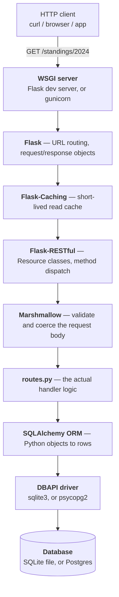
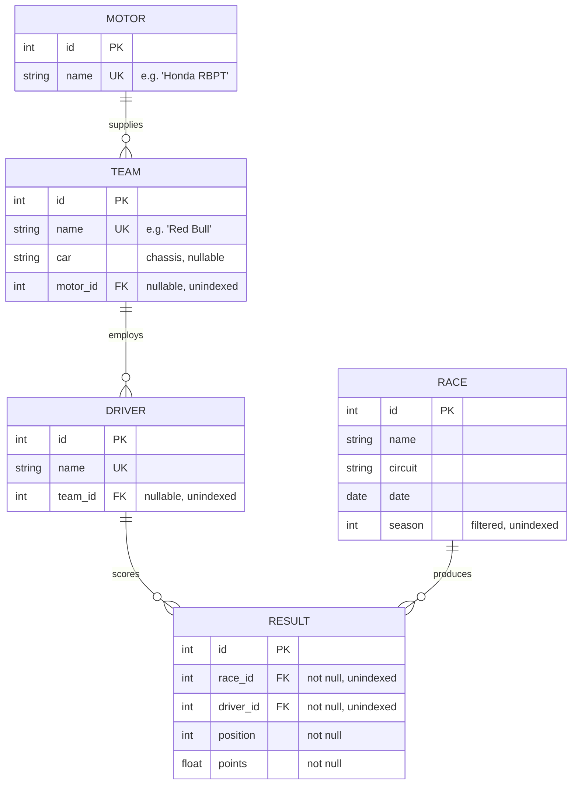
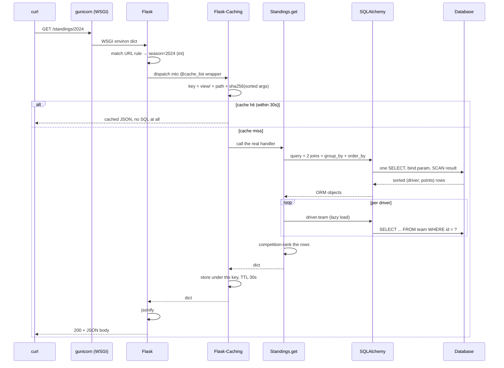

# F1 API — Explained

A from-first-principles walkthrough of every significant decision in this repository.

This document assumes **no prior knowledge** of Flask, SQLAlchemy, REST APIs, relational databases, Docker, Terraform, or AWS. It explains what each piece is, what problem it solves, why *this* path was chosen over the alternatives, and where it breaks. Every snippet is quoted verbatim from the repo.

It also documents what is *wrong* with the code. Thirteen findings in [[#Part 15 — Verified Findings]] were produced by installing the application and probing it — query counts from an event listener, execution plans from the database, status codes from a test client. None of them come from reading the source and reasoning about it. Where a claim is derived rather than observed, it says so.

> [!tip] If you only read one section
> Read [[#Part 8 — One Request, End to End]]. It follows a single real request through all nine layers, and everything else in this document is elaboration on that trace.

**Conventions used here.** Repository files are written as inline code with a line number — `application/routes/routes.py:129` — rather than as links, because they are source files rather than notes and a link to them resolves differently in every reader. Paths are relative to the repository root.

---

## Table of Contents

- [[#Part 0 — The Mental Model]]
- [[#Part 1 — Vocabulary, From Zero]]
- [[#Part 2 — The Data Model, and the Keys Argument]]
- [[#Part 3 — The Application Factory]]
- [[#Part 4 — The ORM Layer]]
- [[#Part 5 — The HTTP Layer]]
- [[#Part 6 — Validation]]
- [[#Part 7 — Standings, Computing Instead of Storing]]
- [[#Part 8 — One Request, End to End]]
- [[#Part 9 — Migrations]]
- [[#Part 10 — Caching]]
- [[#Part 11 — The OpenAPI Spec and Swagger UI]]
- [[#Part 12 — Seeding Real Data]]
- [[#Part 13 — Tests and CI]]
- [[#Part 14 — Docker, Postgres, and Deployment]]
- [[#Part 15 — Verified Findings]]
- [[#Part 16 — Key Decisions and Tradeoffs]]
- [[#Part 17 — Known Weaknesses]]
- [[#Part 18 — Exercises]]
- [[#Appendix — Glossary, Cheatsheet, Further Reading]]
- [[#Course Log]]

---

## Part 0 — The Mental Model

### What this project is

One program. It listens on a network port, receives text messages describing requests for Formula 1 data, reads or writes rows in a database, and sends back text messages containing JSON.

That is the whole of it. There is no user interface, no JavaScript, no HTML page except a documentation viewer. The product is the set of URLs it answers and the shapes it answers them with.

```
   any HTTP client                 this program                   a database
  (curl, browser,     ─────────►   Flask + SQLAlchemy  ────────►  SQLite (dev)
   Postman, an app)   ◄─────────   Python 3.11         ◄────────  Postgres (prod)
                        JSON                              SQL
```

### Why an API at all

An API is a *contract*, decoupled from any one consumer. A website, a phone app, and someone's data-science notebook can all ask `GET /standings/2024` and get the same answer. Nothing in this codebase knows or cares who is calling.

This repository has a second purpose, and understanding it explains most of the decisions below: **it is a deliberate rebuild of a rough 2022 prototype.** The original returned data, but it had a root-level `setup.py` holding global singletons, foreign keys pointing at name columns, no tests, no migrations, no validation, and a mass-assignment hole in every update handler.

Three documents form the spine of the rebuild, and they are worth reading in this order:

| File | What it is | Written when |
|---|---|---|
| `NOTES.md` | An inventory of everything wrong with the original | Phase 0, before any code changed |
| `docs/roadmap.md` | The phase-by-phase plan responding to those findings | Phase 0 |
| `CLAUDE.md` | The decision log — what was chosen and why | Updated as decisions were made |

> [!tip] Transferable lesson
> The most valuable artifact in this repo is `NOTES.md` — a written inventory of everything wrong with the code, produced by tracing it before touching it. You cannot safely extend code you have not read, and you cannot prove you improved something you never described. Write the inventory first, even when nobody asks for it.

### The layer cake

Every request passes down through these layers and the response comes back up. Each layer knows only about the one below it.


```mermaid
graph TD
    A["HTTP client<br/>curl / browser / app"] -->|"GET /standings/2024"| B
    B["<b>WSGI server</b><br/>Flask dev server, or gunicorn"] --> C
    C["<b>Flask</b> — URL routing, request/response objects"] --> D
    D["<b>Flask-Caching</b> — short-lived read cache"] --> E
    E["<b>Flask-RESTful</b> — Resource classes, method dispatch"] --> F
    F["<b>Marshmallow</b> — validate and coerce the request body"] --> G
    G["<b>routes.py</b> — the actual handler logic"] --> H
    H["<b>SQLAlchemy ORM</b> — Python objects to rows"] --> I
    I["<b>DBAPI driver</b><br/>sqlite3, or psycopg2"] --> J
    J[("<b>Database</b><br/>SQLite file, or Postgres")]
```

Nine layers to return a list of drivers is a lot. Each is buying something specific, and [[#Part 16 — Key Decisions and Tradeoffs]] argues about which ones earn their place.

### The shape of the repository

```
f1-api/
├── app.py                  # 8 lines. The WSGI entrypoint. Calls the factory.
├── application/            # The actual package.
│   ├── __init__.py         #   create_app() — the application factory
│   ├── config.py           #   config classes, one per environment
│   ├── extensions.py       #   unbound db / migrate / cache singletons
│   ├── models/             #   one file per table
│   ├── routes/routes.py    #   every HTTP handler (390 lines — the core)
│   ├── schemas.py          #   Marshmallow validation + response shapes
│   └── docs.py             #   hand-built OpenAPI spec
├── migrations/             # Alembic. The versioned history of the schema.
├── tests/                  # pytest. 37 tests, in-memory SQLite.
├── seed.py                 # Standalone: pull a real season from a public API.
├── scripts/                # Operator tooling (CloudFront URL signer).
├── terraform/aws/          # Infrastructure as code: ECS + RDS + CloudFront.
├── Dockerfile / docker-compose.yml
└── docs/                   # roadmap.md, and this file.
```

The single most important structural fact: **`app.py` is 8 lines long.** Everything lives in an importable package, and the app is *built by a function* rather than existing as a module-level global. [[#Part 3 — The Application Factory]] is entirely about why that matters.

---

## Part 1 — Vocabulary, From Zero

Skip this part if HTTP, JSON, SQL and ORMs are already familiar — though [[#Indexes, the part nobody declares]] and [[#WSGI and the concurrency model]] contain findings specific to this codebase that are easy to miss.

### Client, server, port

A **server** is a program that starts, opens a network **port**, and then waits, doing nothing until someone connects. A **client** initiates contact. A port is a number from 0 to 65535 so one machine can run many servers at once; this app uses `5000`. `localhost` always means "this machine" and resolves to `127.0.0.1`.

### HTTP, the message format

HTTP is a text request/response protocol. The client sends one request, the server sends exactly one response, and it is finished. HTTP is **stateless** — the server remembers nothing between requests unless you deliberately build memory in, such as a database or a cache.

A request has four parts:

```
POST /drivers HTTP/1.1                  ← method + path
Host: localhost:5000                    ← headers (metadata)
Content-Type: application/json
                                        ← blank line ends the headers
{"name": "Charles Leclerc"}             ← body (optional)
```

The blank line is structural, not cosmetic: it is how a parser knows the headers have ended and the body has begun.

### Methods, and the two properties that matter

The method is the verb. Beyond "which one reads and which one writes," two formal properties govern how the rest of the internet is allowed to treat your endpoints:

- **Safe** — the request does not change server state. A crawler, a browser prefetcher, or a proxy may issue it without asking.
- **Idempotent** — issuing it twice has the same effect as once. This is what makes automatic retries possible: a client that times out can resend without risking a duplicate.

| Method | Safe | Idempotent | Used here |
|---|:---:|:---:|---|
| `GET` | yes | yes | Read a resource or a list |
| `HEAD` | yes | yes | Automatic — headers only, no body |
| `OPTIONS` | yes | yes | Automatic — discover allowed methods |
| `POST` | no | **no** | Create a resource |
| `PUT` | no | yes | **Not implemented** |
| `PATCH` | no | **no** | Partially update a resource |
| `DELETE` | no | yes | Remove a resource |

`POST` is the one non-idempotent creator, and that is exactly why a double-submitted form creates two records. `DELETE` is idempotent in the formal sense — deleting an already-deleted thing leaves the world in the same state — even though this API returns `404` the second time, which is permitted.

`HEAD` and `OPTIONS` are not written anywhere in this codebase, but both work:

```
HEAD    /drivers  →  200, no body
OPTIONS /drivers  →  200
```

Flask synthesizes `HEAD` from `GET` and answers `OPTIONS` from its own routing table. Free behavior you inherit by using the framework correctly.

### Why this API has no PUT

`PUT` and `PATCH` both update, and the difference is one most APIs get wrong:

- **`PUT` replaces the entire resource.** The body is the complete new state. Any field you omit should be *cleared*, not left alone. `PUT /drivers/1 {"name": "Lewis"}` means "driver 1 is now a driver whose name is Lewis and who has no team."
- **`PATCH` applies a partial change.** Only the fields present are touched. `PATCH /drivers/1 {"name": "Lewis"}` means "change the name, leave everything else."

That difference is why `PUT` is idempotent and `PATCH` is not: replacing with the same body twice converges on the same state, whereas a patch can describe a relative change that compounds.

This API implements only `PATCH`, and sending `PUT` produces:

```
PUT /drivers/1  →  405 Method Not Allowed
Allow: POST, PATCH, DELETE, GET, HEAD, OPTIONS
```

That `Allow` header is correct and automatic — Flask builds it from the methods the resource actually defines. Hold onto this, because it is the direct contrast with [[#1. PATCH or DELETE on a collection URL returns 500 instead of 405]], where a method that *is* defined but cannot be called produces a `500` with no `Allow` header at all. The difference between those two responses is the difference between a method the framework knows is missing and a method that explodes after dispatch.

Omitting `PUT` is the right call here. Full-replacement semantics on a resource with required columns and foreign keys is a trap: a `PUT` that omits `team_id` must null it, which looks like data loss to the caller who simply forgot a field.

### Status codes

The first digit is the category, and the 4xx/5xx split is about **blame**:

| Range | Meaning | Who broke it | Retry? |
|---|---|---|---|
| `2xx` | Success | nobody | n/a |
| `3xx` | Redirection | nobody | follow it |
| `4xx` | Client error | **you** | not unchanged |
| `5xx` | Server error | **me** | maybe |

What this API uses:

| Code | Name | Used when |
|---|---|---|
| `200` | OK | A successful read, update, or delete |
| `201` | Created | A successful `POST` |
| `400` | Bad Request | Marshmallow rejected the body |
| `404` | Not Found | No row with that id |
| `405` | Method Not Allowed | A verb the resource does not define |
| `415` | Unsupported Media Type | Body sent without `Content-Type: application/json` |
| `500` | Internal Server Error | An unhandled Python exception |

That last row is the honest one. A `500` is always a bug: it means the server had no plan for what you did. [[#Part 15 — Verified Findings]] catalogues six distinct ways to provoke one with an ordinary request.

### REST and resources

**REST** is a style, not a specification. The relevant idea: model your domain as **resources** — nouns identified by URLs — and use HTTP methods as the verbs on them.

```
GET    /drivers        → list drivers
POST   /drivers        → create a driver
GET    /drivers/7      → read driver 7
PATCH  /drivers/7      → partially update driver 7
DELETE /drivers/7      → delete driver 7
```

The alternative is **RPC**, where you would have `POST /createDriver` and `POST /deleteDriver`. REST's payoff is uniformity: a client that understands one resource understands them all, and generic tooling — caches, documentation generators, HTTP libraries — can reason about your API without knowing your domain. This app leans on exactly that: the whole of `application/docs.py` is a loop over five resources that share one shape.

### Relational databases, tables, keys

A **table** is a grid. Each **row** is one thing; each **column** is one attribute with a fixed type.

- A **primary key** uniquely identifies a row. Here, always an auto-incrementing integer named `id`.
- A **foreign key** is a column holding another table's primary key — how rows point at each other. `driver.team_id` holds a `team.id`.
- A **constraint** is a rule the database enforces itself: `NOT NULL`, `UNIQUE`, or a foreign key's "this must reference a real row."

Constraints matter because the database is the *last* line of defense. Application code can forget a check; a constraint cannot be bypassed by a bug in a route handler — unless it is not switched on, which in this project's development database it is not. See [[#4. Foreign keys are not enforced in development but are in production]].

### Indexes, the part nobody declares

An **index** is a secondary data structure — usually a B-tree — that lets the database find rows matching a condition without reading every row. Without one, answering `WHERE season = 2024` means a **full table scan**: read every row, test each.

Two facts that together cause a real problem in this codebase:

1. **A primary key is automatically indexed.** So is a `UNIQUE` column. Both need an index to enforce uniqueness, so you get one for free.
2. **A foreign key is *not* automatically indexed.** Not in Postgres, not in SQLite, not in SQLAlchemy. The FK constrains *what values are legal*; it says nothing about how fast you can search them.

Point 2 surprises nearly everyone, because the FK column is precisely the one you join on. Here is what this schema actually creates, dumped from the live database:

```sql
sqlite_autoindex_motor_1    -- from UNIQUE (name)
sqlite_autoindex_team_1     -- from UNIQUE (name)
sqlite_autoindex_driver_1   -- from UNIQUE (name)
```

Three indexes, all incidental to a `UNIQUE` constraint on a name, plus the implicit primary keys. **Nothing on `result.race_id`, `result.driver_id`, `driver.team_id`, `team.motor_id`, or `race.season`** — which is to say, nothing on any column this application joins or filters by. The consequences are measured in [[#12. No index on any foreign key, so the hot queries are full table scans]].

### SQL, ORM, and the mapping

**SQL** is the query language databases speak:

```sql
SELECT driver.id, driver.name, driver.team_id FROM driver LIMIT 20 OFFSET 0;
```

An **ORM** maps Python objects to rows and generates that SQL for you. This project uses SQLAlchemy via Flask-SQLAlchemy:

```python
Driver.query.get_or_404(7)      # → SELECT ... FROM driver WHERE id = 7
db.select(Driver)               # → a SELECT statement object, not yet run
```

The trade is worth stating plainly. You get portability across engines — this project genuinely runs unmodified on SQLite and Postgres — protection from SQL injection, and navigable relationships. You pay with a large dependency, a learning curve, and **SQL you did not write and cannot see**. That last cost is not theoretical: [[#5. N+1 queries, measured]] shows one endpoint issuing 42 queries where two would do, and [[#12. No index on any foreign key, so the hot queries are full table scans]] shows those queries scanning entire tables.

### WSGI and the concurrency model

**WSGI** is the standard interface between a Python web application and a web server: a callable taking `(environ, start_response)`. Flask objects are WSGI applications, which is why `gunicorn app:app` in the Dockerfile needs no adapter — gunicorn imports the module `app`, finds the object named `app`, and calls it.

The part that matters operationally is how many requests that arrangement can serve at once. The Dockerfile says:

```dockerfile
CMD ["gunicorn", "--bind", "0.0.0.0:5000", "app:app"]
```

No `--workers`, no `--worker-class`. Gunicorn's defaults are **one worker** using the **sync** worker class, and a sync worker handles exactly one request at a time, start to finish. Combined with `ecs_desired_count = 1` in `terraform/aws/variables.tf`, the deployed configuration serves **one request concurrently**. A second request waits in the socket backlog until the first completes.

For a portfolio API this is fine, and it is worth knowing rather than discovering. It also explains why the N+1 problem matters more than it looks: with one sync worker, a request spending 40 milliseconds in avoidable database round-trips is 40 milliseconds during which the service answers nobody else.

> [!tip] Transferable lesson
> "How many requests can this serve at once" is a property of your process model, not your framework. Find out the number before you need it — the answer is usually set by a default you never typed.

### JSON, and the type it lacks

**JSON** has six types: string, number, boolean, null, array, object. Notably absent: **dates**. Every JSON number is a float.

The missing date type has a direct consequence here. `Race.date` is a Python `datetime.date`, which the JSON encoder refuses, so `application/routes/routes.py:38` converts it by hand:

```python
def serialize(item):
    def to_json_value(value):
        if isinstance(value, (datetime.date, datetime.datetime)):
            return value.isoformat()
        return value

    return {
        column: to_json_value(getattr(item, column))
        for column in item.__table__.columns.keys()
    }
```

`isoformat()` produces `"2024-05-26"` — unambiguous, sorts correctly as a string, and the right answer for a JSON API. The alternative, a Unix timestamp, is JSON-native but loses the distinction between "a date" and "a moment in time" and forces every client into timezone arithmetic.

The "every number is a float" half of that paragraph also causes a live bug, documented in [[#13. Integer fields silently truncate floats]].

---

## Part 2 — The Data Model, and the Keys Argument

### The five tables


```mermaid
erDiagram
    MOTOR  ||--o{ TEAM   : "supplies"
    TEAM   ||--o{ DRIVER : "employs"
    DRIVER ||--o{ RESULT : "scores"
    RACE   ||--o{ RESULT : "produces"

    MOTOR {
        int id PK
        string name UK "e.g. 'Honda RBPT'"
    }
    TEAM {
        int id PK
        string name UK "e.g. 'Red Bull'"
        string car "chassis, nullable"
        int motor_id FK "nullable, unindexed"
    }
    DRIVER {
        int id PK
        string name UK
        int team_id FK "nullable, unindexed"
    }
    RACE {
        int id PK
        string name
        string circuit
        date date
        int season "filtered, unindexed"
    }
    RESULT {
        int id PK
        int race_id FK "not null, unindexed"
        int driver_id FK "not null, unindexed"
        int position "not null"
        float points "not null"
    }
```

`RESULT` is the interesting table: a **join table with payload**. It connects a race to a driver — the many-to-many relationship "who drove in what" — and carries the facts of that pairing, `position` and `points`. Everything the API computes about championships comes from aggregating this one table.

### Natural keys versus surrogate keys

This is the most important design change in the rebuild, and the concept most worth keeping even if you forget the project.

The 2022 code had:

```python
# the ORIGINAL — do not copy
class Driver(db.Model):
    team_name = db.Column(db.String(80), db.ForeignKey('team.name'))
```

The foreign key pointed at `team.name` — a **natural key**, made of real-world data. The rebuild changed it to a **surrogate key**, a meaningless auto-increment integer (`application/models/Driver.py:6`):

```python
team_id = db.Column(db.Integer, db.ForeignKey('team.id'))
```

Four reasons, in increasing order of how much they hurt:

1. **Renames become schema surgery.** F1 teams are renamed constantly — Alfa Romeo became Stake became Audi. With a natural key, a rename must update the name in every child row of every referencing table, atomically. With a surrogate key it is one statement and every dependent query is instantly correct, because nothing ever stored the name.
2. **You are forced into a `UNIQUE` constraint on a display string.** A foreign key target must be unique, so `team.name` has to be unique forever. That is a *presentation* field carrying *structural* responsibility: two teams can never share a name, and a display name can never be edited freely.
3. **Wider rows and wider indexes.** An 80-character string in every child row and index entry versus a 4-byte integer. The least important reason, and the one people quote first.
4. **Typos resolve to `None` instead of failing.** The original's create handlers did `Team.query.filter_by(name=request.json['team'])`. A client sending `"Mercedez"` got `None` and a driver silently created with no team. With ids, a bad id is a number that either exists or does not — and the database can be asked to enforce that.

### What a rename actually costs

Reason 1 deserves the concrete version, because "renames are painful" is abstract until you write the statements.

Under the **natural-key** schema, renaming Alfa Romeo to Stake means:

```sql
BEGIN;
  -- Every table referencing team.name must be updated in lockstep.
  UPDATE driver SET team_name = 'Stake' WHERE team_name = 'Alfa Romeo';
  UPDATE team   SET name      = 'Stake' WHERE name      = 'Alfa Romeo';
  -- ...and any other referencing table, forever, as the schema grows.
COMMIT;
```

Ordering matters, the foreign key must be deferrable or momentarily violated, and every *new* referencing table added later becomes another line in this transaction that someone has to remember.

Under the **surrogate-key** schema:

```sql
UPDATE team SET name = 'Stake' WHERE id = 9;
```

One row. No child tables touched, because no child table ever recorded the name. The rename is a data change rather than a structural one.

> [!tip] Transferable lesson
> Identity and description are different jobs. A surrogate key's only property is that it identifies a row; because it means nothing, it can never become wrong. The moment a key carries meaning, every change to that meaning becomes a migration.

The counter-argument, stated fairly: natural keys make raw SQL readable — `WHERE team_name = 'Ferrari'` needs no join — and can remove a join from lookups you do constantly. For a reporting schema or a data warehouse that is a real argument. For a transactional API whose entities get renamed, it is not.

Note the idea is not banished, only moved to where it belongs. `seed.py` looks rows up *by name* deliberately, because a name is the only identifier the upstream API and this database share. See [[#Idempotency]]. The lesson is not "never match on names" but "do not make a name the thing your schema is wired together with."

### The column that was deleted

The original `Driver` had a `wins` integer. Once `Result` rows exist, it is derivable:

```sql
SELECT count(*) FROM result WHERE driver_id = 7 AND position = 1;
```

So it was dropped, in `migrations/versions/90c5b2fc29cd_...py`:

```python
with op.batch_alter_table('driver', schema=None) as batch_op:
    batch_op.drop_column('wins')
```

Storing a value you can compute means storing a value that can **disagree** with the truth. Every write path creating a `Result` would have to remember to bump `wins` — forever, including the seeder, including manual corrections, including whatever gets added next year. One forgotten increment and the number is wrong with nothing to detect it.

The same reasoning drives `/standings/<season>` computing the championship on every request instead of maintaining a standings table ([[#Part 7 — Standings, Computing Instead of Storing]]).

> [!tip] Transferable lesson
> Derived data is a cache, whether or not you call it one. Caches go stale. Accept that cost only knowingly, in exchange for a measured speedup — not as a default while designing a schema.

### What the schema does not declare

Three absences are worth naming, because each is a decision by omission.

**No indexes beyond the implicit ones.** Covered in [[#Indexes, the part nobody declares]] and measured in [[#12. No index on any foreign key, so the hot queries are full table scans]]. This is the one with a real cost today.

**No `ON DELETE` behavior.** The foreign keys declare *what* must be true but not what happens when a parent disappears. Deleting a `Race` that has results relies on SQLAlchemy's default, which is to null the child's FK — but `Result.race_id` is `NOT NULL`, so on Postgres that is an `IntegrityError` and a `500`. Under SQLite with constraints off, the inconsistency is simply written. An explicit `ondelete="CASCADE"` (delete the results with the race) or `ondelete="RESTRICT"` (refuse while results exist) would make the intent part of the schema rather than an accident of ORM defaults.

**No `CHECK` constraints.** `position >= 1` and `points >= 0` are enforced in Marshmallow and nowhere else, which means they hold for requests through the API and not for `seed.py`, a migration, or anyone with a database connection. Moving them into the schema would make them true universally. The counter-argument is that database constraints are harder to change than code — which is exactly the point of putting the stable rules there.

> [!tip] Transferable lesson
> Ask of every invariant: *where is this actually enforced?* A rule that lives only in a request handler protects only the requests that go through that handler.

---

## Part 3 — The Application Factory

This part explains an eight-line file and a three-line file, and it is the most structurally important part of the document.

### What the original did, and why it was a trap

The 2022 code kept the live Flask app, the database handle, and the API object as module-level globals in a root-level `setup.py`. Route modules did `from setup import db`, reaching up out of the package.

Three problems, from cosmetic to fatal:

1. **`setup.py` is a reserved-by-convention filename**, used by setuptools to describe an installable package. A running application there guarantees confusion and eventually a tooling collision.
2. **It is an upward import.** `application/routes/routes.py` importing from a root-level module means the package cannot be installed, moved, or imported on its own. The import graph points the wrong way: inner code depended on outer code.
3. **The app was built at import time, so its configuration was frozen at import time.** This is the fatal one.

Point 3 is worth making concrete, because it is the difference between a testable and an untestable codebase:

| | Built at import time | Built by a factory |
|---|---|---|
| When config is chosen | The moment any module imports it | Each time you call the function |
| A test wanting a different database | Monkeypatch globals, or mutate config and hope nothing read it | `create_app("testing")` |
| Two apps in one process | Impossible | Normal |
| What decides the config | Import order | An argument |

That is why the restructure had to happen *before* the tests could be written, and why `CLAUDE.md` made it its own phase (0.5) with its own pull request.

### The fix, build the app inside a function

`app.py`, the entire file:

```python
import os

from application import create_app

app = create_app(os.environ.get("FLASK_CONFIG", "default"))

if __name__ == "__main__":
    app.run(debug=True)
```

Two responsibilities and nothing else: read one environment variable to decide *which* configuration, and hold the result under the name `app` so `gunicorn app:app` can find it.

The `if __name__ == "__main__"` guard is load-bearing. When you run `python app.py`, Python sets that module's `__name__` to `"__main__"` and the development server starts. When gunicorn *imports* the module, `__name__` is `"app"`, the guard is false, and gunicorn does the serving instead. Notice what that prevents: shipping the debug server — and its interactive console, which executes arbitrary Python from the browser — to production by accident.

`application/__init__.py`, the factory:

```python
def create_app(config_name="default"):
    app = Flask(__name__)
    app.config.from_object(config[config_name])

    db.init_app(app)
    migrate.init_app(app, db)
    cache.init_app(app)

    from .routes.routes import Driver, Motor, Team, Race, RaceResults, Result, Standings

    api = Api(app)
    api.add_resource(Motor, "/motors", "/motors/<int:id>")
    api.add_resource(Team, "/teams", "/teams/<int:id>")
    api.add_resource(Driver, "/drivers", "/drivers/<int:id>")
    api.add_resource(Race, "/races", "/races/<int:id>")
    api.add_resource(RaceResults, "/races/<int:id>/results")
    api.add_resource(Result, "/results", "/results/<int:id>")
    api.add_resource(Standings, "/standings/<int:season>")
```

Four steps: create an empty app, apply a named configuration, attach the extensions to *that* app, register the URLs.

One detail that is easy to miss: `app.config.from_object()` copies only attributes whose names are **entirely uppercase**. A lowercase attribute on a config class is silently ignored. That is why every setting in `config.py` is screaming-case, and why a typo like `Cache_Type` fails without an error.

The payoff appears in `tests/conftest.py:14`:

```python
@pytest.fixture
def app():
    app = create_app("testing")
```

One string, and you have a separate application pointed at a throwaway in-memory database. No monkeypatching, no global mutation, no import-order puzzles.

> [!tip] Transferable lesson
> Anything constructed at import time has its configuration decided at import time. Wrapping construction in a function turns a fixed global into a parameterized factory, and testability is usually just the first benefit you notice.

### The unbound-extension pattern

`application/extensions.py`:

```python
db = SQLAlchemy()
migrate = Migrate()
cache = Cache()
```

Three objects created with no app. How can a database handle exist without knowing its database?

Because construction happens in two phases. `SQLAlchemy()` creates the *machinery* — the model base class, the metadata registry, the session factory — none of which needs a connection string. Then `db.init_app(app)` reads `app.config["SQLALCHEMY_DATABASE_URI"]` and builds the engine.

This split is what lets models be defined at module scope. `application/models/Driver.py` begins:

```python
from ..extensions import db

class Driver(db.Model):
```

`db.Model` must exist when this module is imported, long before any app is configured. If `db` needed an app, you would have a cycle: models need `db`, `db` needs the app, the app's factory imports the models.

Note the relative import `from ..extensions import db` — two dots, "up one package." That is an *internal* reference, the opposite of the original's `from setup import db`, which pointed outside the package entirely. The package is now self-contained.

### The one extension that is not a singleton

The docstring at the top of `extensions.py` records a constraint invisible from the code:

```python
"""
Flask-RESTful's ``Api`` doesn't support being re-bound to a second app once
its resources are registered (each ``add_resource()`` call attaches routes
directly to whichever app it's bound to), so it isn't a shared singleton
here — ``create_app()`` builds a fresh ``Api(app)`` each time, which is what
lets it be called more than once (e.g. once per test).
"""
```

`db`, `migrate` and `cache` implement the two-phase `init_app` protocol. Flask-RESTful's `Api` does not — `add_resource()` registers URL rules on one specific app immediately. So `Api` is constructed *inside* the factory, once per app.

This matters directly for the test suite. The `app` fixture is function-scoped, so `create_app("testing")` runs once per test — 37 times. A module-level `Api` would try to re-register `/motors` on each new app.

> [!tip] Transferable lesson
> "Use the app factory pattern" is not a rule you can apply uniformly, because it depends on every extension cooperating. When one does not, find out why before working around it, and write the reason down — otherwise the next person "fixes" your inconsistency and breaks the tests.

### The deferred import

Inside the factory:

```python
    from .routes.routes import Driver, Motor, Team, Race, RaceResults, Result, Standings
```

An import in the middle of a function is normally a smell. Here it is load-bearing. `routes.py` imports `db` and `cache` from `extensions` and imports the models, which need `db.Model`. Putting this at the top of `application/__init__.py` creates a cycle: `application` → `routes` → `models` → `extensions`, while `application` is still mid-initialization.

Deferring it until `create_app()` *runs* means `application/__init__.py` has finished importing and the cycle is broken by timing rather than by restructuring.

The honest assessment: this works, it is idiomatic in the Flask world, and it is also a workaround for a mutual dependency between the factory and the routes. A larger application would invert it — routes declared in blueprints the factory registers without importing their internals. At seven resources in one file, the deferred import is the smaller cost.

### Configuration by class

`application/config.py`:

```python
class Config:
    SQLALCHEMY_TRACK_MODIFICATIONS = False
    CACHE_TYPE = "SimpleCache"
    CACHE_DEFAULT_TIMEOUT = 30


class DevelopmentConfig(Config):
    SQLALCHEMY_DATABASE_URI = "sqlite:///" + os.path.join(basedir, "data.db")


class TestingConfig(Config):
    TESTING = True
    SQLALCHEMY_DATABASE_URI = "sqlite://"
    CACHE_TYPE = "NullCache"
```

Shared defaults in a base class, per-environment differences in subclasses. Inheritance means a new setting added to `Config` applies everywhere at once — you cannot forget one environment.

Details worth naming:

**`sqlite://` with two slashes, not three.** `sqlite:///path/to/file.db` is a file; `sqlite://` with no path is an **in-memory** database that exists only inside the process and vanishes when it exits. That one missing slash is what makes 37 tests run in 0.87 seconds, each with a freshly created schema.

**`SQLALCHEMY_TRACK_MODIFICATIONS = False`** disables a signal system that fires an event on every object change. It costs memory and CPU, almost nobody uses it, and leaving it unset emits a deprecation warning.

**`CACHE_TYPE = "NullCache"` in testing** makes the cache a no-op, so a `POST` in one test cannot be served from a cache populated by another. The consequence is that caching behavior is then untested by default — which `tests/test_caching.py` solves cleverly, in [[#The cleverest test in the suite]].

**`TESTING = True`** does more than it looks: it makes Flask propagate exceptions instead of converting them to `500` responses. That is why the probes in [[#Part 15 — Verified Findings]] had to turn it off to observe the status codes a real client receives — with it on, the exception surfaces as a traceback instead.

`ProductionConfig` is the only one reading the environment, and it does one non-obvious thing:

```python
def _normalize_database_url(url):
    # Render/Heroku-style connection strings use the "postgres://" scheme,
    # which SQLAlchemy 2.0 no longer accepts.
    if url.startswith("postgres://"):
        return url.replace("postgres://", "postgresql+psycopg2://", 1)
    return url
```

A SQLAlchemy URL's scheme names the **dialect and driver**: `postgresql+psycopg2://` is "PostgreSQL, via the psycopg2 library." SQLAlchemy dropped the bare `postgres://` alias in 2.0, several hosting platforms still hand out `DATABASE_URL` in the old form, and you cannot edit a managed provider's injected variable. So the app normalizes at the boundary.

The `1` in `.replace(..., 1)` limits it to the first occurrence, so a password containing the literal text `postgres://` cannot be corrupted. Cheap paranoia in exactly the right place.

> [!tip] Transferable lesson
> Normalize hostile-but-unavoidable input at the boundary, once, in a named function. The alternative — every consumer remembering to handle both spellings — is a bug waiting for the one place you forget.

---

## Part 4 — The ORM Layer

### Columns versus relationships

`application/models/Result.py`, the most connected model:

```python
class Result(db.Model):
    id = db.Column(db.Integer, primary_key=True)
    race_id = db.Column(db.Integer, db.ForeignKey('race.id'), nullable=False)
    driver_id = db.Column(db.Integer, db.ForeignKey('driver.id'), nullable=False)
    position = db.Column(db.Integer, nullable=False)
    points = db.Column(db.Float, nullable=False)

    race = db.relationship("Race", back_populates="results")
    driver = db.relationship("Driver", back_populates="results")
```

Two kinds of attribute, and confusing them is the classic beginner error:

- **`db.Column`** is a real column in the real table. `race_id` holds an integer.
- **`db.relationship`** is **not a column**. Nothing about it exists in the database. It is a Python-level convenience: when someone reads `result.race`, go fetch the `Race` whose `id` matches `race_id` and hand back the object.

So `result.race_id` is a number that exists in the table; `result.race` is an object assembled on demand. The foreign key is the truth, the relationship is navigation.

Table names are never declared — Flask-SQLAlchemy derives `race` from `Race` by converting CamelCase to snake_case, which is why the FK strings read `'race.id'` in lowercase.

### back_populates versus backref

This codebase uses both, which is worth examining because it is the most common source of SQLAlchemy confusion.

**`back_populates` — explicit**, used by `Race`, `Driver` and `Result`:

```python
# Result.py
race = db.relationship("Race", back_populates="results")

# Race.py
results = db.relationship("Result", back_populates="race")
```

Both sides are written out, each naming the attribute on the other. Verbose and symmetrical: reading `Race.py` tells you `race.results` exists without opening `Result.py`.

**`backref` — implicit**, used by `Motor` and `Team`:

```python
# Team.py
driver = db.relationship("Driver", backref='team')
```

One declaration creates *two* attributes: `team.driver` here, and `driver.team` **injected onto the `Driver` class at import time**. Read `application/models/Driver.py` end to end and you will not find `team` anywhere — yet `driver.team` works, and `application/routes/routes.py:86` depends on it:

```python
def serialize_result_with_driver(result):
    driver = result.driver
    team = driver.team          # ← this attribute is declared in Team.py
```

That invisible attribute is why modern SQLAlchemy documentation recommends `back_populates` and treats `backref` as legacy. Half the model's interface is declared in a different file, with nothing at the definition site to tell you.

The mixed usage is honest history rather than design: `Motor` and `Team` are inherited from the 2022 code, while `Race`, `Result` and `Driver.results` were written fresh in Phase 2. Unifying them is [[#Exercise 2 — Unify backref and back_populates]].

### The relationship named in the singular

```python
# Motor.py
team = db.relationship("Team", backref='motor')
```

`Motor.team` returns a **list**, because one engine supplier equips many teams — Mercedes power units in Mercedes, McLaren, Williams and Aston Martin. So `motor.team` is a list called `team`, and `Team.driver` is a list called `driver`.

`NOTES.md` flagged this in Phase 0 and it is still here, because renaming is an API-visible change no phase had a reason to make. It is a naming bug rather than a behavior bug — but it is exactly the kind that makes the next person write `if motor.team:` expecting an object and get a truthiness check on a list. The other side of both relationships is correctly plural (`driver.results`, `race.results`), which makes the inconsistency more jarring, not less.

### The session, the unit of work, and the identity map

Everything the ORM does passes through a **session**. Three ideas are worth having explicitly, because the rest of this document refers to them.

**The session is a unit of work.** You attach objects to it, modify them, and at `commit()` it works out the minimal set of `INSERT`, `UPDATE` and `DELETE` statements and sends them in one transaction. You never write those statements.

**The session is an identity map.** Within one session, one database row maps to exactly one Python object. Query the same driver twice and you get the *same object*, not two equal copies. This is why mutating `driver.name` in one place is visible everywhere in that request, and why an object's state is coherent.

**The session is scoped to the application context.** Flask-SQLAlchemy ties the session's lifetime to Flask's app context, which is pushed per request and popped afterwards. So each request gets a fresh session, and whatever state it accumulated — including a failed transaction — is discarded at the end. That containment is the mechanism behind [[#7. No rollback after a failed commit, contained by per-request teardown]].

Two of its behaviors are invisible until they surprise you, so here they are measured.

### Autoflush, measured

A query issued while the session has pending changes will **flush** them first, so the query sees your own uncommitted work. Instrumenting the engine and querying for a row that has been `add()`ed but not committed:

```
query before commit found the pending row: True
statements emitted by that query: 2
    INSERT INTO driver (name, team_id) VALUES (?, ?)
    SELECT driver.id AS driver_id, driver.name AS driver_name, ...
```

The `INSERT` was not requested. SQLAlchemy emitted it because the `SELECT` would otherwise return a stale answer.

This is why `seed.py`'s get-or-create functions work. `Motor.query.filter_by(name=name).first()` sees motors added earlier in the same run even before any commit, so the same name encountered twice resolves to one row rather than inserting a duplicate.

It also explains a confusing failure mode: an `IntegrityError` raised from a line that is only a *query*. The query did not violate anything — the autoflush it triggered did.

### expire_on_commit, measured

By default, `commit()` marks every object in the session as **expired**. The next attribute access reloads it:

```
statements from reading d.name AFTER commit: 1
    SELECT driver.id AS driver_id, driver.name AS driver_name, ...
```

One extra `SELECT` for touching an attribute you already had. The reason is correctness: after a commit, another transaction may have changed the row, so SQLAlchemy refuses to serve a value it can no longer vouch for.

Every write handler in this codebase pays this: `makeData(driver, ...)` after `db.session.commit()` re-reads the row it just wrote. Harmless at this scale, and worth recognizing as the cause when a "simple" endpoint emits more queries than it appears to.

There is a notable exception, and it resolves a mystery. For an object that was **deleted** and committed, SQLAlchemy does not expire it — it evicts it from the session entirely, leaving it **detached with its attribute values intact**:

```
after delete+commit -> persistent: False | deleted: False | detached: True
expired attribute names: none (values retained)
serialize() of the deleted object -> {'id': 1, 'name': 'Merc PU'}
SQL emitted while serializing: 0
```

Zero statements. That is why every `DELETE` handler can end with `makeData(item, "Resource succesfully deleted")` and return the row it just destroyed: the values are read from memory, and the database is never asked about a row that no longer exists. It looks like it should fail and it does not, for a specific and findable reason.

> [!tip] Transferable lesson
> When code looks like it should break but does not, you have not found a lucky accident — you have found a behavior you do not understand yet. Go and find the mechanism. The alternative is "fixing" it later and breaking something real.

### Lazy loading, and the cost hiding inside it

By default, relationships are **lazy**: related rows are fetched on first attribute access, not when the parent loads. So:

```python
for result in race.results:
    driver = result.driver      # one SELECT per iteration
    team = driver.team          # another SELECT per iteration
```

With 20 results that is 40 extra queries. This is the **N+1 query problem**, and it is not hypothetical here — [[#5. N+1 queries, measured]] has the counts.

Lazy loading is a defensible default: loading a `Race` should not drag in the entire results table. What makes it dangerous is that it renders an expensive operation — a network round-trip to the database — as an ordinary attribute access. The cost is invisible at the call site. That is the ORM's central tradeoff in one line.

The fix is an eager loading strategy, telling SQLAlchemy to fetch the related rows in the same query:

```python
from sqlalchemy.orm import joinedload

db.session.execute(
    db.select(Result)
      .where(Result.race_id == id)
      .options(joinedload(Result.driver).joinedload(Driver.team))
)
```

That is [[#Exercise 4 — Kill the N+1 and index the joins]], the highest-value exercise here.

> [!tip] Transferable lesson
> An abstraction that hides a cost will eventually be used as if the cost were not there. When you adopt an ORM, adopt a way to *see* its queries at the same time — query logging, or an assertion on query counts in a test. Otherwise you find out in production.

---

## Part 5 — The HTTP Layer

`application/routes/routes.py` is 390 lines and holds every handler. It is the core of the project.

### Flask-RESTful resources

Plain Flask associates a *function* with a URL and a method list. Flask-RESTful associates a *class* with a URL and dispatches by method name:

```python
class Motor(fr.Resource):
    def get(self, id=None): ...
    def post(self): ...
    def patch(self, id): ...
    def delete(self, id): ...
```

`GET` calls `get()`, `POST` calls `post()`. It also serializes returned dicts to JSON, so `return data, 201` is a complete response.

Both URLs map to the same class (`application/__init__.py:20`):

```python
api.add_resource(Motor, "/motors", "/motors/<int:id>")
```

`<int:id>` is a **converter**: it matches only digits and passes `id` as an `int`. So `/motors/abc` 404s at the routing layer before any handler runs — free input validation, and the reason no handler ever checks whether `id` is a number.

This is also the source of the `id=None` default. One class serves both the collection and the item, so every `get` branches:

```python
if not id:
    return paginated_data(db.select(motorModel.Motor))
else:
    motor = motorModel.Motor.query.get_or_404(id)
```

Two things to notice, one stylistic and one an actual bug.

The stylistic one: `if not id` is a truthiness test where an identity test belongs. It is correct only because auto-increment ids start at 1, so no real row has id `0`. Seed a table from zero and the collection branch fires for a valid row. `if id is None` says what is meant and costs nothing.

The bug: this arrangement means `PATCH /motors` — the collection, no id — dispatches into `patch(self, id)` with no `id`, raising `TypeError` and returning **500 instead of 405**. See [[#1. PATCH or DELETE on a collection URL returns 500 instead of 405]].

### How method dispatch really works

Understanding why that bug produces a `500` rather than a `405` requires knowing where the two decisions happen, because they are in different layers.

1. **Werkzeug routing** matches the URL and checks the method against the set registered for that rule. A method not in the set is rejected here with `405` and a correct `Allow` header, and no application code runs.
2. **Flask-RESTful dispatch** then looks up the method by name on the resource class and calls it with the URL's captured arguments.

Flask-RESTful registers the *union* of methods the class defines, against *every* URL the resource is bound to. `Motor` defines `patch`, so `PATCH` is registered for `/motors` and `/motors/<int:id>` alike. Step 1 therefore passes, step 2 calls `patch()` with no `id`, and Python raises before the body runs.

The contrast is exact and measurable:

| Request | Where it is decided | Result |
|---|---|---|
| `PUT /drivers/1` | Routing — `put` is not defined | `405` + `Allow: POST, PATCH, DELETE, GET, HEAD, OPTIONS` |
| `POST /races` | Routing — `Race` defines only `get` | `405` + `Allow` |
| `PATCH /motors` | Dispatch — `patch` exists but cannot be called | `500`, no `Allow` |

Both of the first two are correct REST behavior obtained for free. The third is the cost of binding one class to two URL shapes with per-method signatures that disagree about it.

> [!tip] Transferable lesson
> When a framework gives you the right answer in two cases and the wrong one in a third, the difference is usually which layer made the decision. Find the layer, and the fix is usually obvious — here, a default argument.

### The helper vocabulary

Six small functions do the repetitive work. Learning these six is most of learning the file.

**`serialize(item)`** — one ORM object to a plain dict, quoted in [[#JSON, and the type it lacks]]. It iterates `item.__table__.columns.keys()`, reflecting over whatever columns the table has.

That reflection is a genuine double-edged decision. Upside: add a column to a model and it appears in the API with no route changes. Downside: **add a column to a model and it appears in the API with no route changes.** There is no allow-list. The day someone adds `Driver.internal_notes`, or a `password_hash` to any model, it is publicly served and no test fails. For a read-only public dataset of F1 facts this is fine and saves real work; the moment one private field exists it is a leak. The fix is an explicit output schema per model — Marshmallow is already a dependency, and `application/schemas.py` already has the classes, used only for documentation.

**`makeData(item, message=None, single=True)`** wraps the payload in an envelope:

```python
def makeData(item, message = None, single = True):
    data = {"message": message} if message else {}
    if single:
        data["data"] = serialize(item)
    else:
        data["data"] = [serialize(element) for element in item]
    return data
```

So responses are `{"data": {...}}` rather than a bare object. The envelope earns its nesting by leaving room to add fields — `message`, and the pagination keys below — without changing the *type* of the response. Returning a bare top-level JSON **array** is the specific thing to avoid: you can never add a sibling field to an array without breaking every client.

The function is a small relic. The original `makeData` built the id-keyed shape Phase 1 removed, and the `single=False` branch is now dead — `paginated_data` handles every list.

**`paginated_data(query)`** — the list response:

```python
def paginated_data(query):
    page = request.args.get("page", 1, type=int)
    per_page = request.args.get("per_page", 20, type=int)

    result = db.paginate(query, page=page, per_page=per_page, error_out=False)

    return {
        "data": [serialize(item) for item in result.items],
        "page": result.page,
        "per_page": result.per_page,
        "total": result.total,
        "pages": result.pages,
    }
```

Pagination exists because `GET /results` on one season is roughly 450 rows and on ten seasons 4,500 — and the server must build all of them in memory before sending. Unbounded list endpoints are how APIs fall over.

`db.paginate` issues **two** queries, confirmed by instrumentation: one `SELECT ... LIMIT ? OFFSET ?` for the page, and one `SELECT count(*)` for `total`. The count is what lets a client render "page 3 of 12" instead of requesting pages until one comes back empty. It is also unindexed work — `SCAN driver` — so it costs a full pass over the table on every list request. At this data size that is nothing; at a million rows, counting is the expensive half of pagination and the usual answer is to drop `total` or approximate it.

`request.args.get(..., type=int)` returns the default rather than raising when a value will not parse, so `?per_page=abc` quietly becomes 20 (verified). Defensible for a query parameter, and it never produces a `500`.

`error_out=False` is the important flag. By default Flask-SQLAlchemy's `paginate` **aborts with a 404** for an out-of-range page. With it off, `?page=99999` returns `200` with an empty `data` array (verified). That is right: an empty page is not a missing resource, and a client paging through a shrinking dataset should not get a `404` for a page that existed a second ago.

The gap: **`per_page` has no upper bound**. See [[#6. per_page is unbounded]].

**`load_or_400(schema, json_body)`** — validation, in [[#The bridge to HTTP]].

**`cache_list(f)`** — caching, in [[#Part 10 — Caching]].

**`serialize_result_with_driver(result)`** — the one hand-written nested shape:

```python
def serialize_result_with_driver(result):
    driver = result.driver
    team = driver.team

    return {
        "id": result.id,
        "position": result.position,
        "points": result.points,
        "driver": {
            "id": driver.id,
            "name": driver.name,
            "team": {"id": team.id, "name": team.name} if team else None,
        },
    }
```

This is what `GET /races/<id>/results` returns, and it is the project's first real **multi-table join** surfaced to a client: it answers the question a caller actually has — who finished where, and for whom — in one request instead of three.

The `if team else None` matters: `Driver.team_id` is nullable, so a driver with no team is legal, and without the guard the endpoint would `500` on `None.id`. The test suite covers that case — `tests/test_standings.py` asserts `standings[0]["driver"]["team"] is None` for a team-less driver. Guarding a nullable FK *and* testing the null case is the pattern; the guard alone is only half of it.

Two flaws: this is where the N+1 lives, and the endpoint is neither paginated nor cached, so a race with many results is unbounded work on every call.

### 404 handling

The original crashed on a missing id: `Model.query.get(id)` returned `None` and `makeData(None)` raised `AttributeError` — a `500` for an ordinary request.

The fix throughout is `get_or_404`:

```python
motor = motorModel.Motor.query.get_or_404(id)
```

It fetches by primary key and raises Werkzeug's `NotFound` if there is no row, which Flask renders as a clean `404`. Crucially, the code after it needs no `if`. A guard clause that raises is how you keep the happy path unindented.

One wrinkle the test run surfaces: `get_or_404` is built on `Query.get()`, which SQLAlchemy 2.0 considers legacy. The suite prints 18 of these:

```
LegacyAPIWarning: The Query.get() method is considered legacy as of the 1.x
series of SQLAlchemy and becomes a legacy construct in 2.0.
```

Which sits awkwardly beside `CLAUDE.md`'s decision to use "SQLAlchemy 2.0-style usage" — the list queries were modernized to `db.select(...)`, the by-id lookups were not. `db.get_or_404(Model, id)` is the 2.0-style equivalent: [[#Exercise 1 — Silence the legacy Query.get warnings]].

---

## Part 6 — Validation

### The original's hole

Every update handler in the 2022 code did this:

```python
for column in request.json:
    setattr(item, column, request.json[column])
```

Read it as an instruction: *for every key the client sent, set that attribute on the database object.* The client chooses which fields to write. That is **mass assignment**, a genuine vulnerability class — the same bug that let someone add themselves to the Rails core team on GitHub in 2012.

Against this schema: `PATCH /motors/1` with `{"id": 999}` rewrites the primary key, and every `team.motor_id` pointing at motor 1 is left dangling. **This still works in this codebase** — see [[#2. Mass assignment survives on Motor and Team]].

The general principle is that `request.json` is attacker-controlled: the client decides the keys, the values, the types, the nesting depth and the size. Iterating over it and calling `setattr` hands the client your object model.

### Schemas as an allow-list

`application/schemas.py` declares what is acceptable:

```python
class DriverSchema(Schema):
    name = fields.String(required=True, validate=validate.Length(min=1))
    team_id = fields.Integer(required=False, allow_none=True)


class ResultSchema(Schema):
    race_id = fields.Integer(required=True)
    driver_id = fields.Integer(required=True)
    position = fields.Integer(required=True, validate=validate.Range(min=1))
    points = fields.Float(required=True, validate=validate.Range(min=0))
```

Marshmallow does three jobs at once, and separating them is worthwhile:

1. **Validation** — is `position` present, an integer, at least 1?
2. **Coercion** — turning acceptable input into the declared type.
3. **Filtering** — a field not declared is not accepted. Marshmallow raises on unknown keys, so `POST /drivers` with `{"name": "New Guy", "wins": 99}` returns:

```json
{"message": "Validation error", "errors": {"wins": ["Unknown field."]}}
```

The schema is an allow-list, and the allow-list is the whole point. There is no way to reach `Driver.id` through it, because `id` is not in it.

`validate.Range(min=1)` on `position` and `min=0` on `points` encode domain rules the *database* does not: both engines will happily store `position = -5`. Nobody finishes a race in position −5.

### What coercion actually does, measured

"Coercion" sounds harmless. It is where the surprises live, so here is the measured behavior of these exact schemas:

| Input | Field type | Result | Why |
|---|---|---|---|
| `"3"` | Integer | `3` | String of digits parses cleanly |
| `"18.5"` | Float | `18.5` | String parses as a float |
| `"1e2"` | Float | `100.0` | Scientific notation is valid float syntax |
| `25` | Float | `25.0` | Widening int to float is lossless |
| `3.7` | Integer | **`3`** | **Truncated, accepted, no warning** |
| `"4.9"` | Integer | rejected — "Not a valid integer" | String must be integer syntax |
| `true` | Float | rejected — "Not a valid number" | Booleans are not numbers here |
| `12345` | String | rejected — "Not a valid string" | No stringification of numbers |
| `-0.5` | Integer, `Range(min=1)` | rejected — "Must be greater than or equal to 1" | Truncates to 0, then fails the range check |

Three observations that matter in practice.

**Accepting `"3"` for an integer is the feature.** Form encodings, query strings and loosely typed clients all send numbers as strings; rejecting them would be pedantic. This is the coercion you want, and it is why handlers never need to check types.

**Truncating `3.7` to `3` is not.** It is accepted with `201` and the row stores position 3. A client with a rounding bug gets silent data corruption rather than an error. This is [[#13. Integer fields silently truncate floats]].

**The two are inconsistent with each other.** `3.7` the number is accepted and truncated; `"4.9"` the string is rejected. The same logical value is accepted or refused depending on whether the client quoted it. Worth knowing before you write a test that passes for the wrong reason.

> [!tip] Transferable lesson
> Read your validation library's coercion rules rather than assuming them. "It validates integers" can mean rejects non-integers, or quietly makes one out of whatever you sent. Those are different contracts and only one of them is safe.

### The PATCH variants

```python
class DriverPatchSchema(DriverSchema):
    name = fields.String(required=False, validate=validate.Length(min=1))
```

`PATCH` means *partial*, so nothing is required — but the constraints still apply to whatever *is* sent. `{"name": ""}` is still rejected, because `Length(min=1)` survives inheritance; only `required` changed. Subclassing expresses "same rules, different requiredness" without duplicating the field list, so a later change to `name`'s validation is made once.

### The bridge to HTTP

`application/routes/routes.py:77`:

```python
def load_or_400(schema, json_body):
    try:
        return schema.load(json_body or {})
    except ValidationError as err:
        fr.abort(400, message="Validation error", errors=err.messages)
```

Five lines converting a library exception into an HTTP fact. `schema.load()` either returns a clean dict of known keys with correct types, or raises. `fr.abort` raises a Werkzeug exception carrying a status and a body, which Flask-RESTful renders as JSON.

`json_body or {}` handles a `null` or absent body by validating an empty dict, which fails with proper per-field "Missing data for required field" messages instead of a `TypeError`.

Returning the field-level `errors` dict rather than one string is deliberate: a client can highlight the specific bad input. An error a machine can act on beats prose.

The handler then becomes:

```python
def post(self):
    payload = load_or_400(driver_schema, request.json)
    driver = driverModel.Driver(name=payload["name"], team_id=payload.get("team_id"))
```

Note what is *absent*: no `try`, no `if`, no type checks. Past line one, `payload` is trusted — because it was validated, not because the author hoped. Even `Result.post`'s `Result(**payload)` is safe, precisely because `payload` came out of a schema that can only contain four known keys.

And the `PATCH` handler:

```python
payload = load_or_400(driver_patch_schema, request.json)

for column, value in payload.items():
    setattr(driver, column, value)
```

That is the same `setattr` loop as the original — but iterating over `payload` instead of `request.json`. The loop was never the bug. **Iterating over unvalidated input was the bug.** One word changed, and the vulnerability is gone.

> [!tip] Transferable lesson
> Validate at the boundary, then trust. A validated object flowing inward unchecked is not laziness — it is the payoff for having a boundary. What makes it work is that the boundary is *narrow*: one function, one schema per shape, no second way in.

### The part that was not finished

`Motor`, `Team` and `Race` were never wired to schemas. `Motor.post` is still:

```python
motor = motorModel.Motor(name=request.json['name'])
```

A `POST /motors` with no `name` raises `KeyError` and returns **500**. And `Motor.patch` and `Team.patch` still iterate `request.json` — the original mass-assignment hole, live.

`schemas.py` is candid about it:

```python
# The schemas below aren't wired into request validation (Motor/Team/Race
# POST/PATCH still accept whatever's in request.json, same as before this
# phase) — they exist to describe response shapes for the OpenAPI docs in
# application/docs.py.
```

So `MotorSchema` and `TeamSchema` exist and are used to generate documentation *claiming* these endpoints validate input. The classes are written; they are simply never passed to `load_or_400`. This is the largest gap in the project, it is a few lines per handler, and it is [[#Exercise 3 — Close the mass-assignment hole]]. The roadmap's Phase 3 said "at least `Driver` and `Result`" — "at least" is how this happens.

> [!warning] A partial security control is worse than none
> Validation applied to some entry points is not a weakened control, it is a misleading one — especially here, where the published OpenAPI spec asserts the validation exists on endpoints that have none.

---

## Part 7 — Standings, Computing Instead of Storing

`GET /standings/<season>` is the most interesting endpoint in the project, because it is the one that does real work rather than shuffling rows.

The roadmap's instruction was pointed: *compute the championship table by aggregating `Result` rows, do not store it redundantly.* The class docstring records why (`application/routes/routes.py:348`):

```python
class Standings(fr.Resource):
    """Championship standings for a season, computed from Result rows on
    every request rather than stored — there's no separate standings
    table to keep in sync as results come in.
    """
```

### The query

```python
rows = (
    db.session.query(
        driverModel.Driver,
        func.sum(resultModel.Result.points).label("points"),
    )
    .join(resultModel.Result, resultModel.Result.driver_id == driverModel.Driver.id)
    .join(raceModel.Race, raceModel.Race.id == resultModel.Result.race_id)
    .filter(raceModel.Race.season == season)
    .group_by(driverModel.Driver.id)
    .order_by(func.sum(resultModel.Result.points).desc())
    .all()
)
```

That compiles to exactly this, dumped from the running application rather than transcribed:

```sql
SELECT driver.id, driver.name, driver.team_id, sum(result.points) AS points
FROM driver JOIN result ON result.driver_id = driver.id
            JOIN race   ON race.id = result.race_id
WHERE race.season = ?
GROUP BY driver.id
ORDER BY sum(result.points) DESC
```

Four SQL concepts, each earning its place:

- **`JOIN`** stitches rows from two tables together on a matching condition. Two joins here: `driver`→`result` to find each driver's results, then `result`→`race` because the season lives on the *race*, not the result. You cannot filter by season without that second hop — the shape of the schema dictates the shape of the query.
- **`GROUP BY driver.id`** collapses all of one driver's result rows into a single output row.
- **`sum(result.points)`** is an **aggregate**: it only makes sense alongside `GROUP BY` and produces one number per group.
- **`ORDER BY ... DESC`** sorts, highest first.

The whole championship is one query the database executes internally. Doing this in Python — fetch every result for the season, loop, accumulate into a dict — would transfer thousands of rows over a socket to compute a number the database can produce without leaving its own memory. **Push aggregation down to the database.** It has indexes, a planner, and no serialization cost.

Note the `?` where the season should be. That is a **bind parameter**: the value is sent separately from the statement text, so it can never be parsed as SQL. This is what makes the ORM injection-proof by construction — there is no natural way to write the vulnerable version.

### What the database actually does with it

"It has indexes" is the general case. This schema has none where it matters, and the planner says so. Asking SQLite to explain the standings query:

```
SCAN result
SEARCH driver USING INTEGER PRIMARY KEY (rowid=?)
SEARCH race USING INTEGER PRIMARY KEY (rowid=?)
USE TEMP B-TREE FOR GROUP BY
USE TEMP B-TREE FOR ORDER BY
```

Read it from the top. **`SCAN result`** is a full table scan: to answer a question about one season, the database reads *every result row ever recorded*, then follows each to its race to discover whether that race belongs to the requested season. The two `SEARCH ... USING INTEGER PRIMARY KEY` lines are the cheap part — primary keys are indexed, so those lookups are B-tree descents. The two `TEMP B-TREE` lines are scratch structures built per request to group and sort, because nothing is stored in an order that would let it skip them.

So the cost of one standings request grows with **the total number of results in the database**, not with the size of the season being asked about. Seed ten seasons and the 2024 standings get ten times slower, even though the answer involves the same twenty drivers.

The same plan appears for the other hot paths:

| Query | Plan | Grows with |
|---|---|---|
| Standings aggregate | `SCAN result` | every result ever |
| `race.results` lazy load | `SCAN result` | every result ever |
| `/races?season=` filter | `SCAN race` | every race ever |
| `driver.team` lazy load | `SEARCH team USING INTEGER PRIMARY KEY` | nothing — indexed |
| Pagination `count(*)` | `SCAN driver` | every driver |

The fix is three index declarations and a migration, detailed in [[#12. No index on any foreign key, so the hot queries are full table scans]].

> [!tip] Transferable lesson
> "The database will handle it" is only true if you gave the database what it needs. Pushing work down is the right instinct; an execution plan is how you check the instinct was rewarded. Reading one costs thirty seconds and is the highest-yield debugging skill in backend work.

### A portability trap in GROUP BY

This query selects `driver.id`, `driver.name` and `driver.team_id` while grouping only by `driver.id`. Strictly, SQL requires every selected non-aggregate column to appear in `GROUP BY` — otherwise, which `name` should the database pick from the group?

It works here for a specific reason worth knowing, because it is a portability landmine:

- **Postgres** permits it through **functional dependency**: `driver.id` is the primary key, so every other column of `driver` is uniquely determined by it, and there is exactly one possible `name` per group. Postgres has recognized this since 9.1.
- **SQLite** permits it because SQLite is permissive about aggregate queries generally and picks a value from an arbitrary row in the group.

So this query is portable, but *for different reasons on each engine*, and the SQLite reason is not a guarantee. Group by a non-key column — say `GROUP BY driver.team_id` while selecting `driver.name` — and Postgres rejects the query outright while SQLite silently returns an arbitrary name. That is the same category of problem as [[#4. Foreign keys are not enforced in development but are in production]]: the permissive engine runs in development and the strict one in production.

### The ranking loop, and why ties are hard

SQL gave us sorted rows. It did not give us rank numbers, and rank is subtler than row number:

```python
standings = []
previous_points = None
rank = 0
for index, (driver, points) in enumerate(rows, start=1):
    if points != previous_points:
        rank = index
    previous_points = points
```

This implements **competition ranking**: equal scores share a rank, and the next distinct score skips the consumed positions. Two drivers tied on 25 points are both rank 1 and the next is rank **3** — the same convention as sport itself.

Trace it on `[30, 25, 25, 18]`:

| index | points | `points != previous` | rank |
|---|---|---|---|
| 1 | 30 | yes (None) | **1** |
| 2 | 25 | yes | **2** |
| 3 | 25 | **no** | **2** (unchanged) |
| 4 | 18 | yes | **4** |

The mechanism: `rank` is reassigned only when the score changes, and when it is, it takes the *current row index* — which has kept counting through the tie. That is what produces the skip. A separate counter incremented per distinct score would give `1, 2, 2, 3` — dense ranking, a different and, for a championship, wrong convention.

`tests/test_standings.py` pins it down:

```python
def test_standings_ties_share_a_rank(client, seed_data):
    ...
    assert [entry["rank"] for entry in standings] == [1, 1]
```

A tie is exactly the sort of edge case that works by accident and then regresses silently during a refactor.

One detail the loop quietly depends on: `points != previous_points` compares floats. It is safe here because both sides are the *same* value read from the same column, not two separately computed sums — but float equality is a habit worth flagging. If points were ever computed differently per driver, two mathematically equal totals could compare unequal and the tie would vanish.

### Empty seasons return 200, not 404

```python
return {"season": season, "data": standings}
```

`GET /standings/1950` returns `200` with an empty array (verified, and tested). That is the right semantics and a genuinely arguable call.

A season with no results is not a *missing resource* — it is a valid question with an empty answer. The URL `/standings/1950` is meaningful and always will be; there was a 1950 championship. Compare `/drivers/9999`, which 404s, because a driver with that id does not exist as an entity.

The counter-case: `/standings/1066` also returns `200` with `[]`, and there was no 1066 Formula 1 season. A stricter API would validate the season against known races and 404 for one it has never heard of. That is more precise and more code, and it makes "no data yet for the current season" indistinguishable from "typo." Empty-for-unknown is the simpler contract, and the README documents it explicitly — which is what makes it a decision rather than an oversight.

> [!tip] Transferable lesson
> `404` means "this identifier names nothing." An empty collection means "this query matched nothing." Conflating them forces clients to treat a normal empty result as an error.

---

## Part 8 — One Request, End to End

> [!tip] Read this section first
> Everything else in this document is elaboration on the trace below.

We follow `GET /standings/2024` from the keystroke to the rendered JSON. Every step is a real line of code in this repository.

### The sequence


```mermaid
sequenceDiagram
    participant C as curl
    participant W as gunicorn (WSGI)
    participant F as Flask
    participant Ca as Flask-Caching
    participant R as Standings.get
    participant O as SQLAlchemy
    participant D as Database

    C->>W: GET /standings/2024
    W->>F: WSGI environ dict
    F->>F: match URL rule → season=2024 (int)
    F->>Ca: dispatch into @cache_list wrapper
    Ca->>Ca: key = view/ + path + sha256(sorted args)
    alt cache hit (within 30s)
        Ca-->>C: cached JSON, no SQL at all
    else cache miss
        Ca->>R: call the real handler
        R->>O: query + 2 joins + group_by + order_by
        O->>D: one SELECT, bind param, SCAN result
        D-->>O: sorted (driver, points) rows
        O-->>R: ORM objects
        loop per driver
            R->>O: driver.team (lazy load)
            O->>D: SELECT ... FROM team WHERE id = ?
        end
        R->>R: competition-rank the rows
        R-->>Ca: dict
        Ca->>Ca: store under the key, TTL 30s
        Ca-->>F: dict
        F->>F: jsonify
        F-->>C: 200 + JSON body
    end
```

### The nineteen steps

**1. The client sends bytes.** `curl http://localhost:5000/standings/2024` opens a TCP connection to port 5000 and writes:

```
GET /standings/2024 HTTP/1.1
Host: localhost:5000
```

**2. The WSGI server accepts.** In development that is Flask's built-in server from `app.run(debug=True)`; in the container it is `gunicorn --bind 0.0.0.0:5000 app:app`. Either way it parses the HTTP text into a Python dict — the WSGI `environ` — and calls the Flask app object. With gunicorn's default single sync worker, this request now owns the process until step 18 ([[#WSGI and the concurrency model]]).

**3. Flask builds a request context.** The `request` object that handlers reference as a global is bound *here*, to this thread and this request. It looks like a global and is not — which is why two simultaneous requests never see each other's data.

Flask also pushes an **application context**, and this is the step that makes [[#7. No rollback after a failed commit, contained by per-request teardown]] work: Flask-SQLAlchemy scopes the database session to the app context, so this request gets its own session.

**4. URL matching.** Werkzeug compares `/standings/2024` against the registered rules and matches `"/standings/<int:season>"`. The `int` converter parses `"2024"` into `2024`. Had the client sent `/standings/twenty-twenty-four`, no rule would match and Flask would return `404` here, with no handler code running.

**5. Flask-RESTful dispatches.** The matched endpoint is the `Standings` resource. Flask-RESTful instantiates it, reads the method, and calls `get(season=2024)`.

**6. The cache decorator intercepts.** `Standings.get` is wrapped by `@cache_list`, whose `unless` predicate runs first:

```python
unless=lambda: request.view_args and request.view_args.get("id") is not None
```

`request.view_args` is `{"season": 2024}` — truthy, but `.get("id")` is `None`, so the expression is `False`: do not skip the cache.

**7. Cache lookup.** If an identical request arrived in the last 30 seconds, the stored response is returned here and **steps 8 to 16 never happen — zero SQL**. Assume a miss.

**8. The handler runs.** `db.session.query(...).join(...).filter(...)` constructs a statement *object*. Nothing has touched the database: SQLAlchemy is lazy about execution, and the query is data until you ask for results.

**9. `.all()` executes.** SQLAlchemy compiles the statement for the connected dialect, takes a connection from the pool, and sends the SQL from [[#The query]] with `2024` bound separately.

**10. The database does the real work** — and, per [[#What the database actually does with it]], does it the expensive way: a full scan of `result`, primary-key lookups into `driver` and `race`, and two temporary B-trees for the grouping and the sort.

**11. Rows become objects.** SQLAlchemy's identity map ensures each distinct `driver.id` maps to exactly one `Driver` instance in this session. The result is a list of `(Driver, points)` tuples, sorted.

**12. The ranking loop runs** — pure Python over an already-sorted list, assigning competition ranks as traced in [[#The ranking loop, and why ties are hard]].

**13. `driver.team` fires a query, once per driver.** Inside the loop, `team = driver.team` is not a column but the `backref` from `Team.driver`, lazily loaded, so each iteration emits:

```sql
SELECT team.id, team.name, team.car, team.motor_id FROM team WHERE team.id = ?
```

With 20 drivers that is **20 queries on top of the aggregate — 21 in total**, measured. These are at least indexed lookups; it is their number, not their cost each, that is the problem.

**14. The dict is assembled** — `{"season": 2024, "data": [...]}`, plain Python types only.

**15. The cache stores it**, keyed on the path and query string, expiring in 30 seconds.

**16. Flask-RESTful serializes.** The returned dict becomes a JSON body with `Content-Type: application/json` and status `200`.

**17. The app context pops.** Flask-SQLAlchemy's teardown removes the session and returns the connection to the pool. Uncommitted state is discarded — which is why a failed write in one request cannot poison the next.

**18. The response goes out** over the same TCP connection, and the worker becomes free.

**19. The client prints:**

```json
{
  "season": 2024,
  "data": [
    {"rank": 1, "points": 30.0,
     "driver": {"id": 2, "name": "Max Verstappen", "team": null}},
    {"rank": 2, "points": 25.0,
     "driver": {"id": 1, "name": "Lewis Hamilton",
                "team": {"id": 1, "name": "Mercedes"}}}
  ]
}
```

### What it cost

Nineteen steps, one HTTP round-trip, and on a cache miss with 20 drivers:

| Measure | Actual | Achievable |
|---|---|---|
| SQL statements | 21 | 1 |
| Full table scans | 1 (all results, every time) | 0, with an index |
| Concurrent requests served meanwhile | 0 | 0 — single sync worker |

Each layer had one job. One of them is doing its job twenty times too often, and doing it against an unindexed table.

---

## Part 9 — Migrations

### The problem

You have shipped. The database holds real rows. Now you need a new column.

You cannot just edit the model — the model is Python, the table is in the database, and changing one does not change the other. The naive approach is `db.create_all()`, which creates tables that do not exist and **silently ignores tables that do**. It cannot add a column to an existing table. So the naive workflow becomes "delete the database and recreate it," which is fine on day one and catastrophic the moment the data matters.

### How Alembic tracks state

A **migration** is a script describing one schema change as a pair of functions: `upgrade()` applies it, `downgrade()` reverses it. **Alembic**, via **Flask-Migrate**, keeps them in an ordered chain and records which one a given database is at, in a table called `alembic_version`.

That version marker is the whole trick. Alembic compares where a database *is* against where the chain *ends* and applies exactly the missing steps. That is what makes `flask db upgrade` safe to run against a fresh database, a development database three versions behind, and production — the same command, doing different amounts of work.

This project has two migrations, chained by explicit ids:

```python
# d870f14e926b — initial schema with id-based foreign keys
revision = 'd870f14e926b'
down_revision = None            # ← the head of the chain

# 90c5b2fc29cd — add race and result models, drop driver.wins
revision = '90c5b2fc29cd'
down_revision = 'd870f14e926b'  # ← points at its parent
```

A linked list. Alembic walks it to order the migrations, which is why they work regardless of filename or timestamp.

It is also why two developers who each generate a migration from the same parent create a genuine **two-heads** situation: the chain forks, `flask db upgrade` refuses to guess, and someone must run `flask db merge` to create a migration whose `down_revision` is a tuple of both. Worth recognizing on sight, because the error message is opaque the first time.

### Why this started in Phase 1

`CLAUDE.md` recorded this as an explicit decision:

> Alembic (via Flask-Migrate) is set up starting in Phase 1, not deferred to the Postgres switch in Phase 6. Every schema change from Phase 1 onward should be a migration, not a `db.create_all()` / drop-and-recreate cycle.

The reasoning is about *practice*, not need. In Phase 1 nothing is deployed and the database is disposable, so drop-and-recreate genuinely works — which is exactly why it is the right moment to learn migrations, while getting one wrong costs nothing. Deferring to Phase 6 would mean learning Alembic *and* Postgres *and* Docker simultaneously, with the first real migration being one that matters.

There is a second payoff. Because migrations existed from Phase 1, the Docker entrypoint could be a one-liner (`docker-entrypoint.sh`):

```sh
#!/bin/sh
set -e

flask db upgrade

exec "$@"
```

Every container start brings the schema current before the app serves traffic. With `create_all()` there would be no equivalent command to put here, and schema management in production would be a step in a runbook. **Migrations are what make schema changes deployable.**

Two shell details worth having:

- **`set -e`** aborts on any error, so a failed migration prevents the app from starting rather than letting it serve against a half-migrated schema.
- **`exec "$@"`** replaces the shell process with the `CMD`, so gunicorn becomes PID 1 and receives signals directly. Without `exec`, the shell sits in the middle swallowing `SIGTERM`, and every container stop waits out the full grace period before being killed.

### The batch_alter_table detail

```python
with op.batch_alter_table('driver', schema=None) as batch_op:
    batch_op.drop_column('wins')
```

Why the ceremony for a dropped column? **SQLite cannot drop columns** — older versions not at all, newer ones only in limited cases. Alembic's batch mode works around it by creating a new table with the desired shape, copying the rows, dropping the original, and renaming, all in a transaction.

Flask-Migrate enables this in its generated templates, and it is the main reason these migrations run unchanged on both engines. Postgres supports `ALTER TABLE ... DROP COLUMN` natively, so batch mode is unnecessary there but harmless.

### What autogenerate will not do for you

Both files carry the warning:

```python
# ### commands auto generated by Alembic - please adjust! ###
```

`flask db migrate` compares your models to the database and guesses. It is an instruction, not decoration, and the specific limits are worth knowing:

| Autogenerate detects | Autogenerate misses |
|---|---|
| Added and removed tables | **Renames** — sees a drop plus an add, destroying the column's data |
| Added and removed columns | Changes to server defaults, in many cases |
| Changes to nullability | `CHECK` constraints |
| Changes to column type, sometimes | Anything requiring data to be moved or transformed |
| Added and removed indexes **that you declared on the model** | Indexes you never declared — it cannot infer what you meant to index |

That last row is directly relevant. Autogenerate did not flag the missing foreign-key indexes in [[#12. No index on any foreign key, so the hot queries are full table scans]], and it never will: the models do not declare them, so from Alembic's point of view the database matches the models exactly. **Autogenerate checks that your schema matches your models. It has no opinion about whether your models are right.**

The rename case deserves emphasis because it loses data silently. Renaming `Driver.wins` to `Driver.victories` produces a migration that drops `wins` and adds an empty `victories`. It runs without error, and every value is gone. The fix is to replace the generated pair with `op.alter_column('driver', 'wins', new_column_name='victories')` by hand — which you will only do if you read the file.

> [!tip] Transferable lesson
> A migration is executable documentation of how your schema got here, which is why "just recreate the database" is a habit worth breaking before it costs you something. And a generated migration is a draft: the generator knows what changed, not what you meant.

---

## Part 10 — Caching

A **cache** stores the result of expensive work under a key so the next identical request can skip the work. The cost is **staleness**: the stored answer may no longer be true. Every caching decision is a position on that trade. This project's position is *be stale for at most 30 seconds, and never be stale about something the API itself changed*.

### The decorator

`application/routes/routes.py:28`, with its comment:

```python
# Cache list endpoints only, not single-resource lookups by id — `unless`
# skips caching whenever the view was matched with an `id` in the URL.
# SimpleCache is per-process: on a multi-worker deployment this means each
# worker has its own cache, which is fine for cutting duplicate-query load
# but isn't a shared/consistent cache across workers.
def cache_list(f):
    return cache.cached(
        query_string=True,
        unless=lambda: request.view_args and request.view_args.get("id") is not None,
    )(f)
```

Three decisions in six lines.

**`query_string=True`** includes the query string in the key. Without it, `/races?season=2023` and `/races?season=2024` would collide on the key `/races` and serve each other's data. Any cached endpoint whose response depends on query parameters *must* key on them.

**The `unless` predicate** is the clever bit. `Motor.get` serves both `/motors` and `/motors/7`, so the decorator cannot be applied selectively by URL — one method, two roles. `unless` resolves it at request time by inspecting `request.view_args`.

Why exempt single-item reads? They are already cheap — one primary-key lookup, the fastest query a database performs. The expensive endpoints are the lists, which paginate, count, and in the standings case join and aggregate over an unindexed table. Caching the cheap thing buys little and adds staleness for nothing. It is also the response most likely to be read immediately after a write to it, where staleness would be most visible.

### What the cache key actually is

Worth knowing precisely, because "keyed on the query string" leaves an obvious worry: does `?page=1&per_page=5` collide with `?per_page=5&page=1`? Dumping the live cache after four requests:

```
view//motors1f3dc29c79d64045e82fc4ebf084ea911b2d149beef13fe23bb7385d8aff77ce
view//motors2e38e77b22c314a449e91fafed92a43826ac6aa403ae6a8acb6cf58239fbaf5d
view//motorsff81f543396517d91d8698d24db2b17fd80a8068dc0dc35174eddac8c21dcc16
```

**Four requests, three keys.** The key is `view/` plus the path plus a SHA-256 of the arguments, and Flask-Caching **sorts the arguments before hashing**, so `?page=1&per_page=5` and `?per_page=5&page=1` produce the same key and share a cache entry. Parameter order does not fragment the cache. That is the behavior you want and it is reassuring to confirm rather than assume.

It also tells you what the cache does *not* key on: headers, method, and authentication. Fine for a public read-only API where every caller gets the same bytes. The moment responses vary per user, a cache keyed only on the URL serves one user's data to another — which is why this pattern must be revisited before any per-user behavior is added.

### Invalidation

```python
def invalidate_cache():
    cache.clear()
```

Every `POST`, `PATCH` and `DELETE` handler calls this after committing. It is a sledgehammer: one new motor flushes the cached driver lists, race lists, and every standings page.

The defense is that it is *correct*, and the alternative is not obviously so. Consider what a `POST /results` actually invalidates: `/results`, `/standings/<that race's season>`, and `/races/<race_id>/results`. Computing that set requires the handler to know which cached keys depend on which tables — a dependency graph maintained by hand, in parallel with the routes, and wrong the moment someone adds an endpoint and forgets to register its dependencies. A wrong invalidation map serves confidently incorrect data.

`cache.clear()` cannot be wrong in that way. It is wasteful, and waste here means the next few reads hit the database, which is the normal state of an uncached API. Given a 30-second TTL and a write-rare, read-often workload, the sledgehammer is the right instrument.

> [!tip] Transferable lesson
> Cache invalidation bugs are *silently wrong answers*; over-invalidation is *slower correct answers*. When you cannot cheaply guarantee precision, prefer the failure mode that is merely slow. Get precise later, with measurements.

### Where this actually breaks

Three limitations, and it matters which are live and which are latent.

**`SimpleCache` is per-process.** It is a dict in the worker's memory. Run gunicorn with four workers and you have four independent caches — and, more sharply, **`cache.clear()` only clears the cache of the worker that handled the write.** A `POST /motors` served by worker 1 leaves workers 2, 3 and 4 serving the pre-write list for up to 30 seconds. The code comment notes the per-process part; the invalidation consequence is the part that bites.

Is it live? No. Gunicorn runs one worker and `ecs_desired_count = 1` ([[#WSGI and the concurrency model]]), so there is one cache and invalidation is always total. The bug is latent — and armed to trigger on the most natural scaling change anyone would make. Adding `--workers 4` is a performance change that silently becomes a correctness change.

The fix is a shared backend: `CACHE_TYPE = "RedisCache"` with a URL, at which point `cache.clear()` clears the one cache everyone reads. The README already says so.

**Writes that bypass the API are invisible.** `invalidate_cache()` only runs when a write goes *through* the API. `seed.py` writes straight to the database, so a cached list can be stale for up to 30 seconds after seeding. Irrelevant for a seeder; a trap for any future background job or admin tool.

**Nothing prevents a thundering herd.** When a cached entry expires, every concurrent request for it misses and recomputes simultaneously. With one sync worker that is academic — requests are serialized anyway — but it is the standard next problem once the cache matters, and the standard answers are a lock around recomputation or serving stale data while one request refreshes.

> [!tip] Transferable lesson
> A cache whose invalidation lives in the application is only correct for writes that go through the application. The database is not the boundary of your system; the write paths are.

---

## Part 11 — The OpenAPI Spec and Swagger UI

**OpenAPI**, formerly Swagger, is a machine-readable description of an HTTP API: its paths, methods, parameters, and request and response shapes. Machine-readable is the point — from one spec you get interactive documentation, client libraries, mock servers, and contract tests.

### How it is wired

The app serves the spec at `/openapi.json` and a browsable UI at `/docs`, in eight lines of the factory:

```python
from .docs import build_spec

@app.get("/openapi.json")
def openapi_spec():
    return jsonify(build_spec().to_dict())

app.register_blueprint(
    get_swaggerui_blueprint("/docs", "/openapi.json", config={"app_name": "F1 API"})
)
```

`get_swaggerui_blueprint` returns a Flask **blueprint** — a reusable bundle of routes — serving the Swagger UI static assets. The UI is a JavaScript app that fetches `/openapi.json` and renders it, so the spec is the only thing this project maintains.

`build_spec()` is called **per request**, rebuilding the spec every time. It is a pure function over static data, so it is correct, just repeated. A module-level constant or `functools.lru_cache` would fix it; at documentation-endpoint traffic it does not matter.

### The choice of tooling, and what it cost

`docs/roadmap.md` records the decision:

> API docs via Swagger/OpenAPI (used apispec + flask-swagger-ui rather than flask-smorest, to avoid rewriting the existing Flask-RESTful resources as MethodViews)

**flask-smorest** generates the spec automatically from decorated handlers — far less hand-written declaration, and no drift, because the docs *are* the code. But it requires handlers to be Flask `MethodView` classes with its own decorators, so adopting it meant rewriting all seven resources.

The trade: rewrite every route handler for generated docs, or hand-declare the paths once and leave the routes alone. For a stretch-goal phase on a stable seven-resource API, hand-declaring won.

The cost is stated in `application/docs.py`'s own docstring:

```python
"""Builds the OpenAPI 3 spec served at /openapi.json (and rendered by
Swagger UI at /docs).

The routes are Flask-RESTful resources rather than plain view functions,
so there's no decorator on each handler generating this automatically —
the paths below are declared by hand, once per resource, using apispec's
MarshmallowPlugin to turn the existing marshmallow schemas into component
schemas and $refs.
"""
```

**Hand-declared paths can lie.** Nothing checks the spec against the routes, and they have already diverged. The spec declares `400: Validation error` on `POST /motors` and `PATCH /motors/{id}` — but [[#The part that was not finished]] established those handlers do not validate at all, and a missing `name` produces a **500**. The documentation describes the API as intended, not as it behaves.

> [!warning] Two sources of truth diverge
> Documentation maintained separately from code is a second description of the same system, and the two drift. Sometimes that is the right trade — but then the drift is a known debt rather than a surprise. The mitigation is a test that reads the spec and exercises what it claims: [[#Exercise 7 — Make the OpenAPI spec testable]].

### The DRY part

The file avoids being 400 lines of repetition by noticing five resources share a shape:

```python
# name -> (schema class, base path, extra query params for the list op)
RESOURCES = {
    "Motor": (MotorSchema, "/motors", []),
    "Team": (TeamSchema, "/teams", []),
    "Driver": (DriverSchema, "/drivers", []),
    "Race": (RaceSchema, "/races", [{"name": "season", "in": "query", "schema": {"type": "integer"}}]),
    "Result": (ResultSchema, "/results", []),
}
```

One loop emits the collection path and the item path for each. The per-resource variation is data in a table; the structure is code. Adding a sixth resource is one line.

`apispec`'s `MarshmallowPlugin` turns the schema classes into OpenAPI component schemas, so field types in the docs come from the same declarations used for validation:

```python
spec.components.schema(name, schema=schema_cls)
```

This is the part that does *not* drift, because it is derived rather than written. The hand-written parts — paths, parameters, response envelopes — are exactly the parts that have drifted. That split is the useful observation: generated documentation stays true, hand-written documentation decays, and this one file contains both so you can watch it happen.

`$ref` is OpenAPI's cross-reference: rather than inlining the driver shape into every response, point at the one component definition. Same motivation as a variable.

### What the tests check

`tests/test_docs.py` is 14 lines and asserts the spec is served and lists every resource path:

```python
for path in ("/motors", "/teams", "/drivers", "/races", "/results", "/standings/{season}"):
    assert path in spec["paths"]
```

That catches the most likely regression — a resource added to the routes and forgotten in `RESOURCES` — which is the highest-value thing to test given this design. It cannot catch the drift above, that a documented `400` is really a `500`. Catching that needs a test driven *from* the spec.

---

## Part 12 — Seeding Real Data

Five tables need filling, and typing a season by hand is out of the question. `seed.py` pulls one from the **Jolpica-F1 API**, the maintained successor to Ergast.

### Standalone, but inside the app

```python
def main(argv=None):
    parser = argparse.ArgumentParser(description=__doc__)
    parser.add_argument("--season", type=int, default=DEFAULT_SEASON, ...)
    parser.add_argument("--base-url", default=DEFAULT_BASE_URL, ...)
    args = parser.parse_args(argv)

    app = create_app()
    with app.app_context():
        seed_season(requests.Session(), args.base_url, args.season)
```

It is a command-line program, not an endpoint — bulk imports do not belong behind HTTP, where they would occupy the single worker for minutes and time out. But it calls the same `create_app()` and uses the same models, so it writes through the same ORM layer as everything else.

`with app.app_context():` is required because `db.session` and `Model.query` need to know *which* app's engine to use. In a request Flask pushes that context for you; in a script you push it yourself.

Two choices make this testable:

- **`argv=None` passed through to `parse_args`** — when `None`, argparse reads `sys.argv`; when a list, it parses that. Tests can call `main(["--season", "2023"])`.
- **`requests.Session()` is constructed by the caller and injected.** `seed_season(session, base_url, season)` takes it as a parameter rather than creating it. That single choice lets `tests/test_seed.py` pass a fake object with a `get()` method and test the entire seeder with no network.

> [!tip] Transferable lesson
> The difference between testable and untestable here is one parameter. A function that *creates* its HTTP client can only be tested by monkeypatching the library; a function that *receives* one can be tested by passing a stub. Inject what talks to the outside world.

### Idempotency

**Idempotent** means running it twice has the same effect as once. It matters because seeding fails halfway — the network drops, the API rate-limits, you press Ctrl-C — and the only acceptable recovery is running it again.

The pattern is get-or-create, once per entity:

```python
def get_or_create_motor(name):
    motor = Motor.query.filter_by(name=name).first()
    if motor is None:
        motor = Motor(name=name)
        db.session.add(motor)
        db.session.flush()
    return motor
```

This relies on autoflush ([[#Autoflush, measured]]): the `filter_by` query flushes pending inserts first, so a name added earlier in the same run is found rather than inserted twice.

The results version updates rather than skipping:

```python
def upsert_result(race, driver, position, points):
    result = Result.query.filter_by(race_id=race.id, driver_id=driver.id).first()
    if result is None:
        result = Result(race_id=race.id, driver_id=driver.id, position=position, points=points)
        db.session.add(result)
    else:
        result.position = position
        result.points = points
```

Not skipping is right: results are amended after the race — post-race penalties reshuffle classifications routinely in F1 — so re-running should pick up corrections. A skip-if-exists seeder would freeze the first version it ever saw.

Note the natural keys, `filter_by(name=...)`, which is what [[#Natural keys versus surrogate keys]] argued against. It is right here and wrong there, and the distinction is the lesson: a name is the only identifier this database and the upstream API *share*, so matching on it is unavoidable at the integration boundary. Match on natural keys at the boundary; store surrogate keys in the schema.

There is a sharp edge worth noting: this idempotency is enforced by a *read-then-write* in application code, not by the database. Two seeders running concurrently could both find no motor and both insert one. The `UNIQUE` constraint on `name` would catch it — one would fail with an `IntegrityError` — which is the constraint doing exactly the job [[#Relational databases, tables, keys]] described. For a single-operator seeder this is fine; it is worth knowing the uniqueness guarantee comes from the schema, not from the function.

### flush versus commit

`get_or_create_motor` calls `db.session.flush()`, not `commit()`:

- **`flush()`** sends pending `INSERT`s inside the current transaction. The row is not durable and can still be rolled back — but the database has assigned its auto-increment `id`, so `motor.id` is readable.
- **`commit()`** ends the transaction and makes everything durable.

The seeder needs the `id` immediately, because `get_or_create_team` passes the motor into `Team(motor=motor)`. But it does not want to commit per row, because a crash halfway would leave a partial season with no clean boundary. So: flush per row for ids, commit once per phase. Two commits total, each an atomic unit.

### Mapping a foreign API

The upstream shapes do not match this schema, and the docstring is honest:

```
The upstream API describes constructors, not engine suppliers or chassis
names, so those aren't available to pull in. Engine manufacturer is filled
in from a small static, season-specific lookup (CONSTRUCTOR_ENGINES) with
the constructor's own name as a fallback (correct for works teams); "car"
is left unset.
```

This project's model splits `Motor` (engine supplier) from `Team` (constructor). The upstream API has only "constructor." Those are genuinely different: in 2023 Red Bull ran Honda RBPT, while McLaren, Williams and Aston Martin all ran Mercedes.

The data does not exist upstream, so it is hardcoded:

```python
CONSTRUCTOR_ENGINES = {
    2023: {
        "red_bull": "Honda RBPT",
        "alphatauri": "Honda RBPT",
        "mclaren": "Mercedes",
        ...
    },
}
```

with a fallback correct by construction for the rest:

```python
engine_name = engines.get(constructor_payload["constructorId"], constructor_payload["name"])
```

Any constructor not listed is assumed to build its own engine — true for Ferrari, Mercedes and Renault/Alpine as works teams. So the table needs only the *customer* deals, which is why it is eight entries rather than twenty.

The limitation is real and keyed by season: seeding 2024 looks up `CONSTRUCTOR_ENGINES.get(2024, {})`, gets an empty dict, and records every team as running its own engine — wrong for five teams, with no warning. One `print` when the season is absent would cost a line and save real confusion.

> [!tip] Transferable lesson
> When your model is richer than your data source you are choosing between dropping the field, inferring it, and hardcoding it. All three are defensible. What is not defensible is doing one of them silently — write down which, and why, where the next person will find it.

### Politeness

```python
REQUEST_DELAY_SECONDS = 0.3

def fetch_json(session, url, **params):
    response = session.get(url, params=params, timeout=30)
    response.raise_for_status()
    time.sleep(REQUEST_DELAY_SECONDS)
    return response.json()["MRData"]
```

Three good habits in five lines:

- **`raise_for_status()`** turns a `4xx`/`5xx` into an exception. Without it an error page's HTML flows into `.json()` and fails with a confusing parse error far from the cause.
- **`timeout=30`** — `requests` has **no default timeout**. Omit it and a hung connection hangs the script forever. The most commonly forgotten argument in the library.
- **`time.sleep(0.3)`** rate-limits voluntarily. A full season is roughly 25 sequential requests, so the delay costs about 7 seconds and keeps a free public API from blocking you.

---

## Part 13 — Tests and CI

37 tests, 0.87 seconds. That speed is a design achievement, and it is what makes running them a reflex rather than a chore.

### The fixture chain

**Fixtures** are pytest's dependency injection: a function decorated with `@pytest.fixture`, requested by name as a test's parameter. `conftest.py` is loaded automatically, so fixtures defined there are available everywhere without imports.

`tests/conftest.py`:

```python
@pytest.fixture
def app():
    app = create_app("testing")

    with app.app_context():
        db.create_all()
        yield app
        db.session.remove()
        db.drop_all()
```

The `yield` splits setup from teardown. Everything above runs before the test, the test runs with `app` bound to the yielded value, and everything below runs after — **even if the test fails**, which a plain setup/teardown pair in the test body cannot guarantee.

So each of the 37 tests gets a new app, a new in-memory database, a fresh schema, and a clean drop. Total isolation: tests cannot leak state, depend on order, or be made to pass by a predecessor's side effects.

This is affordable only because two earlier decisions compound:

1. The **app factory** makes `create_app("testing")` a one-liner. Without it there is one global app wired to `data.db`.
2. **In-memory SQLite** makes `create_all()` and `drop_all()` nearly free. Against real Postgres, 37 schema creations would take minutes and the fixture would need to be session-scoped with a per-test transaction rollback — a strictly more complicated design, and the one [[#Exercise 9 — Postgres in CI]] runs into.

Note `db.create_all()` rather than `flask db upgrade`. Tests build the schema from the *models*; production builds it from the *migrations*. Fast and convenient, and it means **the migrations are never exercised by the test suite** — a broken migration passes CI and fails at container start.

Then a chain:

```python
@pytest.fixture
def client(app):
    return app.test_client()
```

`app.test_client()` invokes the WSGI app directly — no socket, no server, no port. `client.get("/drivers")` goes through routing, the cache decorator, resource dispatch, the handler and SQLAlchemy, and returns a real response object. Full-stack coverage at in-process speed.

And `seed_data` builds a small world:

```python
@pytest.fixture
def seed_data(app):
    motor = Motor(name="Mercedes PU")
    team = Team(name="Mercedes", car="W15", motor=motor)
    other_team = Team(name="Ferrari", car="SF-24")
    driver = Driver(name="Lewis Hamilton", team=team)
    other_driver = Driver(name="Max Verstappen")
    ...
```

Look at what is deliberately *asymmetric*: `team` has a motor, `other_team` does not. `driver` has a team, `other_driver` does not. Those nulls are not laziness — they are the nullable-FK edge cases, available to every test by default. It is why one standings test can assert both branches of the `if team else None` guard:

```python
assert standings[1]["driver"]["team"]["name"] == "Mercedes"
assert standings[0]["driver"]["team"] is None
```

> [!tip] Transferable lesson
> Design fixtures so the awkward cases are always present. If every seeded record is fully populated, your tests silently cover only the happy shape and the null-handling bug ships.

Note `Team(name="Mercedes", car="W15", motor=motor)` passes the *object*, not `motor.id` — SQLAlchemy resolves the relationship and fills the FK at flush time, so the fixture need not commit in dependency order. The one place it does commit twice is where a real id is needed:

```python
db.session.add_all([motor, team, other_team, driver, other_driver, race])
db.session.commit()

result = Result(race_id=race.id, driver_id=driver.id, position=1, points=25.0)
```

`Result` is constructed with explicit integers, so the parents must be committed first for their ids to exist.

### What is covered

| File | Covers |
|---|---|
| `test_drivers.py` | Full CRUD: list, get, 404, POST valid/invalid, PATCH valid/invalid, DELETE |
| `test_results.py` | Same, plus `position=0` and `points=-5` rejection |
| `test_races.py` | List, `?season=` filter, get, 404, and the nested `/races/<id>/results` join |
| `test_motors_teams.py` | List, get, 404, POST — the unvalidated resources, read paths only |
| `test_standings.py` | Ranking order, tie-sharing, empty season |
| `test_caching.py` | That caching caches, and that writes invalidate |
| `test_docs.py` | The spec is served and lists every resource |
| `test_seed.py` | The whole seeder against a fake API session |

The pattern throughout is **behavior, not implementation**: tests call URLs and assert on status codes and JSON bodies. Not one imports a route handler or asserts on an internal call. That is what lets [[#Exercise 4 — Kill the N+1 and index the joins]] rewrite a handler's entire query strategy with the tests as a safety net rather than an obstacle.

The gap is that `Motor` and `Team` have no `PATCH` or `DELETE` tests — precisely the handlers with the mass-assignment hole. **Untested code and broken code are strongly correlated**, and the correlation runs in both directions: writing the test would have exposed the bug, and the bug survived because no test described the behavior.

### The cleverest test in the suite

The testing config sets `CACHE_TYPE = "NullCache"` so tests do not contaminate each other, which makes the caching behavior unreachable — you cannot test a cache that is disabled. `tests/test_caching.py` re-initializes one app with a real cache:

```python
def test_list_endpoint_is_actually_cached(app):
    app.config["CACHE_TYPE"] = "SimpleCache"
    cache.init_app(app)
    client = app.test_client()

    with app.app_context():
        db.session.add(Motor(name="Mercedes PU"))
        db.session.commit()

    first = client.get("/motors")
    assert first.get_json()["total"] == 1

    with app.app_context():
        db.session.add(Motor(name="Ferrari"))
        db.session.commit()

    cached = client.get("/motors")
    assert cached.get_json()["total"] == 1  # stale: still cached from the first call

    client.post("/motors", json={"name": "Red Bull"})  # goes through the API, invalidates

    fresh = client.get("/motors")
    assert fresh.get_json()["total"] == 3
```

The technique is worth studying. It **proves staleness** — it writes to the database behind the API's back, then asserts the API returns the *old* answer. `assert total == 1` when there are two rows is an assertion that the cache is working, expressed as an assertion that the answer is wrong.

Testing a cache by asserting a fresh value would be a false positive: it passes whether or not the cache exists. Only asserting the *stale* value distinguishes cached from not cached. Then the final `POST` demonstrates invalidation, and `total == 3` proves both that the cache cleared and that all three rows are really there.

`cache.init_app(app)` working a second time on a live app is the two-phase extension pattern from [[#The unbound-extension pattern]] used for something its designers probably did not intend, and it works precisely because `init_app` reads config at call time.

> [!tip] Transferable lesson
> To test that an optimization is active, assert the observable consequence that *only* the optimization produces. For a cache, that consequence is staleness.

### The seeder test

`tests/test_seed.py` defines canned payloads and a fake session:

```python
CONSTRUCTORS = {
    "MRData": {
        "ConstructorTable": {
            "Constructors": [
                {"constructorId": "red_bull", "name": "Red Bull"},
                {"constructorId": "ferrari", "name": "Ferrari"},
            ]
        }
    }
}
```

Nested exactly as Jolpica-F1 returns it, `"MRData"` wrapper and all — because `fetch_json` does `response.json()["MRData"]`, and a fake that does not match the real shape tests nothing.

This exercises URL construction, the unwrapping, the constructor-to-engine mapping, name assembly from `givenName` and `familyName`, ISO date parsing, and get-or-create idempotency, with no network. Fast, deterministic, and it still passes when Jolpica-F1 is down.

Its blind spot is the flip side: if the upstream API changes its response shape, the fake keeps the old shape and the test keeps passing while the real seeder breaks. That is inherent to mocking an external dependency. The mitigation is a separate, optional, network-touching **contract test** run occasionally — not in the fast suite.

### CI

`.github/workflows/test.yml`:

```yaml
on:
  push:
    branches: [main]
  pull_request:

jobs:
  test:
    runs-on: ubuntu-latest
    steps:
      - uses: actions/checkout@v4
      - uses: actions/setup-python@v5
        with:
          python-version: "3.11"
      - name: Install dependencies
        run: pip install -r requirements-dev.txt
      - name: Run tests
        run: pytest
```

Four steps. The value is not complexity — it is that this runs on a machine that is *not* the author's, from a clean checkout, on every push and pull request.

`python-version: "3.11"` is quoted deliberately. Unquoted YAML parses `3.11` as the *number* 3.11, which equals 3.1 — and you get Python 3.1. A genuine, widely hit footgun.

Two `CLAUDE.md` decisions are visible here. **CI was folded into Phase 4** rather than left as its own later phase, so there is "no gap where tests exist but nothing runs them on push." Tests that only run when someone remembers are halfway to dead.

And **it runs on SQLite, not Postgres**. The roadmap is explicit that a Postgres service container should be added once Phase 6 landed, and that item is still unchecked. Not cosmetic: [[#4. Foreign keys are not enforced in development but are in production]] and [[#A portability trap in GROUP BY]] are both invisible to this pipeline. **CI currently certifies the app against a database it does not deploy on.**

`requirements-dev.txt` is worth a note:

```
-r requirements.txt
pytest==9.1.1
```

The `-r` includes the other file, so dev dependencies are runtime dependencies *plus* pytest — one source of truth, no possibility of drift on a shared version. Every version is pinned exactly, so CI installs the same bytes every run and a transitive patch release cannot turn a green build red overnight.

---

## Part 14 — Docker, Postgres, and Deployment

### Why Postgres, when SQLite works

SQLite is a *library*, not a server: the database is one file, accessed directly by the process. Perfect for tests and fine for local development.

It is wrong for a deployed service, for reasons that are structural rather than about speed:

1. **Writes serialize.** SQLite locks the whole database for a write; concurrent writers queue.
2. **It is on one machine's filesystem.** Two application containers cannot share a SQLite file, which makes horizontal scaling impossible rather than merely difficult.
3. **The filesystem is ephemeral in a container.** Restart and the file is gone unless it is on a mounted volume, so durability depends on orchestration details.
4. **Looser typing and unenforced constraints** — not abstract here: [[#4. Foreign keys are not enforced in development but are in production]] and [[#A portability trap in GROUP BY]].

Postgres is a separate server process, reachable over the network by many clients, with real concurrency, enforced constraints, and a storage lifecycle independent of any application container.

The migration cost was nearly zero, and that is the ORM earning its keep: models, routes and queries are unchanged. What changed is a connection string.

### Env-driven configuration

```python
class ProductionConfig(Config):
    SQLALCHEMY_DATABASE_URI = _normalize_database_url(
        os.environ.get("DATABASE_URL", "sqlite:///" + os.path.join(basedir, "data.db"))
    )
```

The connection string — which contains a password — comes from the environment, never a committed file. This is the **twelve-factor** principle: configuration that varies between deployments lives in the environment. It is also the only way to avoid committing credentials, a mistake you cannot fully undo once pushed, since git keeps every version forever.

The SQLite fallback is debatable. A production deployment with a missing or misspelled `DATABASE_URL` **starts successfully against a local SQLite file**: the app comes up, serves requests, appears healthy, and writes into a file that vanishes with the container. A `raise RuntimeError` when it is unset would fail fast and be strictly safer. See [[#Exercise 8 — Fail fast on missing production config]].

> [!tip] Transferable lesson
> A default that silently substitutes something *almost* right is more dangerous than no default. Crashing on missing configuration is a feature.

### The Dockerfile

A **container** is a process with an isolated filesystem, network and process tree, sharing the host kernel — not a virtual machine, which is why it starts in milliseconds. An **image** is the read-only template; a container is a running instance.

```dockerfile
FROM python:3.11-slim

WORKDIR /app

ENV PYTHONDONTWRITEBYTECODE=1 \
    PYTHONUNBUFFERED=1 \
    FLASK_APP=app.py

COPY requirements.txt .
RUN pip install --no-cache-dir -r requirements.txt

COPY . .

EXPOSE 5000

COPY docker-entrypoint.sh /usr/local/bin/docker-entrypoint.sh
RUN chmod +x /usr/local/bin/docker-entrypoint.sh
ENTRYPOINT ["docker-entrypoint.sh"]

CMD ["gunicorn", "--bind", "0.0.0.0:5000", "app:app"]
```

**`python:3.11-slim`** drops build toolchains and docs, cutting roughly 1GB to 150MB. Smaller images pull faster and have less attack surface. (`alpine` is smaller still but uses musl instead of glibc, so packages with C extensions often compile from source; `slim` is the pragmatic middle.)

**`PYTHONDONTWRITEBYTECODE=1`** — `.pyc` files are never reused across container runs, so they are pure image bloat.

**`PYTHONUNBUFFERED=1`** is important and non-obvious. Python buffers stdout when it is not a terminal, so log lines sit in a buffer instead of reaching Docker's log driver. The application looks silent, then dumps everything at once on crash — or loses the buffer entirely.

**`COPY requirements.txt` before `COPY . .`** is **layer caching**, the most valuable pattern in the file. Each instruction creates a cached layer, reused if its inputs are unchanged. Copying requirements first means editing `routes.py` invalidates only the final `COPY`, and the expensive `pip install` stays cached. Here it is doing real work: `psycopg2-binary` and `SQLAlchemy` are not fast installs.

**`EXPOSE 5000` is documentation only.** It publishes nothing; `docker run -p` or compose's `ports:` does the mapping. Very commonly misunderstood.

**`ENTRYPOINT` plus `CMD`** — the entrypoint always runs, `CMD` is its default argument. Since the entrypoint ends with `exec "$@"`, the pattern is "always migrate, then run whatever was asked," so `docker compose run web python seed.py` migrates first and then runs the seeder instead of gunicorn. That composability is the reason to split them.

**`.dockerignore`** keeps the build context lean, and excluding `data.db` is the line that matters most: without it a developer's local SQLite file, possibly with real data, is baked into a published image.

### How many requests can this serve at once

The `CMD` has no `--workers` and no `--worker-class`, so gunicorn's defaults apply: **one worker, sync class**. A sync worker handles one request start to finish before accepting the next.

| Knob | Value here | Effect |
|---|---|---|
| gunicorn workers | 1 (default) | One request at a time per container |
| gunicorn worker class | `sync` (default) | No concurrency within a worker |
| `ecs_desired_count` | 1 | One container |
| **Effective concurrency** | **1** | A second request waits in the backlog |

The usual starting point is `--workers (2 × cores) + 1`. Raising it here is a one-line change that would also convert the latent cache bug in [[#Where this actually breaks]] into a live one — which is exactly the kind of coupling worth knowing before you make the change rather than after.

### Compose

```yaml
services:
  db:
    image: postgres:16-alpine
    environment:
      POSTGRES_USER: f1api
      POSTGRES_PASSWORD: f1api
      POSTGRES_DB: f1api
    volumes:
      - pgdata:/var/lib/postgresql/data
    healthcheck:
      test: ["CMD-SHELL", "pg_isready -U f1api"]
      interval: 5s
      timeout: 5s
      retries: 5

  web:
    build: .
    environment:
      DATABASE_URL: postgresql+psycopg2://f1api:f1api@db:5432/f1api
      FLASK_CONFIG: production
    depends_on:
      db:
        condition: service_healthy
```

**`@db:5432` — `db` is a hostname.** Compose puts both containers on a network where each service resolves by its service name, so no IP appears anywhere and nothing breaks when Docker assigns different addresses.

**`condition: service_healthy` is the difference between working and flaky.** Plain `depends_on` waits only for the container to *start*, and Postgres takes several seconds after starting before it accepts connections. Without the health check, `docker compose up` on a cold volume is a race: the entrypoint runs `flask db upgrade`, Postgres is not listening, the migration fails, `set -e` aborts, and the web container exits. It would work on the second try — the classic "works sometimes" bug. `pg_isready` is Postgres's own readiness probe, so the condition is "the database says it can accept connections," not "the process is running." Distinguishing *started* from *ready* is the whole idea.

The trivially weak `f1api:f1api` credentials are fine here and only here: this database is reachable only from within the compose network on a developer's machine. Note that `ports: - "5432:5432"` does publish it to the host.

### AWS, CloudFront as a lock

Phase 7's target changed mid-build from Render/Fly.io to AWS. All of it lives in `terraform/aws/` as **infrastructure as code** — declared in version-controlled files rather than clicked together in a console, so it is reviewable, reproducible and destroyable.

```
viewer --(signed URL/cookie required)--> CloudFront --(shared-secret header,
    IP-range-restricted)--> ALB --> ECS Fargate (this app) --> RDS Postgres
```

The unusual decision is what CloudFront is for. Normally a CDN caches static assets near users. Here it is **the authentication layer**, and the app has no authentication of its own:

```hcl
  default_cache_behavior {
    # This is the actual access control: without a valid signed URL or
    # signed cookie from the key pair in aws_cloudfront_key_group.signer,
    # CloudFront returns 403 before the request ever reaches the ALB.
    trusted_key_groups = [aws_cloudfront_key_group.signer.id]
  }
```

Unsigned requests are rejected at the edge; they never reach the load balancer, let alone Python. And caching is explicitly *disabled* via the `Managed-CachingDisabled` policy — a CDN used purely as a cryptographic gate.

Is this a good idea? Unusual but coherent. **For:** no user model, no login endpoints, no token handling, no password storage — access control is entirely infrastructure, and requests are rejected before consuming any application resource, which is a real denial-of-service property. Signed URLs expire, so access is time-bounded by construction. **Against:** it is all-or-nothing. No per-user permissions, no roles, no audit trail of who called what, and no revocation short of rotating the key pair and reissuing every URL. It is a lock on a door, not an identity system. Right-sized for a portfolio API with no multi-user story; insufficient for anything with tenants.

`scripts/sign_cloudfront_url.py` mints the signatures, and it is a small lesson in reading a protocol spec precisely:

```python
def cloudfront_b64encode(data: bytes) -> str:
    # CloudFront's flavor of base64: standard base64, then swap the three
    # characters that aren't URL/cookie-safe.
    encoded = base64.b64encode(data).decode("ascii")
    return encoded.replace("+", "-").replace("=", "_").replace("/", "~")
```

Standard base64 uses `+`, `/` and `=`, all meaningful in URLs and cookies. CloudFront defines its own substitution — and it is *not* the RFC 4648 URL-safe alphabet, so `base64.urlsafe_b64encode` is wrong. You need CloudFront's exact three swaps.

```python
    # No whitespace: CloudFront verifies the signature over these exact bytes.
    return json.dumps(policy, separators=(",", ":")).encode("utf-8")
```

The signature covers the literal bytes of the policy. `json.dumps` inserts `", "` and `": "` by default; those spaces change the bytes and the signature fails. A single space is the difference between working and a 403 with no useful error.

`padding.PKCS1v15()` and `hashes.SHA1()` are not modern choices — SHA-1 is deprecated for new designs — but they are what CloudFront's scheme specifies. You implement the protocol you are talking to, not the one you would design.

### Defense in depth at the ALB

The most instructive piece of the Terraform is a two-layer control whose comment explains why one layer is not enough:

```hcl
# The prefix list narrows *who* can reach the ALB to CloudFront's edge
# network, but doesn't prove a request came from *this* distribution
# specifically (anyone else's CloudFront distribution could point at the
# same ALB). random_password + the listener rule in alb.tf close that gap:
# CloudFront attaches this value as a custom header, and the ALB only
# forwards requests that carry it.
resource "random_password" "origin_verify" {
  length  = 32
  special = false
}
```

Follow the reasoning. Restricting the ALB's security group to CloudFront's published IP ranges stops the general internet. But CloudFront is shared infrastructure — **anyone** can create a distribution pointing at your ALB's public DNS name, and their traffic arrives from those same IPs. The IP restriction proves the request came from *some* CloudFront distribution, not *yours*.

So CloudFront injects a 32-character secret header, and the ALB's default action is to **reject**:

```hcl
  default_action {
    type = "fixed-response"
    fixed_response {
      status_code  = "403"
      message_body = "Forbidden"
    }
  }
```

with a single rule forwarding only requests carrying the secret. Default-deny plus an explicit allow — the right way round, so a misconfiguration fails closed.

> [!tip] Transferable lesson
> "The request came from a trusted network" and "the request came from my trusted service" are different claims. Shared infrastructure makes network-level identity nearly meaningless on its own. Ask what an attacker who *also* has access to that network can do.

The rest follows the same posture: ECS tasks in private subnets with `assign_public_ip = false`, their security group accepting traffic only from the ALB's security group by identity rather than IP, RDS reachable only from the tasks, and `DATABASE_URL` injected from Secrets Manager so the password never appears in the task definition, in `terraform plan` output, or in the console. The deploy workflow uses OIDC rather than stored keys — GitHub requests a short-lived token which AWS exchanges for temporary credentials, so there is no permanent access key to leak or rotate — and it is `workflow_dispatch` only.

### What is honestly not done

> [!warning] Written and reviewed is not the same as run
> - **Phase 6:** `docker compose up` was never executed — the authoring session's network policy blocked the Docker Hub CDN. `docker compose config` validates the file, `psycopg2-binary` imports, and the SQLite suite passes against identical code paths. The live confirmation is unticked.
> - **Phase 7:** `terraform apply` has never run. No AWS credentials, and `terraform init` could not reach the provider registry, so even `terraform validate` is unconfirmed.
> - **Migrations against Postgres** have never been applied.
>
> None of the Postgres or AWS path has been executed end to end. Everything in this part describes configuration that has been *written* and *reviewed*, not configuration that has been *run*.

> [!tip] Transferable lesson
> "I wrote the configuration" and "I ran the configuration" are different claims, and only one of them is evidence. State which one you have.

---

## Part 15 — Verified Findings

Everything here was found by **running** the application, in a Python 3.11 virtualenv with the pinned requirements. The test suite passes — **37 passed in 0.87s** — and catches none of it. That relationship is the lesson: a green suite tells you the cases you thought of still work.

Responses are transcribed from real output, with `PROPAGATE_EXCEPTIONS = False` so unhandled exceptions render as the `500` a real client receives rather than re-raising into the harness.

### 1. PATCH or DELETE on a collection URL returns 500 instead of 405

```
PATCH /motors  {"name": "z"}   →  500 {"message": "Internal Server Error"}
```

```
TypeError: Motor.patch() missing 1 required positional argument: 'id'
```

**Root cause.** One resource class is registered on two URLs, and `get` takes `id=None` while `patch` and `delete` take a required `id`. Werkzeug's routing allows the method — the class defines it — and dispatch then calls it with no argument. The full mechanism is in [[#How method dispatch really works]].

**Why it matters.** It is a `5xx` for a client error. A `500` tells the caller the server is broken and to retry; the truth is the method is not valid on that URL. It also means an unhandled exception and a stack trace for an unremarkable rejection, and no `Allow` header to tell the client what *is* valid — where `PUT /drivers/1` correctly returns `405` with `Allow: POST, PATCH, DELETE, GET, HEAD, OPTIONS`. Affects `Motor`, `Team`, `Driver` and `Result`.

**Fix.** Default the signatures and return the right status:

```python
def patch(self, id=None):
    if id is None:
        fr.abort(405, message="PATCH requires a resource id")
```

### 2. Mass assignment survives on Motor and Team

```
PATCH /motors/1  {"id": 999}
  →  200 {"message": "Resource succesfully updated", "data": {"id": 999, "name": "Merc PU"}}

GET /motors/999
  →  200 {"data": {"id": 999, "name": "Merc PU"}}
```

A client changed the primary key, and the server reported success.

**Root cause.** `application/routes/routes.py:129`, unchanged from 2022:

```python
for column in request.json:
    setattr(motor, column, request.json[column])
```

**Why it matters.** Every `team.motor_id` that pointed at motor 1 now references an id that does not exist. Under SQLite with constraints off (finding 4) nothing complains and the rows are simply wrong; on Postgres the `UPDATE` is rejected and surfaces as a `500`. Either way it is data corruption reachable by any client in a single request — and the response says `"Resource succesfully updated"`.

**Fix.** Wire the existing `MotorSchema` and `TeamSchema` into `load_or_400`, as `Driver` already does. [[#Exercise 3 — Close the mass-assignment hole]]. The highest-priority fix in the project.

### 3. POST to an unvalidated resource returns 500 for a missing field

```
POST /motors  {}                              →  500  (KeyError: 'name')
POST /teams   {"name":"X","motor_id":1}       →  500  (KeyError: 'car')
```

**Root cause.** `Motor(name=request.json['name'])` — direct subscript access on client-controlled input.

The `Team` case is worse than it looks: `car` is a **nullable** column, so a team without a chassis name is legal in the schema, but the handler requires it in the body. Creating a team without one is impossible through the API despite being valid in the database.

**Why it matters.** A missing required field is the most ordinary client error there is and should be a `400` naming the field, which `Driver` and `Result` already do.

**Fix.** Same as finding 2 — one change closes both.

### 4. Foreign keys are not enforced in development but are in production

```
POST /results  {"race_id": 99999, "driver_id": 88888, "position": 3, "points": 15.0}
  →  201 Created
```

A result for a race that does not exist and a driver that does not exist. Marshmallow validated it, because a schema checks *shape*, not *existence*. And the database did not stop it because:

```
PRAGMA foreign_keys  →  0
```

**SQLite does not enforce foreign keys unless switched on per connection.** The constraint is declared in the schema and ignored at runtime. Postgres has no such setting.

**Why it matters.** This is the most interesting finding here, because it is not really a bug in the code — it is a **divergence between environments**, the category that gets discovered by users:

| | SQLite (dev, test, CI) | Postgres (production) |
|---|---|---|
| `POST /results` with bogus ids | **201 Created** | `IntegrityError` → **500** |
| Deleting a race that has results | silently inconsistent | `IntegrityError` → **500** |

The suite passes, CI passes, and the same request against the deployed app fails. CI still runs on SQLite, so nothing in the pipeline can catch this class of difference.

**Two fixes, and you want both:**

1. **Make the environments agree** — enable the pragma per connection:

   ```python
   from sqlalchemy import event

   @event.listens_for(db.engine, "connect")
   def _set_sqlite_pragma(dbapi_connection, connection_record):
       dbapi_connection.execute("PRAGMA foreign_keys=ON")
   ```

2. **Validate existence in the handler**, so the answer is a `400` or `404` with a useful message on *either* database rather than a `500`.

> [!tip] Transferable lesson
> "It works on SQLite" is not "it works." Every difference between your test database and your production database is a bug that cannot be caught by testing. Run the real engine in CI, or accept that you are testing a different program.

### 5. N+1 queries, measured

A SQLAlchemy `before_cursor_execute` listener counting statements per request, against one race with 20 drivers, 20 teams and 20 results:

| Endpoint | SQL statements | Should be |
|---|---|---|
| `GET /races/1/results` | **42** | 1–2 |
| `GET /standings/2024` | **21** | 1–2 |
| `GET /drivers?per_page=20` | **2** | 2 ✓ |

**Root cause.** Lazy loading in a loop. For `/races/1/results`: one query for the race, one for its results, then per result one for `result.driver` and one for `driver.team` — 2 + 20 + 20 = 42. For standings: one aggregate plus one per driver for `driver.team` — 21.

`GET /drivers` is the control, and it proves the endpoint design is fine when no relationship is touched: one `SELECT` for the page, one `count(*)` for the total.

**Why it matters.** Query *count* is what kills API latency. Each statement is a round-trip; microseconds on local SQLite, but a millisecond or more against RDS across an availability zone, so a 42-query response is tens of milliseconds of pure waiting — during which the single sync worker serves nobody else. It also scales with the data, and the endpoint is unpaginated.

**Fix.** Eager load:

```python
from sqlalchemy.orm import joinedload

results = db.session.execute(
    db.select(resultModel.Result)
      .where(resultModel.Result.race_id == id)
      .options(joinedload(resultModel.Result.driver).joinedload(driverModel.Driver.team))
).scalars().all()
```

42 → 2. See [[#Exercise 4 — Kill the N+1 and index the joins]].

Note the short-TTL cache hides this from repeat callers, which is its own hazard: **caching an inefficient query makes the inefficiency harder to notice** while leaving every cache miss slow.

### 6. per_page is unbounded

```
GET /motors?per_page=100000
  →  200 {"data": [...], "page": 1, "per_page": 100000, "total": 1, "pages": 1}
```

The value is accepted as given. Flask-SQLAlchemy's `paginate()` takes `max_per_page`; `paginated_data` does not pass it.

**Why it matters.** Pagination was added in Phase 3 precisely to stop unbounded list responses, and a query parameter opts straight back out. `GET /results?per_page=1000000` against a multi-season database asks the server to load every row into memory and serialize it — one URL, repeatable. That is a denial-of-service primitive, and with one sync worker it only takes one request to block the service.

In fairness to severity, the deployed design puts CloudFront signing in front of everything, so an anonymous attacker cannot reach it. The fix is one argument:

```python
result = db.paginate(query, page=page, per_page=per_page, max_per_page=100, error_out=False)
```

The other pagination inputs behave sensibly (all verified): `?per_page=-5` falls back to 20, `?per_page=abc` falls back to 20, `?page=99999` returns `200` with an empty array.

### 7. No rollback after a failed commit, contained by per-request teardown

No handler wraps `db.session.commit()` in a `try`, so a failed commit leaves the session needing a `rollback()` that nobody performs.

I expected this to poison subsequent requests. **It does not**, and the reasoning is the useful part:

```
POST /drivers {"name":"Lewis Hamilton"}  (duplicate)  →  500
GET  /drivers                      immediately after  →  200, correct data
POST /drivers {"name":"George Russell"}               →  201
```

**Why it is contained.** Flask-SQLAlchemy scopes the session to the application context, and Flask pushes a fresh one per request, tearing it down afterwards — step 17 of [[#The nineteen steps]]. The broken session is discarded before the next request begins.

This is **containment, not correctness**, and it is fragile in one specific way: it holds only while no handler does more than one unit of work. Add a second `commit()` to any handler, or an `except` that continues, and it becomes a live bug immediately. I reproduced exactly that while probing — sharing one app context across several requests made a later `DELETE` fail purely because of an earlier failed `POST`.

**Fix.** Handle the failure where it happens, which also fixes finding 8:

```python
try:
    db.session.commit()
except IntegrityError:
    db.session.rollback()
    fr.abort(409, message="A resource with that name already exists")
```

### 8. Constraint violations are 500s, not 4xx

```
POST /drivers  {"name": "Lewis Hamilton"}   (already exists)
  →  500  (sqlalchemy.exc.IntegrityError: UNIQUE constraint failed: driver.name)
```

**Why it matters.** Creating a duplicate is a client error the client can fix, and the right answer is `409 Conflict` naming the field that collided. A `500` tells the client to retry the identical request, which will fail identically forever.

This generalizes: **the schema's constraints are currently a crash surface rather than an error-handling surface.** Every `NOT NULL`, `UNIQUE` and — on Postgres — foreign key is a `500` waiting for the right request.

### 9. A missing Content-Type header is a 415

```
POST /drivers   (no body, no Content-Type)
  →  415 {"message": "Did not attempt to load JSON data because the request
           Content-Type was not 'application/json'."}
```

**Correct behavior**, included because it looks like a bug the first time you hit it with `curl`. `415 Unsupported Media Type` is precisely right. The lesson is for the caller: `curl -X POST localhost:5000/drivers -d '{"name":"X"}'` fails because `curl -d` sends `application/x-www-form-urlencoded`. You need `-H "Content-Type: application/json"`.

### 10. The container health check cannot fail

```hcl
  health_check {
    path    = "/"
    matcher = "200"
  }
```

The ALB polls `/`, which is:

```python
@app.get("/")
def index():
    return "Hello World!"
```

A string literal. It proves Python is running and gunicorn is accepting connections. It proves **nothing** about the database.

**Why it matters.** If RDS becomes unreachable — credentials rotated, security group changed, instance failing over — every real endpoint returns `500` while `/` cheerfully returns `200`. ECS considers the task healthy and keeps it in service, and the system that exists to replace broken tasks never notices. A health check that cannot fail is decoration.

**Fix.** A `/health` endpoint executing `SELECT 1`, with the ALB pointed at it. [[#Exercise 6 — A health check that can actually fail]].

### 11. Process drift, the git history contradicts its own contract

Not a code bug, but a documented rule with verifiable compliance. `CLAUDE.md` states:

> One PR per phase, merged with `--no-ff` so the merge commit marks the phase boundary — `git log --first-parent main` should read like the roadmap's phase list.

Counting parents on `origin/main`:

| Phase | How it landed | Matches the rule? |
|---|---|---|
| 3, 4, 5, 6 | merge commit, 2 parents | yes |
| 8 (`#12`) | **1 parent — squash merge** | no, contradicts "not squash" |
| 0.5, 1, 2, 7 | committed straight to main | no phase boundary at all |

So `git log --first-parent main` does not read like the roadmap's phase list. Also, local `main` sits at the bootstrap commit while `origin/main` has everything, so following the instruction to "branch off current `main`" without fetching first branches from the pre-rebuild state.

**Why it matters.** The squash is the consequential half: `CLAUDE.md` says "the commit decomposition inside the PR is deliberate and worth keeping," and squashing Phase 8 discarded exactly that for the standings, caching and docs work.

> [!tip] Transferable lesson
> A process convention nobody verifies decays into a description of what someone once intended. If the rule is worth writing down, it is worth a check that enforces it — a branch protection setting, or a CI step that fails when a phase lands without a merge commit.

### 12. No index on any foreign key, so the hot queries are full table scans

Dumping every index the schema actually creates:

```sql
sqlite_autoindex_motor_1    -- from UNIQUE (name)
sqlite_autoindex_team_1     -- from UNIQUE (name)
sqlite_autoindex_driver_1   -- from UNIQUE (name)
```

Three, all incidental to a `UNIQUE` constraint on a name, plus implicit primary keys. **Nothing on `result.race_id`, `result.driver_id`, `driver.team_id`, `team.motor_id`, or `race.season`** — every column this application joins or filters on.

**Root cause.** A foreign key constrains which values are legal; it does not create an index. Neither Postgres nor SQLite nor SQLAlchemy adds one. You must ask, with `index=True` on the column or an explicit `Index()`.

The query planner confirms the cost:

| Query | Plan | Grows with |
|---|---|---|
| Standings aggregate | **`SCAN result`** | every result ever stored |
| `race.results` lazy load | **`SCAN result`** | every result ever stored |
| `/races?season=` filter | **`SCAN race`** | every race ever stored |
| `driver.team` lazy load | `SEARCH team USING INTEGER PRIMARY KEY` | nothing — indexed |
| Pagination `count(*)` | `SCAN driver` | every driver |

**Why it matters.** The cost of a standings request grows with the total size of the `result` table, not the season requested. Seed ten seasons and the 2024 standings get roughly ten times slower while returning the same twenty rows. This compounds with finding 5: the 42-query race-results response is 21 unindexed scans of the whole results table, not 42 cheap lookups.

It is also the finding most likely to stay hidden. It cannot be seen in the response, the tests pass, and **`flask db migrate` will never flag it** — autogenerate compares the database to the models, and the models do not declare these indexes, so the schema matches perfectly ([[#What autogenerate will not do for you]]).

**Fix.** Declare them on the models:

```python
race_id   = db.Column(db.Integer, db.ForeignKey('race.id'),   nullable=False, index=True)
driver_id = db.Column(db.Integer, db.ForeignKey('driver.id'), nullable=False, index=True)
season    = db.Column(db.Integer, nullable=False, index=True)
```

then `flask db migrate` — which *will* detect these, because now they are declared — and check the plan again. A composite index on `(race_id, driver_id)` additionally makes the seeder's `upsert_result` lookup an index hit and could enforce "one result per driver per race" as a `UniqueConstraint`, which the schema currently does not guarantee at all.

### 13. Integer fields silently truncate floats

```
POST /results  {"race_id":1,"driver_id":1,"position":3.7,"points":5}
  →  201 Created, with "position": 3
```

Loading the schema directly, with no database involved, isolates it to Marshmallow:

```
position=3.7      -> 3
position=3.2      -> 3
position='4.9'    -> REJECTED: 'Not a valid integer.'
position=-0.5     -> REJECTED: 'Must be greater than or equal to 1.'
```

**Root cause.** Marshmallow's `fields.Integer` accepts a JSON *number* and truncates it toward zero, while rejecting a *string* that is not integer syntax.

**Why it matters.** Two reasons, and the second is the subtler one.

First, it is silent data corruption: a client with a rounding bug sends `3.7` and gets `201 Created` with a row saying position 3. Nothing in the response indicates a value was changed. Since every JSON number is a float ([[#JSON, and the type it lacks]]), a JavaScript client that computed a position arithmetically can easily produce `3.0000000000000004`.

Second, the rule is **inconsistent with the string case**. `3.7` the number is accepted; `"4.9"` the string is rejected. The same logical value passes or fails depending on quoting, which means a client that switches from form encoding to JSON changes its validation behavior without changing its values.

**Fix.** Marshmallow's `fields.Integer(strict=True)` rejects non-integer numeric types outright:

```python
position = fields.Integer(required=True, strict=True, validate=validate.Range(min=1))
```

`"3"` still coerces — strings are parsed separately — but `3.7` becomes a `400` rather than a silent `3`. Worth applying to `race_id` and `driver_id` too.

---

## Part 16 — Key Decisions and Tradeoffs

`CLAUDE.md` keeps a decision log, which is itself the best practice on display: the reasoning behind a choice is written down *at the time*, so later sessions neither relitigate it from scratch nor silently reverse it.

### The six recorded decisions

> [!info] 1. Modernize dependencies rather than pin to 2022 versions
> Flask 3.x, Flask-SQLAlchemy 3.x, SQLAlchemy 2.0-style. The original README claimed Python 3.9.1 while the environment was 3.11 — real drift, not a loose range. **Cost:** SQLAlchemy 2.0 has genuine breaking changes, and the `postgres://` scheme removal is one this project had to write code for. **Partly incomplete:** by-id lookups are still legacy `Query.get()`.

> [!info] 2. Alembic from Phase 1, not Phase 6
> Learn migrations while mistakes are free, and get a deployable `flask db upgrade` for the Docker entrypoint as a side effect. See [[#Why this started in Phase 1]].

> [!info] 3. The app-factory restructure is its own phase (0.5)
> So Phase 1's diff contains only foreign-key changes and 0.5's contains only the restructure. **The general principle:** one PR, one kind of change. A diff that moves every file *and* changes behavior is unreviewable — the reviewer cannot tell which of a hundred moved lines also changed meaning.

> [!info] 4. Fix the list response shape in Phase 1
> From `{"1": {...}}` to `{"data": [...], "page": ..., "total": ...}`, because "there are no real consumers yet, so this is free now." **The principle:** breaking changes are free before you have consumers and expensive after. The window closes permanently, so spend it deliberately.

> [!info] 5. Fold CI into Phase 4
> No gap where tests exist but nothing runs them. See [[#CI]].

> [!info] 6. One fresh session per phase
> Each session reads `CLAUDE.md` and `NOTES.md`, branches off `main`, does one phase, opens one PR. This forces the project's context to live in *files* rather than in a conversation — if the documentation is insufficient, the next session fails immediately and visibly, which is a feature.

### Decisions that are genuinely arguable

**Flask-RESTful.** The original 2022 choice, kept to avoid a rewrite. It has been in low maintenance for years, and it is the direct cause of finding 1 and of the awkward `id=None` branching in every `get`. It also blocked flask-smorest, which is why the OpenAPI spec is hand-written and has already drifted. Plain Flask `MethodView`s would cost one rewrite and remove a dependency, a bug class, and the drift. The case for keeping it is that it works and no phase had a reason to spend that. **The decision most likely to look wrong in a year.**

**`cache.clear()` as the invalidation strategy.** The choice of over-invalidation over precision is right ([[#Invalidation]]). The un-argued part is `SimpleCache` in a deployment that could scale to multiple workers, where `clear()` stops being global.

**Reflective serialization.** `serialize()` iterating `__table__.columns` means new columns are exposed automatically. Zero-effort for a public dataset, a leak the moment one private field exists.

**No indexes.** Not a recorded decision at all, which is the point — [[#12. No index on any foreign key, so the hot queries are full table scans]] is a decision by omission. Indexes cost write throughput and disk, so "none until measured" is a defensible *position*; the problem is that nobody took it deliberately.

**CloudFront signed URLs as the entire auth model.** Coherent and unusual; right-sized for a single-consumer API, insufficient for anything with users.

**Nullable `Driver.team_id` and `Team.motor_id`.** Correct for real F1 data — reserve drivers exist, and the seeder legitimately creates drivers before knowing their team. The cost is that every consumer must handle `None`. Making them `NOT NULL` would be simpler code and wrong data.

**SQLite fallback in `ProductionConfig`.** Convenient locally, dangerous in production.

---

## Part 17 — Known Weaknesses

Catalogued honestly. A project presenting itself as finished teaches worse than one clear about its edges.

### Verified defects, ranked by what to fix first

| # | Issue | Severity | Fix cost |
|---|---|---|---|
| 2 | Mass assignment on `Motor`/`Team` `PATCH` — a client can rewrite a primary key | **High** — data corruption | ~3 lines per handler |
| 4 | FKs unenforced on SQLite, so dev/test and production disagree | **High** — an untestable class of bug | ~5 lines + a CI change |
| 12 | No index on any FK; hot queries are full table scans | **High** — degrades as data grows | 3 columns + a migration |
| 13 | Integer fields silently truncate floats | Medium — silent corruption | one argument per field |
| 5 | N+1: 42 queries for a 20-row response | Medium — latency, scales badly | ~5 lines |
| 3 | `POST /motors`, `/teams` → 500 on a missing field | Medium | same fix as #2 |
| 8 | Constraint violations → 500 instead of 409 | Medium | a `try`/`except` per write |
| 10 | Health check cannot fail | Medium in production | ~6 lines |
| 1 | `PATCH`/`DELETE` on a collection URL → 500 instead of 405 | Low | signature defaults |
| 6 | `per_page` unbounded | Low behind CloudFront, High if public | one argument |
| 7 | No `rollback()` after a failed commit | Low today, latent | same as #8 |

### Gaps in coverage and process

| Gap | Risk |
|---|---|
| **CI runs on SQLite, not Postgres** | The roadmap's own unticked item. Cannot catch finding 4, the `GROUP BY` portability trap, or any other engine difference. |
| **Migrations are never run by the tests** | `conftest.py` uses `db.create_all()`, so the tested schema comes from the models, not the migration chain. A broken migration passes CI and fails at container start. |
| **No test asserts query counts** | Nothing would catch a new N+1 or a regression of a fixed one. |
| **`docker compose up` never executed** | Documented in the roadmap. The compose file validates; the stack has not run. |
| **`terraform apply` never executed** | All of the AWS infrastructure is unverified. |
| **No `PATCH`/`DELETE` tests for `Motor`/`Team`** | Exactly the handlers that are broken. |

### Missing for a production service

| Missing | Why it matters |
|---|---|
| **Authentication in the app** | Anything reaching the app has full read/write. CloudFront signing is all-or-nothing, with no users, roles, or audit trail. |
| **Structured logging** | No request ids, no levels, no context. Debugging a production `500` means a bare stack trace in CloudWatch. |
| **Rate limiting** | No per-client limits; `flask-limiter` is the usual answer. |
| **More than one worker** | One sync worker, one task: effective concurrency of 1. Raising it also arms the cache bug. |
| **No `ON DELETE` policy** | Deleting a `Race` with results relies on ORM defaults and is an `IntegrityError` on Postgres. Untested, and hidden locally by finding 4. |
| **No uniqueness on `(race_id, driver_id)`** | Nothing at the schema level stops two results for the same driver in the same race; only `upsert_result`'s read-then-write prevents it. |
| **No `CHECK` constraints** | `position >= 1` holds for API requests and for nothing else. |
| **Container runs as root** | `python:3.11-slim`'s default. A `USER` directive is standard hardening. |
| **No request size limit** | `MAX_CONTENT_LENGTH` unset, so a huge body is parsed into memory. |
| **`DELETE` returns 200 with a body** | `204 No Content` is conventional. Arguable, not wrong. |
| **No `SECRET_KEY`** | Not needed today — no sessions or cookies — but required by anything that adds them. |

### Cosmetic but worth knowing

- **`"Resource succesfully created"`** — misspelled in all nine places it appears. Fixing it is a client-visible string change, which is why it has survived.
- **`makeData(..., single=False)`** is dead code.
- **`Motor.team` and `Team.driver`** are singular names for list relationships. Flagged in `NOTES.md`, still present.
- **`build_spec()` runs per request** — pure and cheap, but needlessly repeated.
- **`if not id`** instead of `if id is None` throughout — correct only because ids start at 1.
- **18 `LegacyAPIWarning`s** on every test run, from `get_or_404`.
- **README still says "Python 3.9.1"** in the installation section, while the Dockerfile, CI and `NOTES.md` all say 3.11 — the exact drift `NOTES.md` flagged in Phase 0, still in the first screenful of the README.

---

## Part 18 — Exercises

Roughly ordered by difficulty. Each has a hint; try without it first. Run `pytest` after each.

### Exercise 1 — Silence the legacy Query.get warnings

Replace `Model.query.get_or_404(id)` with the SQLAlchemy 2.0-style equivalent everywhere, and confirm the 18 `LegacyAPIWarning`s disappear.

> [!hint]- Hint
> `db.get_or_404(motorModel.Motor, id)` — a Flask-SQLAlchemy 3.x method on the extension object rather than on `Model.query`. Mechanical, about ten call sites, and a good way to get oriented in `routes.py`. Then ask why the *list* queries were modernized to `db.select(...)` in Phase 1 while these were not.

### Exercise 2 — Unify backref and back_populates

Convert `Motor.team` and `Team.driver` to explicit `back_populates`, and rename them to `Motor.teams` and `Team.drivers`.

> [!hint]- Hint
> Add `motor = db.relationship("Motor", back_populates="teams")` to `Team` and `team = db.relationship("Team", back_populates="drivers")` to `Driver`, then drop the `backref` arguments. The rename will break `seed.py` and `serialize_result_with_driver`. **No migration is needed** — relationships are not columns. Convincing yourself *why* is the real exercise.

### Exercise 3 — Close the mass-assignment hole

Wire `MotorSchema`, `TeamSchema` and `RaceSchema` into request validation so those resources behave like `Driver` and `Result`. Then prove finding 2 is dead.

> [!hint]- Hint
> The schemas exist already, and they carry `id = fields.Integer(dump_only=True)` — check what `dump_only` means for a `load()` call, and whether it is sufficient on its own. You will need `*PatchSchema` subclasses with `required=False`, following `DriverPatchSchema`. Also fix `Team.post`'s insistence on `car`, which is a nullable column.
>
> Write the failing tests **first**: `PATCH /motors/1 {"id": 999}` should be a 400, and `POST /motors {}` should be a 400. They currently return 200 and 500.

### Exercise 4 — Kill the N+1 and index the joins

Two findings, one exercise, because fixing either alone leaves most of the cost in place. Get `/races/<id>/results` from 42 statements to 2, add the missing indexes, and confirm the plan no longer says `SCAN result`.

> [!hint]- Hint
> Part one: `from sqlalchemy.orm import joinedload`, then `db.select(Result).where(...).options(joinedload(Result.driver).joinedload(Driver.team))`. Chaining `joinedload` follows the relationship two levels deep.
>
> Part two: `index=True` on `Result.race_id`, `Result.driver_id` and `Race.season`, then `flask db migrate`. Compare `EXPLAIN QUERY PLAN` before and after — you are looking for `SCAN result` to become `SEARCH result USING INDEX`.
>
> Part three, the durable one: a test that asserts the query count, so this cannot regress.
> ```python
> from sqlalchemy import event
> statements = []
> event.listen(db.engine, "before_cursor_execute",
>              lambda *a: statements.append(a[2]))
> ```
> Then `assert len(statements) <= 2`. Do the same for `/standings/<season>`.

### Exercise 5 — Make SQLite enforce foreign keys

Turn on the pragma so dev and CI catch what production would, then watch a test fail.

> [!hint]- Hint
> A `connect` event listener issuing `PRAGMA foreign_keys=ON`, registered against the engine. It must be per-connection, not once at startup — that is the part people get wrong.
>
> Then `POST /results {"race_id": 99999, ...}` becomes an `IntegrityError` and a 500. That is *better* — dev now matches production — but still wrong. Finish the job: make it a `400` or `404` naming the bad id. Decide whether to check existence in the handler or catch the `IntegrityError`, and write down why; it is a real argument about where validation belongs.

### Exercise 6 — A health check that can actually fail

Add `GET /health` verifying database connectivity, point the ALB at it, and test both the healthy and unhealthy responses.

> [!hint]- Hint
> `db.session.execute(db.text("SELECT 1"))` in a `try`, returning `200 {"status": "ok"}` or `503`. Change `health_check { path = "/" }` in `terraform/aws/alb.tf`.
>
> Testing the failure path is the interesting half: how do you simulate an unreachable database? One way is to `monkeypatch` the session's `execute` to raise. Then the judgment question — should the check verify anything *beyond* the primary database? Consider what happens during a brief RDS failover if the check is too aggressive.

### Exercise 7 — Make the OpenAPI spec testable

Write a test that reads `/openapi.json` and verifies the API behaves as documented. Watch it fail.

> [!hint]- Hint
> Start narrow: for each documented `400` on a `POST`, send an empty body and assert you get a 400. `POST /motors` is documented as 400 and returns **500**, so this fails until Exercise 3 is done. That is the point — it converts documentation drift into a build failure.
>
> Then consider `schemathesis`, which generates test cases from an OpenAPI spec. Ask whether a hand-written spec is a trustworthy input for a fuzzer.

### Exercise 8 — Fail fast on missing production config

Make `ProductionConfig` refuse to start without `DATABASE_URL` instead of falling back to SQLite.

> [!hint]- Hint
> The subtlety is that config classes are evaluated at *import* time, so a bare `raise` in the class body fires whenever `config.py` is imported — including under `FLASK_CONFIG=development` and in every test. Move the check into the factory after `from_object`, or make the URI a lazily evaluated property. Getting it wrong breaks the whole suite, which is itself the lesson about import-time work.

### Exercise 9 — Postgres in CI

Add a Postgres service container to `.github/workflows/test.yml` and run the suite against it. This is the roadmap's own unticked Phase 4 item.

> [!hint]- Hint
> GitHub Actions `services:` with `postgres:16` and a `pg_isready` health check — the same started-versus-ready distinction as compose — plus `DATABASE_URL` in the job env.
>
> Then the real design problem: `TestingConfig` hardcodes `sqlite://`, and `db.create_all()` per test is far too slow against a real server. This is where you learn why serious suites use a session-scoped schema with a per-test transaction rollback. Consider running both ways: SQLite for speed locally, Postgres for truth in CI. Expect finding 4 to start failing tests — that is success.

### Exercise 10 — Exercise the migration chain

Make the suite build its schema from the migrations instead of the models, and prove the two agree.

> [!hint]- Hint
> Two parts. First, a test that runs `flask db upgrade` against a temporary file-based SQLite database — in-memory is awkward because Alembic opens its own connection — and asserts it succeeds. Second, and more valuable: after upgrading, use Alembic's autogenerate comparison programmatically to assert it detects **no** differences between the models and the migrated schema. A non-empty diff means models and migrations have drifted, which is exactly what `create_all()`-based testing cannot see.

### Exercise 11 — Add constructors' standings

`GET /standings/<season>/constructors`, aggregating points by team rather than driver.

> [!hint]- Hint
> One more join: `result → driver → team`. The design question is the interesting part and it is a genuine data-modelling problem: `Result` links to a *driver*, and a driver's team is stored on the `Driver` row as it is **now**. So if a driver changes team mid-season, aggregating through `driver.team_id` credits all their earlier points to the new team.
>
> Real championships do not work that way. Fixing it properly means `Result` needs its own `team_id`, recording who the driver was racing *for at that race*. That is a migration, a seeder change, and a lesson about the difference between an entity's current state and a historical fact. Write down the tradeoff before you code.

---

## Appendix — Glossary, Cheatsheet, Further Reading

### Glossary

| Term | Definition |
|---|---|
| **Aggregate function** | SQL function collapsing many rows to one value — `sum`, `count`, `avg` |
| **Alembic** | SQLAlchemy's migration tool; Flask-Migrate is its Flask integration |
| **Allow-list** | Naming what is permitted rather than what is forbidden; the safe direction |
| **App factory** | A function that builds and configures the app, instead of a module-level global |
| **Application context** | Flask's per-request scope holding `current_app`; the database session's lifetime |
| **Autoflush** | SQLAlchemy sending pending changes before a query so it sees your own work |
| **back_populates** | Explicit two-sided relationship declaration; both sides written out |
| **backref** | Implicit declaration that injects an attribute onto the other class |
| **Bind parameter** | A value sent separately from the SQL text; what makes injection impossible |
| **Blueprint** | A reusable bundle of Flask routes registered onto an app |
| **Coercion** | Converting input to the declared type — and sometimes losing information doing it |
| **Competition ranking** | Ties share a rank and consume the next positions: 1, 2, 2, 4 |
| **Constraint** | A rule the database enforces itself: `NOT NULL`, `UNIQUE`, foreign key, `CHECK` |
| **Denormalization** | Storing derived data for speed, accepting that it can go stale |
| **Eager loading** | Fetching related rows in the same query, via `joinedload` and friends |
| **Envelope** | Wrapping a payload in an object so fields can be added later |
| **expire_on_commit** | SQLAlchemy invalidating objects after commit so stale values are never served |
| **Fixture** | pytest's dependency injection; setup and teardown split by a `yield` |
| **flush vs commit** | Send SQL within the transaction, ids assigned, versus end the transaction |
| **Full table scan** | Reading every row because no index can narrow the search |
| **Functional dependency** | Postgres allowing `GROUP BY` on a primary key alone, since other columns follow from it |
| **Identity map** | SQLAlchemy's guarantee of one Python object per row per session |
| **Idempotent** | Running it twice has the same effect as running it once |
| **Image / Container** | A filesystem template / a running process isolated from the host |
| **Index** | A B-tree letting the database find rows without reading them all; **not** created by a foreign key |
| **Infrastructure as code** | Infrastructure declared in version-controlled files, not clicked in a console |
| **Layer caching** | Docker reusing unchanged build steps; why `COPY requirements.txt` comes first |
| **Lazy loading** | Fetching related rows on first attribute access; the cause of N+1 |
| **Mass assignment** | Letting client-supplied keys set object attributes directly; a vulnerability |
| **Migration** | A versioned script with `upgrade()`/`downgrade()` describing one schema change |
| **N+1 query problem** | One query for a list, then one more per item |
| **Natural key** | A key made of real-world data, such as a name; renames become schema surgery |
| **OIDC** | Short-lived identity tokens exchanged for credentials; no stored secrets |
| **OpenAPI** | A machine-readable description of an HTTP API, formerly Swagger |
| **ORM** | Object-Relational Mapper; Python objects in, SQL out |
| **Pagination** | Returning a bounded slice of a collection with `page`, `per_page`, `total` |
| **Prefix list (AWS)** | A managed set of IP ranges usable as a security-group source |
| **Query plan** | The database's description of how it will execute a query |
| **REST** | Resources as URLs, HTTP methods as verbs |
| **Safe / Idempotent (HTTP)** | Does not change state / can be repeated without additional effect |
| **Session (SQLAlchemy)** | The unit of work and identity map; scoped per request here |
| **Signed URL** | A URL carrying a cryptographic signature and expiry; CloudFront's access control |
| **Surrogate key** | A meaningless auto-increment id used as the key; can never become wrong |
| **Sync worker** | A gunicorn worker handling exactly one request at a time |
| **Thundering herd** | Many requests recomputing the same expired cache entry at once |
| **Twelve-factor** | Config in the environment, not in code |
| **Two heads (Alembic)** | A forked migration chain, resolved with `flask db merge` |
| **Upsert** | Update if present, insert if not |
| **WSGI** | The Python server-to-application interface; why `gunicorn app:app` works |

### Command cheatsheet

```bash
# Setup
python3 -m venv .venv && source .venv/bin/activate
pip install -r requirements-dev.txt        # runtime deps + pytest

# Database
export FLASK_APP=app.py
flask db upgrade                           # apply all pending migrations
flask db migrate -m "describe the change"  # autogenerate one — then READ IT
flask db downgrade                         # step back one
flask db current                           # which revision is this database at?
flask db history                           # the whole chain
flask db merge heads -m "merge"            # resolve a forked chain

# Run
python app.py                               # dev server on :5000, debug on
gunicorn --bind 0.0.0.0:5000 app:app        # production-style, ONE worker
gunicorn --workers 4 --bind 0.0.0.0:5000 app:app   # and the cache bug is now live
FLASK_CONFIG=production python app.py       # needs DATABASE_URL

# Tests
pytest                                      # all 37
pytest -v                                   # one line per test
pytest tests/test_standings.py              # one file
pytest -k "cache"                           # by name substring
pytest -x                                   # stop at the first failure

# Seed real data
python seed.py --season 2023
python seed.py --season 2023 --base-url http://localhost:9999   # a fake API

# Docker
docker compose up --build                   # app + Postgres, migrations run first
docker compose exec web python seed.py --season 2023
docker compose down                         # add -v to delete the pgdata volume
docker compose config                       # validate the compose file

# Poke the API
curl localhost:5000/drivers
curl "localhost:5000/races?season=2023&page=2&per_page=5"
curl localhost:5000/standings/2023
curl localhost:5000/races/1/results
curl -X POST localhost:5000/drivers \
     -H "Content-Type: application/json" \
     -d '{"name":"Oscar Piastri","team_id":2}'     # the header is required
curl localhost:5000/openapi.json
open  localhost:5000/docs                    # Swagger UI

# Look at what the database is actually doing
sqlite3 data.db ".indexes"                   # see how few there are
sqlite3 data.db "EXPLAIN QUERY PLAN SELECT * FROM result WHERE race_id = 1;"
```

### Further reading

- [Flask: Application Factories](https://flask.palletsprojects.com/en/stable/patterns/appfactories/) — the pattern in [[#Part 3 — The Application Factory]], from the source
- [SQLAlchemy: Relationship Loading Techniques](https://docs.sqlalchemy.org/en/20/orm/queryguide/relationships.html) — the direct cure for the N+1
- [SQLAlchemy: Session Basics](https://docs.sqlalchemy.org/en/20/orm/session_basics.html) — the unit of work, autoflush and `expire_on_commit`
- [Use The Index, Luke](https://use-the-index-luke.com/) — the best free resource on indexes, and the direct companion to finding 12
- [SQLite: Query Planning](https://www.sqlite.org/queryplanner.html) and [EXPLAIN QUERY PLAN](https://www.sqlite.org/eqp.html) — how to read the plans quoted here
- [SQLite: Foreign Key Support](https://www.sqlite.org/foreignkeys.html) — section 2, "Enabling Foreign Key Support," is finding 4
- [Postgres: GROUP BY and functional dependency](https://www.postgresql.org/docs/current/sql-select.html#SQL-GROUPBY) — why the standings query is legal
- [Alembic: Auto Generating Migrations](https://alembic.sqlalchemy.org/en/latest/autogenerate.html) — including what it cannot detect
- [Marshmallow: Quickstart](https://marshmallow.readthedocs.io/en/stable/quickstart.html) — and read the field types page for coercion rules
- [MDN: HTTP request methods](https://developer.mozilla.org/en-US/docs/Web/HTTP/Methods) and [status codes](https://developer.mozilla.org/en-US/docs/Web/HTTP/Status)
- [RFC 9110](https://www.rfc-editor.org/rfc/rfc9110.html) — the current HTTP semantics spec; safe, idempotent and `PATCH` vs `PUT` are defined here
- [The Twelve-Factor App](https://12factor.net/) — particularly *Config*
- [OWASP API Security](https://owasp.org/www-project-api-security/) — the mass-assignment class in findings 2 and 3
- [Gunicorn: Design](https://docs.gunicorn.org/en/stable/design.html) — worker types and how many you need
- [CloudFront: Serving private content](https://docs.aws.amazon.com/AmazonCloudFront/latest/DeveloperGuide/PrivateContent.html) — the scheme the signing script implements

---

## Course Log

Newest first. Each entry links a dated lesson covering just what changed in that run.

- **[[2026-10-07-depth-and-obsidian-pass]]** — second pass over the same commit: added the session and concurrency model, HTTP method semantics, query plans and coercion rules; two new findings (no foreign-key indexes, float truncation in integer fields); converted the whole document to Obsidian-native syntax.
- **[[2026-09-16-initial-teach]]** — first full walkthrough of the project at Phase 8, covering the rebuild from the 2022 prototype through standings, caching and OpenAPI docs; eleven verified defects found by running and probing the app.
